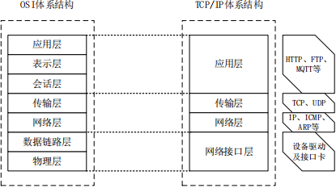
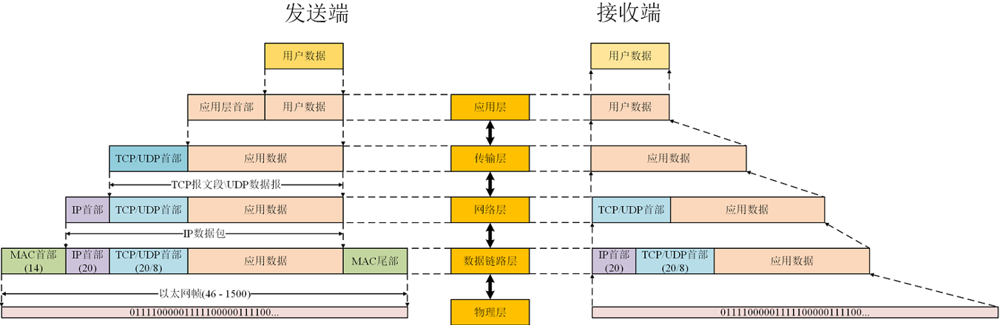
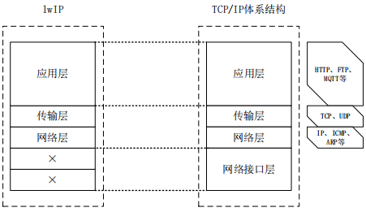
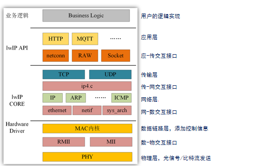

# STM32 LwIP 简介

计算机网络作为现代社会的关键基础设施，已经深入到各个领域中，从日常生活到工业生产，从科学研究到军事应用，几乎无处不在。而在这背后，TCP/IP 协议栈作为网络通信的核心，起到了至关重要的作用。它定义了数据如何在不同的网络设备之间传输，确保了数据的可靠、有序和高效传输。然而，在许多嵌入式系统和资源受限的环境中，标准的 TCP/IP 协议栈由于其庞大的体积和复杂的结构，并不适合直接使用。为了解决这一问题，一种轻量级的 TCP/IP 协议栈 —— LwIP 应运而生。

## 1. TCP/IP 协议栈

TCP/IP 协议栈是一系列网络协议的总和，构成网络通信的核心骨架，定义了电子设备如何连入因特网以及数据如何在它们之间进行传输。该协议采用 4 层结构，分别是**应用层、传输层、网络层和网络接口层**，每一层都使用下一层提供的协议来完成自己的需求。

> 1. **应用层**：这是最顶层，负责处理特定的应用程序细节。在这一层，用户的数据被处理和解释。一些常见的应用层协议包括 HTTP、FTP、SMTP 和 DNS 等。
> 2. **传输层**：这一层负责数据包的分割、打包以及传输控制，确保数据能够可靠、有序地到达目的地。主要的传输层协议有 TCP 和 UDP。
> 3. **网络层**：负责确定数据包的路径从源到目的地。这一层的主要协议是 IP（Internet Protocol），它负责在主机之间发送和接收数据包。
> 4. **网络接口层**：这是最底层，负责将数据转换为可以在物理媒介上发送的信号。这一层的协议涉及到如何将数据帧封装在数据链路层，以便在网络上进行传输。
>
> 
>
> > TCP/IP 协议栈和传统的 OSI 模型并不完全对应。TCP/IP 协议栈是一个简化的模型，强调了实际的协议实现和因特网的实际运作方式。相比之下，OSI 模型更加全面和理想化，它提供了一个框架来描述不同系统之间的交互方式。

> - 数据封包和解包
>
>   TCP/IP 协议栈的封包和拆包是指**在网络通信中，将数据按照一定的协议和格式进行封装和解析的过程**。
>
>   在 TCP/IP 协议栈中，数据封装是指在发送端将数据按照协议规定的格式进行打包，以便在网络中进行传输。在应用层的数据被封装后，会经过传输层、网络层和网络接口层的处理，最终转换成可以在物理网络上传输的帧格式。数据封装的过程涉及到对数据的分段、压缩、加密等操作，以确保数据能够可靠、安全地传输到目的地。
>
>   数据拆包是指接收端收到数据后，按照协议规定的格式对数据进行解析和处理，还原出原始的数据。在接收到数据后，接收端会按照协议规定的层次从下往上逐层处理数据，最终将应用层的数据还原出来。数据拆包的过程涉及到对数据的重组、解压缩、解密等操作，以确保数据能够被正确地解析和处理。
>
>   

## 2. LwIP 协议栈

LwIP，全称为 Lightweight IP 协议，是一种专为嵌入式系统设计的轻量级 TCP/IP 协议栈。它可以在无操作系统或带操作系统环境下运行，支持多线程或无线程，适用于 8 位和 32 位微处理器，同时兼容大端和小端系统。它的设计核心理念在于保持 TCP/IP 协议的主要功能同时尽量减少对 RAM 的占用。这意味着，尽管它的体积小巧，但它能够实现完整的 TCP/IP 通信功能。通常，LwIP 只需十几 KB 的 RAM 和大约 40K 的 ROM 即可运行，使其成为资源受限的嵌入式系统的理想选择。LwIP 的灵活性使其既可以在无操作系统环境下工作，也可以与各种操作系统配合使用。这为开发者提供了更大的自由度，可以根据具体的应用需求和硬件配置进行优化。无论是在云台接入、无线网关、远程模块还是工控控制器等场景中，LwIP 都能提供强大的网络支持。

- LwIP 框架

  