# STM32 LwIP 网络接口层

## 1. MAC 简介

STM32 的 MAC 内核是一个以太网 MAC 控制器，用于实现以太网通信。它符合 IEEE 802.3 标准，支持 10/100Mbit/s 的数据传输速率，并提供了地址和媒体访问控制方式。

MAC 内核作为链路层设备，负责与物理层接口（如以太网 PHY）进行通信，并提供了对数据包的封装解析和发送接收等操作的支持。同时，MAC 内核还可以通过配置和管理 PHY 设备，实现网络层的地址解析和数据包的路由等功能。

### STM32 的 ETH 外设

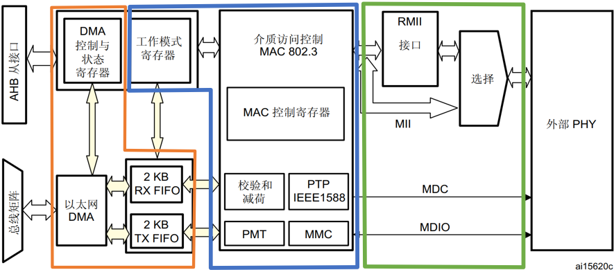

> 1. RX FIFO 和 TX FIFO 都是 2KB 的物理存储器，它们分别存储网络层递交的以太网数据和接收的以太网数据。
> 2. 以太网 DMA 是网络层和数据链路层的中间桥梁，是利用存储器到存储器方式传输。
> 3. MAC 内核以太网帧发送时，给数据加上一些控制信息；以太网帧接收时，去掉控制信息。
> 4. RMII 与 MII 是 MAC 内核（数据链路层）与 PHY 芯片（物理层）的数据交互通道，用来传输以太网数据。
> 5. MDC 和 MDIO 是 MAC 内核对 PHY 芯片的管理和配置，是站管理接口（SMI）所需的通信引脚。

#### SMI 站管理接口(包含在介质接口内)

SMI 站管理接口允许应用程序通过时钟线和数据线访问任意PHY寄存器，最多支持 32 个 PHY 访问。MDC是周期时钟引脚（最大频率为：2.5MHz），MDIC是数据输入/输出线。

- SMI 帧格式

  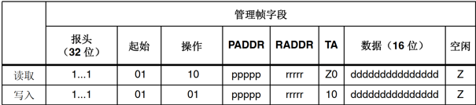

  > - `PADDR`：PHY地址（00-1F）；
  > - `RADDR`：寄存器地址（00-1F）；
  > - 数据位：16位数据位（PHY寄存器都是16位的）。

- MDIO 时序

  - 写时序

    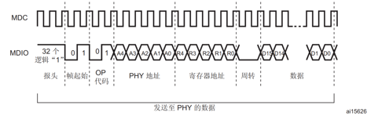

  - 读时序

    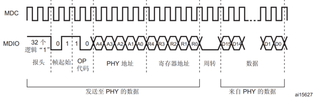

#### 介质接口 MII/RMII

- MII 介质独立接口

  介质独立接口（MII）是一个媒体独立接口，也称为媒体接口。它是 IEEE-802.3 定义的以太网行业标准。MII 包括一个数据接口，以及一个 MAC 和 PHY 之间的管理接口。数据接口包括分别用于发送器和接收器的两条独立信道，每条信道都有自己的数据、时钟和控制信号。

  MII 数据接口总共需要 16 个信号。管理接口是个双信号接口：一个是时钟信号，另一个是数据信号。通过管理接口，上层能监视和控制 PHY。

  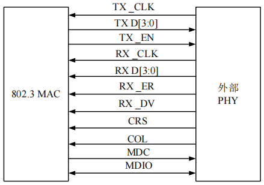

  > 1. `MII_TX_CLK`：连续时钟信号。该信号提供进行 TX 数据传输时的参考时序。标称频率为：速率为 10 Mbit/s 时为 2.5 MHz；速率为 100 Mbit/s 时为 25 MHz。
  > 2. `MII_RX_CLK`：连续时钟信号。该信号提供进行 RX 数据传输时的参考时序。标称频率为：速率为 10 Mbit/s 时为 2.5 MHz；速率为 100 Mbit/s 时为 25 MHz。
  > 3. `MII_TX_EN`：发送使能信号。
  > 4. `MII_TXD[3:0]`：数据发送信号。该信号是 4 个一组的数据信号。
  > 5. `MII_CRS`：载波侦听信号。
  > 6. `MII_COL`：冲突检测信号。
  > 7. `MII_RXD[3:0]`：数据接收信号。该信号是 4 个一组的数据信号
  > 8. `MII_RX_DV`：接收数据有效信号。
  > 9. `MII_RX_ER`：接收错误信号。该信号必须保持一个或多个周期（`MII_RX_CLK`），从而向 MAC 子层指示在帧的某处检测到错误。

  MII 介质接口使用的引脚数量是非常多的，这也反映出引脚紧缺的 MCU 不适合使用 MII 介质接口来实现以太网数据传输。

- RMII 精简介质独立接口

  简化媒体独立接口（RMII）是一种标准的以太网接口之一，比 MII 有更少的 I/O 传输。RMII 口通常只用两根线来传输数据，而 MII 口需要用四根线。对于 10M 线速，RMII 的速率是 5M，而 MII 的速率是 2.5M；对于 100M 线速，RMII 的速率是 50M，而 MII 的速率是 25M。

  RMII 用于传输以太网包，在 MII/RMII 接口是 4/2bit 的，在以太网的 PHY 里需要做串并转换、编解码等才能在双绞线和光纤上进行传输，其帧格式遵循 IEEE 802.3(10M)/IEEE 802.3u(100M)/IEEE 802.1q(VLAN)。

  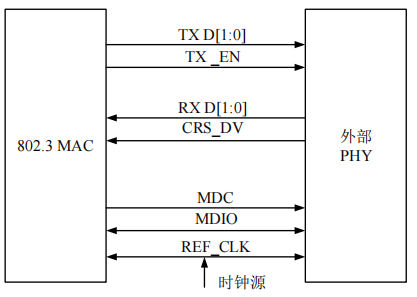

#### ETH DMA描述符

DMA 描述符用于辅助以太网 DMA 和 CPU 之间的数据传输，当需要发送数据的时候，把数据拷贝到发送描述符的缓冲区中，告诉 DMA 拷贝完成，DMA 就会从发送描述符的缓冲区中取数据，将数据通过以太网外设发送到网络中去。以太网外设接收到了网络中的数据时，DMA 自动拷贝数据到接收描述符的缓冲区中，产生中断告诉 CPU 接收数据，就可以取出描述符的数据。

描述符描述了缓冲区的情况。

- DMA 描述符的结构

  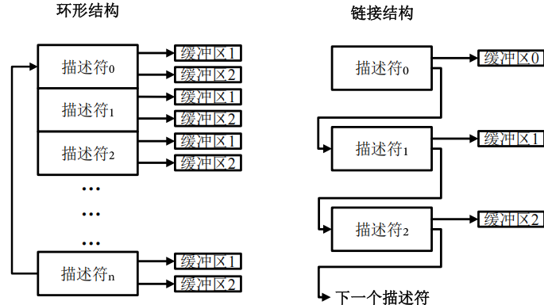

  STM32 中的 DMA 描述符是链接结构。

  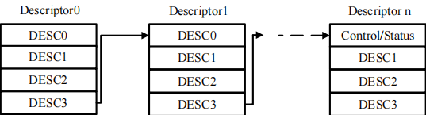

  > - 一个以太网数据包可以跨越一个或多个 DMA 描述符。
  > - 一个 DMA 描述符只能用于一个以太网数据包。
  > - DMA 描述符列表中的最后一个描述符指向第一个，形成循环链式结构。

  HAL 库中使用结构体描述一个 DMA 描述符。

  ```c
  typedef struct{
   __IO uint32_t DESC0;
   __IO uint32_t DESC1;
   __IO uint32_t DESC2;
   __IO uint32_t DESC3;
   __IO uint32_t DESC4;
   __IO uint32_t DESC5;
   __IO uint32_t DESC6;
   __IO uint32_t DESC7;
   uint32_t BackupAddr0; /* used to store rx buffer 1 address */
   uint32_t BackupAddr1; /* used to store rx buffer 2 address */
  } ETH_DMADescTypeDef;
  ```

- DMA 描述符的类型

  DMA 描述符分为增强描述符和常规描述符。常规描述符用于管理缓冲区，增强描述符在常规描述符基础上开启时间戳和IPv4校验和减荷。

  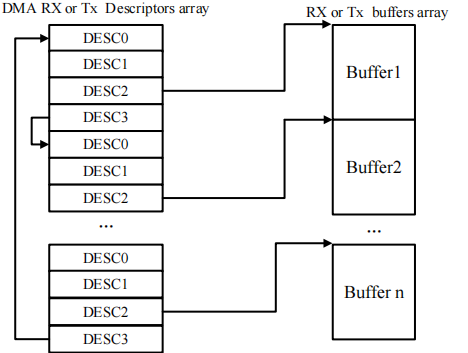

  - Tx DMA 描述符：

    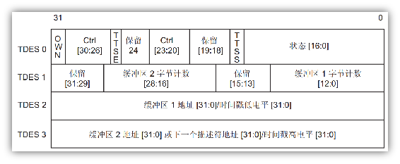

    > `TDES0[31]` 置0：CPU可将数据拷贝到描述符中，拷贝完成之后把该位置1，告诉DMA可以发送数据。
    >
    > `TDES0[20]` 置1：描述符中的第二个地址是下一个描述符地址。
    >
    > `TDES1[28:16]`：如果 `TDES0[20]` 位置1，则该字段无效。
    >
    > `TDES3[31:0]`：取决于 `TDES0[20]` 的值，为1，则指向下一个描述符地址。
    >
    > （HAL 库将 `TDES0[20]` 置为1）

  - RX DMA 描述符：

    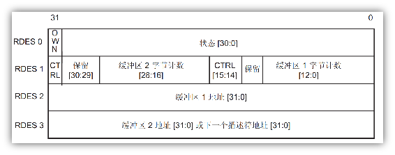

- DMA 描述符追踪

  `ETH_InitTypeDef` 中定义了 `RxDesc` 和 `TxDesc` 指针，它们是用来追踪Rx/Tx的 DMA 描述符。

  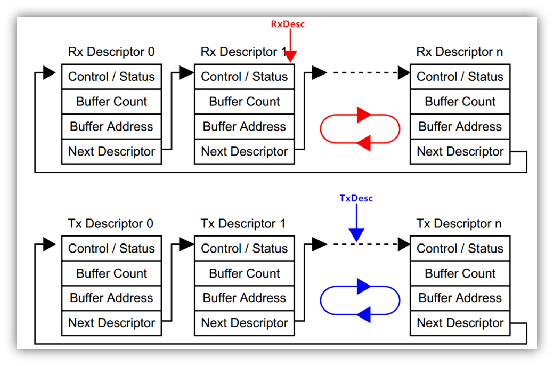

## 2. 外部 PHY 芯片

从硬件上来说，一般的 PHY 芯片为模数混合电路，负责接收电、光这类模拟信号，经过解调和A/D转换后通过MII/RMII接口将信号交给MAC内核处理。

###  YT8512C 芯片

YT8512C 是一款低功耗的单端口 10/100Mbps 以太网 PHY 芯片，它通过两条标准双绞线电缆收发器实现发送和接收数据所需的所有物理层功能。此外，YT8512C 还通过标准 MII 和 RMII 接口与 MAC 层进行连接。

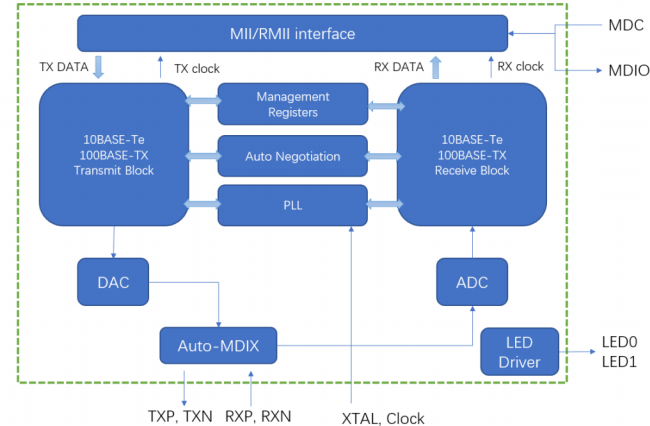

通过 LED0 和 LED1 引脚的电平来设置 PHY 地址，PHY 内部时钟由 XTAL 和 Clock 引脚提供。同时，TXP、TXN、RXP 和 RXN 引脚连接到 RJ45（网口），用于数据的发送和接收。

- 地址设置

  | `LED0/ PHYAD[0]` (PD)（Pin24） | `LED1/ PHYAD[1]` (PD)（Pin25） | PHY地址 |
  | ------------------------------ | ------------------------------ | ------- |
  | 0                              | 0                              | 00000   |
  | 0                              | 1                              | 00010   |
  | 1                              | 0                              | 00001   |
  | 1                              | 1                              | 00011   |

- RMII 模式

  对于 RMII 接口而言，为了使 PHY 芯片与 MAC 内核保持时钟同步操作，需要外部提供 50MHz 的时钟驱动。这个时钟可以来自 PHY 芯片、有源晶振或者 STM32 的 MCO 引脚。

  RMII1 模式：YT8521C 的 TXC 引脚不会输出 50MHz 时钟；

  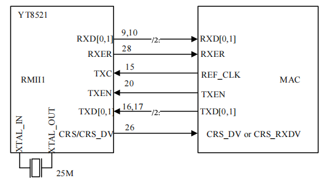

  RMII2 模式：YT8521C 的 TXC 引脚会输出 50MHz 时钟。

  如果电路采用 RMII1 模式，PHY 芯片将由 25MHz 晶振经过内部 PLL 倍频达到 50MHz。但是，在这种情况下，MAC 内核并没有被直接提供 50MHz 时钟以与 PHY 芯片保持同步。因此，为了保持时钟同步，需要在该基础上使用 MCO 或接入外部 50MHz 晶振来为 MAC 内核提供时钟。

  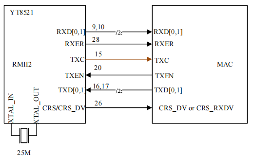

  PHY 芯片将通过外接晶振的 25MHz 信号和内部 PLL 倍频操作，生成 50MHz 的内部时钟。接着，PHY 芯片的外围引脚 TXC 将输出 50MHz 时钟频率，这个时钟频率可以直接输入到 MAC 内核，以保持时钟同步。不需要再使用外部晶振或 MCO 引脚来提供 MAC 内核的时钟。

- 寄存器

  - BCR

    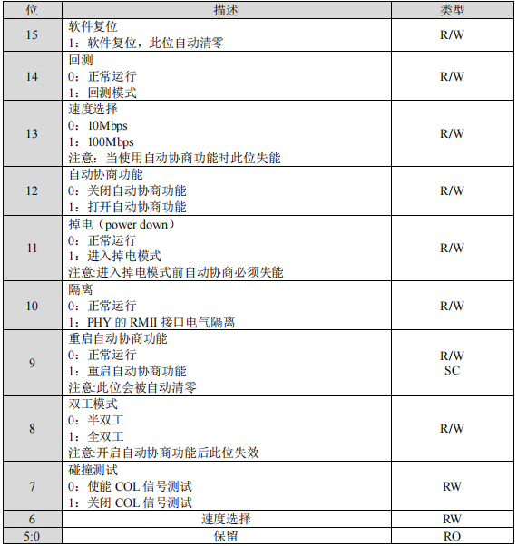

  - BSR

    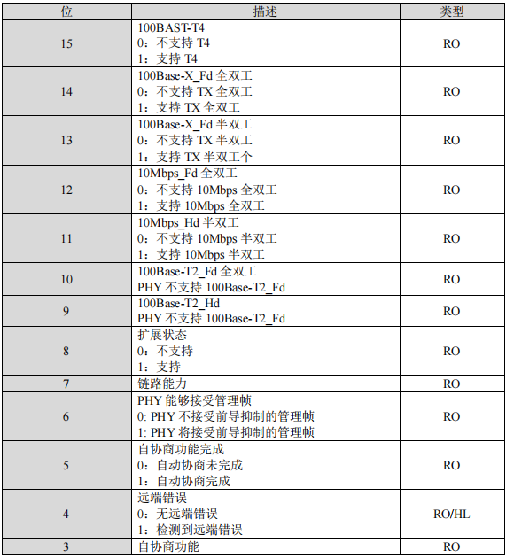

  - SR

    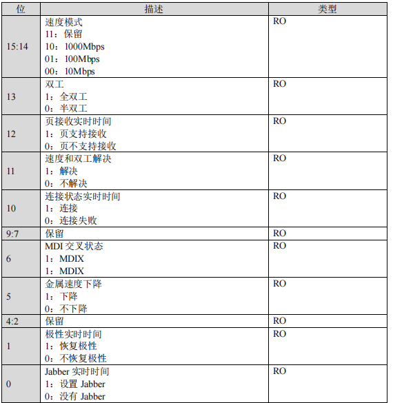

### LAN8720A

LAN8720A 是一款低功耗的单端口 10/100Mbps 以太网 PHY 芯片，它通过两条标准双绞线电缆收发器实现发送和接收数据所需的所有物理层功能。此外，LAN8720A 还通过标准 MII 和 RMII 接口与 MAC 层进行连接。

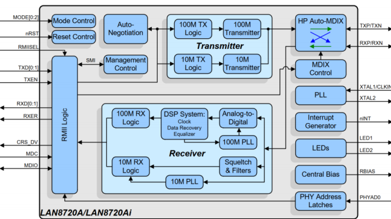

- 中断管理

  LAN8720A 的器件管理接口支持非 IEEE 802.3 规范的中断功能。当中断事件发生且相应中断位被使能时，LAN8720A 会在 nINT（14 脚）产生一个低电平有效的中断信号。
  
  LAN8720A 的中断系统提供了两种中断模式：主中断模式和复用中断模式。默认的中断模式为主中断模式，LAN8720A 在上电或复位后即工作在此模式下。模式控制/状态寄存器（十进制地址为 17）的 `ALTINT` 位决定了工作模式：当 `ALTINT` 为 0 时，LAN8720A 工作在主模式；当 `ALTINT` 为 1时，工作在复用中断模式。
  
- 地址设置

  | `RXER/PHYAD0`引脚状态（Pin10） | PHY地址 |
  | ------------------------------ | ------- |
  | 上拉                           | 0x01    |
  | 下拉（默认）                   | 0x00    |

- `nINT/REFCLKO` 配置

  |`nINTSEL` 引脚值 | 模式| `nINT/REFCLKO` 引脚功能 |
  |-|-|-|
  |`nINTSEL = 0` | `REF_CLK` Out 模式 | `nINT/REFCLKO` 作为 `REF_CLK` 时钟源 |
  |`nINTSEL = 1`  |`REF_CLK` In 模式  |`nINT/REFCLKO` 作为中断引脚|

  当工作在 `REF_CLK` In 模式时，50MHz 的外部时钟信号应接到LAN8720 的 `XTAL1/CKIN` 引脚和 STM32 的 `RMII_REF_CLK` 引脚上。
  
  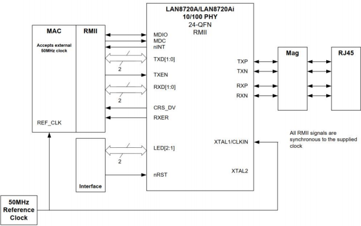
  
  LAN8720A 可以从外部的 25MHz 的晶振中产生 REF_CLK 时钟。到要使
  用此功能时应工作在 `REF_CLK` Out 模式。
  
  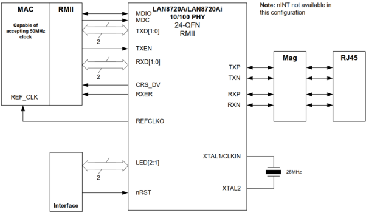
  
- 寄存器

  - 特殊功能寄存器

    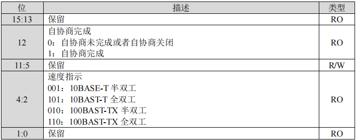