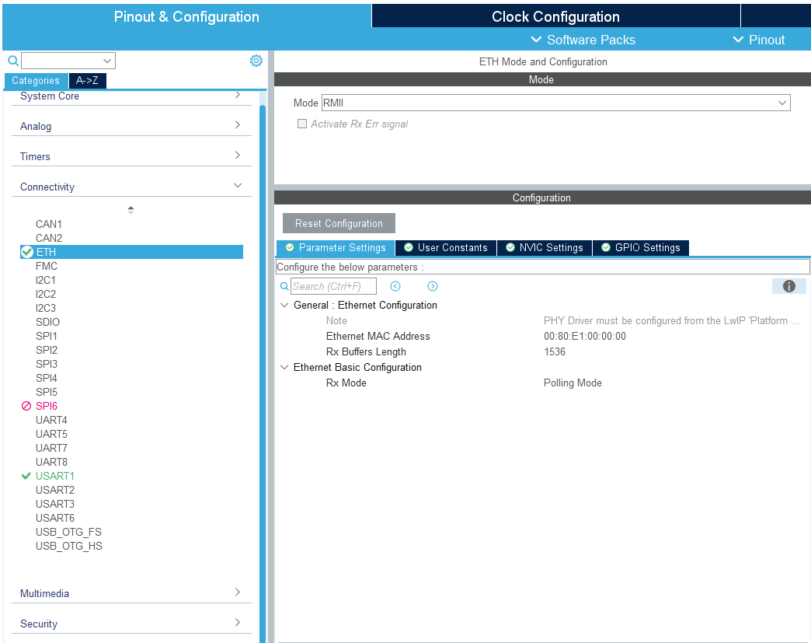
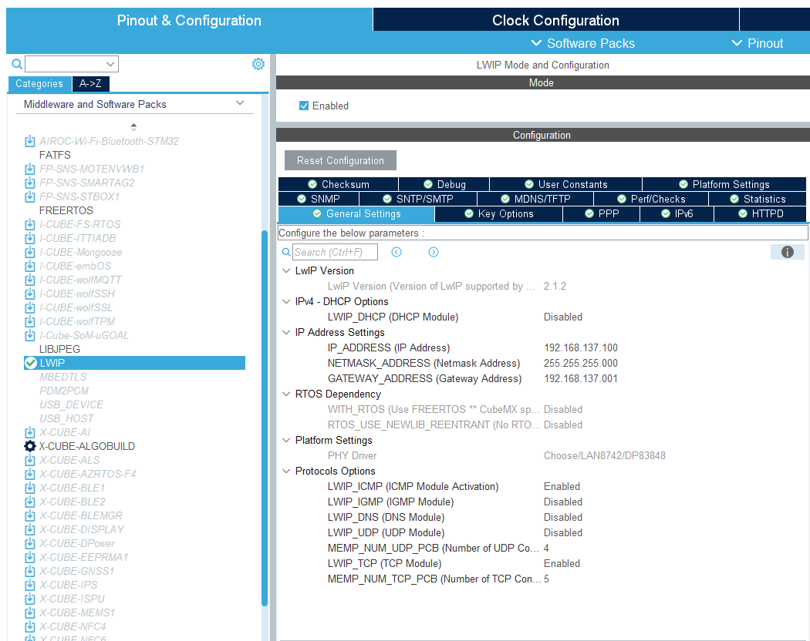
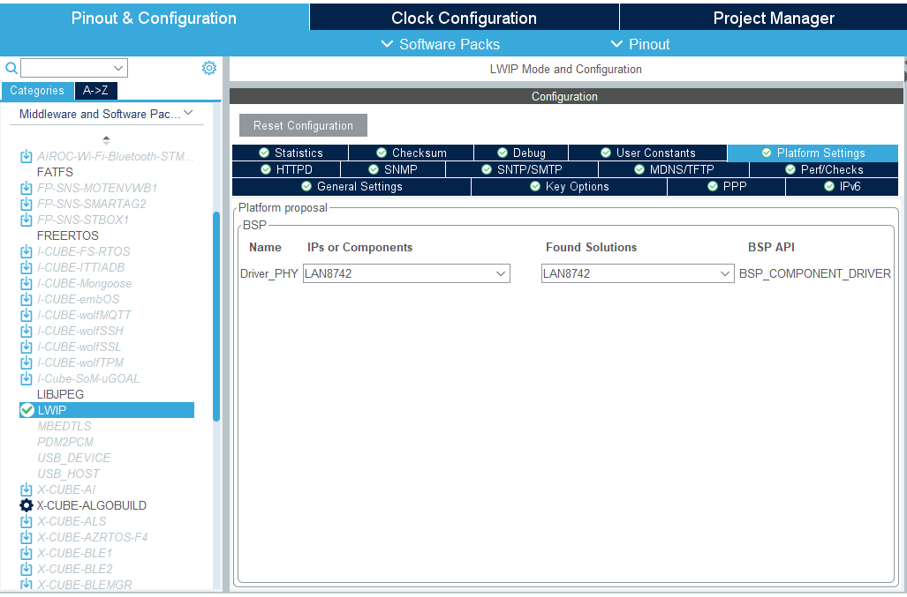
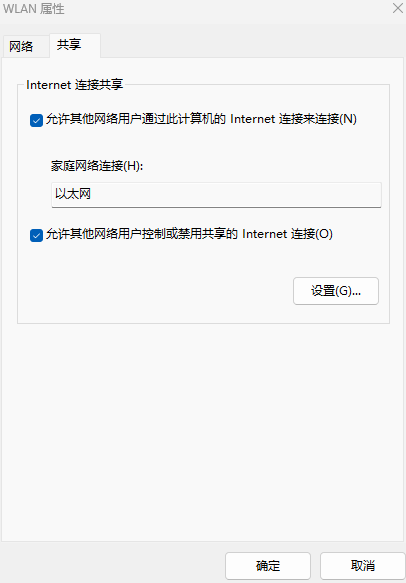
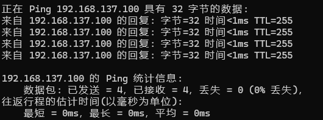

# STM32 LwIP 移植

以下使用 CubeMX（8.0 版本以上）进行移植。

## 1. 裸机移植

1. ETH 配置

   

2. LWIP 配置

   

   > 1. DHCP Options：禁止 DHCP，STM32 的 IP 地址手动分配。
   > 2. IP Address Settings：设置 IP 地址，子网掩码和默认网关。
   > 3. Protocols Options：
   >    - LWIP_ICMP：用于网络测试和诊断，通常开启；
   >    - LWIP_IGMP：用于网络组管理，通常关闭。
   >    - LWIP_DNS：域名系统。
   >    - LWIP_UDP/LWIP_TCP：使能 TCP 功能和 UDP 功能。

   

   > 选择 PHY 设备：LAN8742 和 LAN8720A 基本无差别，直接选择即可。

3. `ETH_RESET` 复位引脚需要自行定义为输出模式，在 LwIP 初始化之前执行复位操作。

4. 代码

   - 在 LwIP 初始化之前复位 PHY 芯片。
   - 在主函数中加入`MX_LWIP_Process();`

5. 连接测试

   - 使用网线连接电脑和单片机。

   - 更改电脑网络配置：

     

     电脑连接的网络应当处于共享状态。

   - Ping 测试连通性：

     


## 2. FreeRTOS 移植

使能 FreeRTOS 后使能 Lwip 即可。

## 3. 源码

- Lwip 的源码分为 `contrib` 包和 `lwip` 包。

  `contrib` 包：提供移植文件及应用实例。

  `lwip` 包：提供TCP/IP协议栈的核心文件。

  - contrib 包文件

    | 文件夹      | 说明                |
    | ----------- | ------------------- |
    | `addons`    | LwIP 扩展插件       |
    | `apps`      | LwIP 应用实例       |
    | `converity` | LwIP 静态分析工具   |
    | `examples`  | LwIP 高级应用实例   |
    | `ports`     | LwIP 移植相关的文件 |

  - lwip 包文件

    | 文件夹 | 说明                 |
    | ------ | -------------------- |
    | `doc`  | LwIP 技术文档        |
    | `src`  | LwIP 源码            |
    | `test` | 官方人员内部测试代码 |

    `src` 源码文件夹：

    | 文件夹    | 说明                        |
    | --------- | --------------------------- |
    | `api`     | LwIP API接口                |
    | `apps`    | LwIP 应用层协议             |
    | `core`    | LwIP 内核文件               |
    | `include` | LwIP 头文件                 |
    | `netif`   | LwIP 网络层与链路层交互文件 |

- 移植后的源码

  ```
  .
  |- LwIP
  |	|- APP							--- 用户应用层文件
  |	|- Target						--- 硬件层接口(ETH外设)
  |- MiddleWares/Third_Party/LwIP
  	|- src							--- LwIP 源码
  	|- system/arch					--- LwIP 上层接口和配置			
  ```

  