# STM32 LwIP 框架

## 1. 内存管理

> 主要包含 `mem.c` 和 `memp.c` 文件。

在 LwIP 中内存分配策略有两种，一种是：动态内存池管理策略，另一种是：动态内存堆管理策略，它们在 LwIP 中起到以长补短的作用，LwIP 内核根据不同的场景而选择不同的分配方式使系统的内存开销和分配效率大大的提高。

|宏定义 |描述|
|-|-|
|`MEM_LIBC_MALLOC` |选择 C 标准库分配策略（默认为 0）|
|`MEMP_MEM_MALLOC` |是否使用 LwIP 内存堆分配策略实现内存池分配（默认为 0）|
|`MEM_USE_POOLS` |是否使用 LwIP 内存池分配策略实现内存堆的分配（默认为 0）|

> LwIP 内存堆管理策略和 C 标准库管理策略只能选其一。

### 内存堆管理

内存堆管理能够提供合适大小的内存，剩余内存返回堆中。采用 First Fit 内存算法。

- 内存堆初始化

  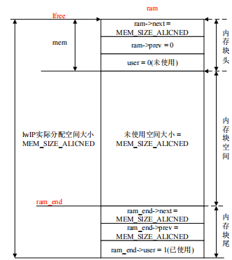

- 内存堆申请：从低地址往高地址方向查找合适的内存块，每一个内存块由两个部分组成，一个是`struct mem`大小的内存块，它用来描述和管理可用的内存块，另一个是可用内存块，用户可直接操作。

  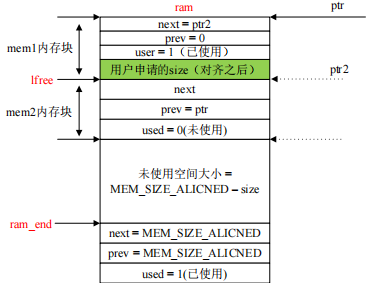

- 内存堆释放

  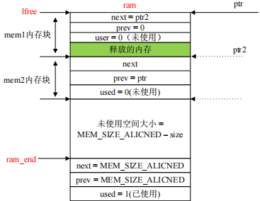
  
  
  

### 内存池管理

在内存池初始化时候，系统会将可用的内存块划分为 N 个固定大小的内存，这些内存块通过单链表的方式连接起来，在用户申请内存块时，直接从单链表的头部取出一个内存块进行分配，释放内存块时将内存块释放到链表的头部。

LwIP 存在很多固定的数据结构，这些结构的特点就是在使用之前就已经知道了数据结构的大小，而且这些数据结构在使用的过程中不会发生大小改变。为了满足这些数据类型分配的需要，在内存初始化的时候就建立了一定数量的动态内存池 POOL。

- `memp_std.h` 文件

  定义了 LwIP 内核所需的内存池，由于 LwIP 内核的固定数据结构多种多样，所以它们使用宏定义声明是否使用该类型的内存池，如 TCP、UDP、DHCP、ICMP 等协议。

-  `memp_priv.h` 文件

  `memp` 结构体把同一类型的内存池以链表的形式链接起来，`memp_desc` 结构体是用来管理和描述各类型的内存池，如数量、大小、内存池的起始地址和指向空闲内存池的指针。
  
  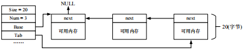

- 内存池初始化

  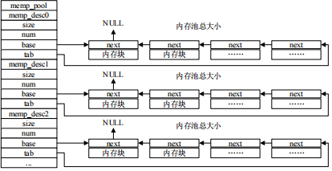

  `memp_pool` 数组包含了多个类型的内存池描述符，这些描述符管理同一类型的内存池，这些内存池以链表的形式链接起来，最后形成一个单向链表。
  
- 内存池申请

  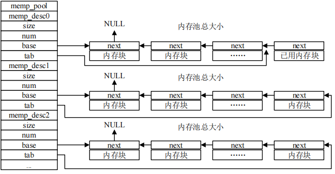

- 内存池释放

  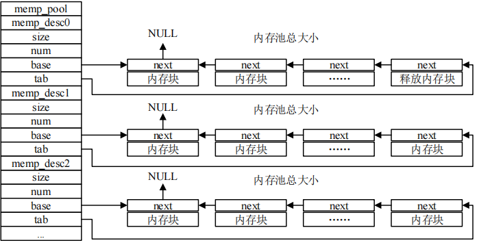

## 2. 网络接口管理

LwIP 协议栈支持多种不同的网络接口（网卡），由于网卡是直接和硬件平台打交道，硬件不同则处理也是不同的，所以由用户提供最底层的接口函数，LwIP 提供统一的接口，但是底层的实现需要用户自己去完成。

一个系统中可能有多个网络接口，有可能是以太网，有可能是 WIFI，也有可能是其他的网络接口，在 LwIP 中每一个网卡都由一个 `netif` 结构体来表示，这些结构体描述了各个网卡的底层实现函数及状态，并以链表形式链接起来。

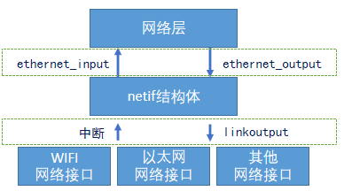

- 网络接口结构

  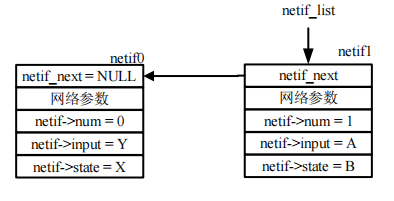

- `netif` 结构体：

  > - `next`: 该字段指向下一个 `netif` 类型的结构体，因为 LwIP 可以支持多个网络接口，当设备有多个网络接口的话 LwIP 就会把所有的 `netif` 结构体组成链表来管理这些网络接口。
  > - `ipaddr`，`netmask` 和 `gw`：分别为网络接口的 IP 地址、子网掩码和默认网关。
  > - `input`：此字段为一个函数，这个函数将网卡接收到的数据交给 IP 层。
  > - `output`：此字段为一个函数，当 IP 层向接口发送一个数据包时调用此函数。这个函数通常首先解析硬件地址，然后发送数据包。此字段一般使用 `etharp.c` 中的 `etharp_output`函数。
  > - `linkoutput`：此字段为一个函数，该函数被 ARP 模块调用，完成网络数据的发送。`etharp_output` 函数将 IP 数据包封装成以太网数据帧以后就会调用 `linkoutput` 函数将数据发送出去。
  > - `state`：用来定义一些关于接口的信息，用户可以自行设置。
  > - `mtu`：网络接口所能传输的最大数据长度，一般设置为 1500。
  > - `hwaddr_len`：网卡 MAC 地址长度，6 个字节。
  > - `hwaddr`：MAC 地址。
  > - `flags`：网络的接口状态，属性信息字段。
  > - `name`：网卡的名字。
  > - `num`：编号从 0 开始，此字段为协议栈为每个网络接口设置的一个编号。
  > - `rs_count`：发送的路由器请求消息的数量。

## 3. 网络数据包解析

TCP/IP 协议本质上就是对数据包的处理过程，LwIP 为了提高对数据包的处理工作效率，它提供一种高效的数据包管理机制，使得各层之间对数据包灵活操作，同时避免在各层之间的复制数据的巨大开销和减少各层间的传递时间。LwIP 使用 `pbuf` 结构表示数据包，`pbuf` 数据包的种类和大小也可以说是多种多样的，从网卡读取出来的数据包可以是一千个字节也可以是几个字节的 IP 数据包，这些数据包可能存在于 RAM 和 ROM 中，这个根据用户来决定的，所以 LwIP 为了处理的数据高效，它需要把这些数据进行统一的管理。

- LwIP 内部并没有采用完整的分层结构，它会假设各层间的部分数据结构和实现原理在其他层是可见的，这样在数据包递交过程中，各层协议可以直接对数据包中属于其他层次协议的字段进行操作。

- 线程处理

  - 在操作系统中，任务的创建与任务管理是常见的东西，如果把协议栈的各层变成独立的任务或者线程，那么会导致各层之间是严格分层的，在这种模式下，能够使编程简便、代码组织灵活，但是缺点也是很明显的，例如数据递交时需要进行拷贝和切换任务，任务或者线程频繁切换可能对用户程序不能够准时的处理，一个数据包在各个层次间的递交至少需要进行 3 次切换任务。
  - 协议栈与操作系统结合，相当于把协议栈成为操作系统的一部分，这样用户任务与协议栈之间通过操作系统的 API 函数实现，虽然提高了效率，各层也可以交叉存取，但是协议栈与操作系统融合会导致很严重的后果，总所周知，操作系统最大的优势是实时性高，能准确的运行相关的线程，如果协议栈成为了操作系统的一部分，那么协议栈处理的数据包过慢的话，会导致操作系统的实时性变低。
  - LwIP 让协议栈与操作系统相互隔离，这样不会影响操作系统的实时性，协议栈只作为操作系统的一个独立的任务。这样可以得出两个方法，第一种方法就是让用户程序驻留在协议栈任务里，协议栈通过回调函数实现用户与协议栈之间的数据交互，这
    个也是 LwIP 所说的 RAW API 编程。第二种方法就是用户程序可以作为操作系统的独立任务，用户任务与协议栈任务之间的通信通过 IPC 通信机制交互，这种在 LwIP 叫做 NETCONN API 和 Socket API 编程。

- `pbuf` 的结构

  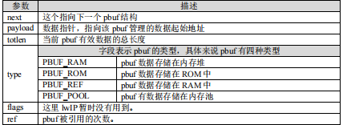

  - `PBUF_RAM` 类型

    `PBUF_RAM` 是 LwIP 用的最多的一种类型，`pbuf` 空间大小是通过内存堆来分配的，一般协议栈中要发送的数据都是采用这种形式，这个类型也是常用的类型之一，申请 `PBUF_RAM` 类型的 `pbuf` 时协议栈会在内存堆中分配相应空间，这里的大小包括如前面所述的 `pbuf` 结构和相应数据缓冲区的大小，并且它们是在一片连续的存储空间。
    
    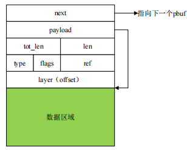
    
  - `PBUF_POOL` 类型
  
    `PBUF_POOL` 的空间通过内存池分配得到的，这种类型的 `pbuf` 可以在极短的时间内得到分配。
  
    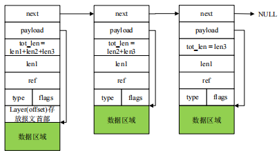
  
  - `PBUF_ROM` 和 `PBUF_REF` 类型
  
    `PBUF_ROM` 和 `PBUF_REF` 比较类似，它们都是在内存池中分配一个相应的 `pbuf` 结构，但不申请数据区的空间，它们两者的区别在于 `PBUF_ROM` 指向 ROM 空间内的数据，后者指向 RAM 空间内的某段数据。在发送某些静态数据时，可以采用这两种类型的 `pbuf`，这可以大大节省协议栈的内存空间。
  
    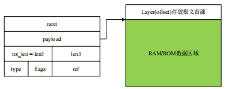

## 4. LwIP 框架

### 网络接口接收数据

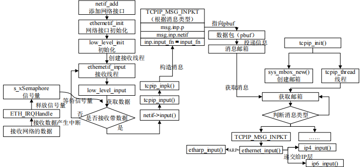

STM32 使用 ETH 接口来接收数据后产生一个 ETH 中断，在中断中释放一个信号量（`s_xSemaphore`）通知网络接口任务（`ethernetif_input`）处理接收的数据，这个任务对数据封装成消息并传递给 `tcpip_mbox` 邮箱，以邮箱发送消息。

LwIP 内核有一个协议栈线程，它的作用就是接收 `tcpip_mbox` 邮箱的消息，并且对接收的消息进行解析处理，在处理之前先判断消息的类型，LwIP 内核根据消息的类型处理不同的代码段。

### 超时处理

TCP 的建立连接超时、重传超时机制，IP 分片数据报的重装等待超时，ARP 缓存表项的时间管理、ping 接收数据包超时处理等等，都需要使用超时操作来处理。超时处理的相关代码在 `timeouts.c/h` 中实现。

`timeouts.h` 定义 `lwip_cyclic_timer` 结构体（超时等待时间和超时处理函数）和 `sys_timeo`（超时定时器）。

- 超时事件：
  - 超时事件注册
    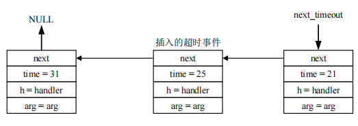
  
  - 超时事件删除
  
    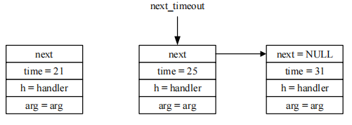
  
- 超时定时器检查

  - `sys_check_timeouts` 函数用于裸机部分，可以在裸机的应用中周期性调用该函数，每次进来检查定时器链表上定时最短的定时器是否到期，如果没有到期，直接退出该函数，否则，执行该定时器回调函数，并从链表上删除该定时器，然后继续检查下一个定时器，直到没有一个定时器到期退出。
  - `tcpip_timeouts_mbox_fetch` 函数在 OS 线程中循环执行的，主要等待 `mbox` 消息并可阻塞，如果等待 `mbox` 时超时，则会同时执行超时事件处理，即调用超时回调函数，否则一直没有收到 `mbox` 消息就会一直 等 待 直 到 下 一 个 超 时 时 间 并 循 环 将 所 有 超 时 定 时 器 检 查 一 遍 ( 内 部 调 用 了 `sys_check_timeouts`)，LwIP 中 TCP-IP 线程就是靠这种方法，即处理了上层及底层的 `mbox` 消息，同时处理了所有需要定时处理的事件。

### 协议栈线程

- 初始化
  - 创建邮箱为数据传输准备；
  - 创建互斥锁为防止优先级翻转问题；
  - 创建 TCP/IP 线程。

- 线程内容
  - 接收邮箱的消息；
  - 递交数据至网络层；
  - 遍历超时链表等任务。

### 消息

- 数据包消息

  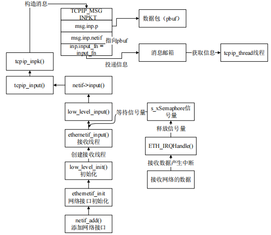

- API 消息

  API 消息是两个 API 部分的交互的消息，它是由用户调用 API 函数为起点，使用 IPC 通信机制告诉内核需要执行那个部分的 API 函数，内核的具体消息内容都可以直接包含内核消息结构 `tcpip_msg`，但是 API 消息除外，由于它的消息内容实在庞大，所以协议栈专门用结构体 `api_msg` 来描述 API 消息内容。
  
  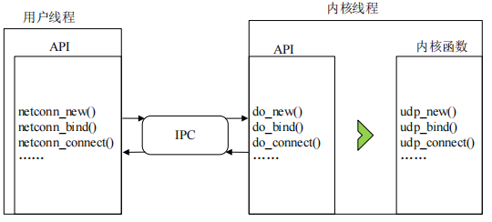
  
  
