# STM32 LwIP网络层协议

## 1. ARP 协议

ARP 全称为 Address Resolution Protocol（地址解析协议），是**根据 IP 地址获取物理地址**的一个 TCP/IP 协议。主机发送信息时将包含目标 IP 地址的 ARP 请求广播到局域网络上的所有主机，并接收返回消息，以此确定目标的物理地址；收到返回消息后将该 IP 地址和物理地址存入本机 ARP 缓存中并保留一定时间，下次请求时直接查询 ARP 缓存以节约资源。ARP 协议是建立在网络中各个主机互相信任的基础上的，局域网络上的主机可以自主发送 ARP 应答消息，其他主机收到应答报文时不会检测该报文的真实性就会将其记入本机 ARP 缓存。

**ARP 协议是透过目标设备的 IP 地址，查询目标设备的 MAC 地址，以保证通信的顺利进行**。

- ARP 协议的工作流程

  假设由两台主机，分别为主机 A 与主机 B，它们两个都是同一网段的，如果主机 A 向主机 B 发送信息或者数据，ARP 的地址解析过程如下：

  - 主机 A 首先查自己的 ARP 表是否有包含主机 B 的信息，例如主机 B 的 MAC 地址，如果主机 A 的 ARP 表包含主机 B 的 MAC 地址，则主机 A 直接利用 ARP 表的主机 B 的 MAC 地址对 IP 数据包进行封装并把数据包发给主机 B。
  - 如果主机 A 的 ARP 表没有包含主机 B 的 MAC 地址或者没有找到主机 B 的 MAC 地址，则主机 A 就把数据包缓存起来，然后以广播的方式发送一个 ARP 包的请求报文，该 ARP 包的内容包含主机 A 的 IP 地址、MAC 地址、主机 B 的 IP 地址和主机 B 的全 0 的 MAC 地址，由于主机 A 发送 ARP 包是使用广播形式，那么同一网段的主机都可以收到该 ARP 包，主机 B接收到这个 ARP 包会进行处理。
  - 主机 B 接收到主机 A 的 ARP 包之后，主机 B 会对这个 ARP 解析并比较自己的 IP 地址和 ARP 包的目的 IP 地址是否相同，如果相同，则主机 B 将 ARP 请求报文中的发送端（即主机 A）的 IP 地址和 MAC 地址存入自己的 ARP 表中。之后以单播方式发送 ARP 响应报文给主机 A，其中包含了自己的 MAC 地址。
  - 当主机 A 收到了主机 B 的 ARP 包也是同样的处理，首先比较 ARP 包的 IP 地址是否和自己的 IP 地址相同，如果 IP 地址相同，则把 ARP 包的信息存入自己的 ARP 表中，最后对 IP数据包进行封装并把数据包发给主机 B。

  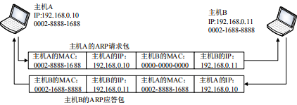

- ARP 缓存表

  ARP 缓存表（arp_table）最大存放 10 个表项，每一个表项描述符了 IP 地址映射 MAC 地址的信息和表项生存时间与状态。这个 ARP 缓存表很小，LwIP 根据传入的目标 IP 地址对 ARP 缓存表直接采用遍历方式查找对应的 MAC 地址。**每一个表项都有一个生存时间，若超出了自身生存时间，则 LwIP 内核会把这个表项删除**。每一个表项从创建、请求等都设置了一个状态，不同状态的表项都需要特殊的处理。

  - `ETHARP_STATE_EMPTY` 状态

    这个状态表示 ARP 缓存表处于初始化的状态，所有表项初始化之后才可以被使用，如果需要添加表项，LwIP 内核就会遍历 ARP 缓存表并找到合适的表项进行添加。

  - `ETHARP_STATE_PENDING` 状态

    该状态表示该表项处于不稳定状态，此时该表项只记录到了 IP 地址，但是还未记录到对应的 MAC 地址。此时会设定超时
    时间， 当计数超时后，对应的表项将被删除，如果超时之前收到应答数据包，那么系统会更新缓存表的信息，记录目标 IP 地址与目标 MAC 地址的映射关系并且开始记录表项的生存时
    间，同时该表项的状态会变成 `ETHARP_STATE_STABLE` 状态。

  - `ETHARP_STATE_STABLE` 状态
    当收到应答之前，这些数据包会暂时挂载到表项的数据包缓冲队列上，收到应答之后，系统已经更新 ARP 缓存表，那么系统发送数据就会进入该状态。

  - `ETHARP_STATE_STABLE_REREQUESTING_1`/`ETHARP_STATE_STABLE_REREQUESTING_2` 状态

    如果系统再一次发送 ARP 请求数据包，则表项状态会暂时被设置为 `ETHARP_STATE_STABLE_REREQUESTING_1`，之后设置为 `ETHARP_STATE_STABLE_REREQUESTING_2` 状态，这两个状态为过渡状态，如果超时时间收到 ARP 应答后，表项又会被设置为 `ETHARP_STATE_STABLE` 状态，这样子能保持表项的有效性。

- ARP 报文结构

  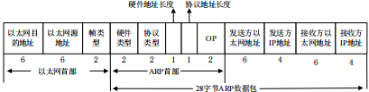

  > 左边的是以太网首部，数据发送时必须添加以太网首部，添加完成之后才能把数据发往到网络当中（这里解答了为什么需要对方主机的 MAC 地址），而右边是 ARP 报文结构，定义了 5 个字段，它们分别为：
  >
  > - **硬件类型**：如果这个类型设置为 1 ，表示以太网 MAC 地址。
  > - **协议类型**：表示要映射的协议地址类型，0x0800 —— 映射为 IP 地址。
  > - **硬件地址长度和协议地址长度**：以太网 ARP 请求和应答分别设置为 6 和 4，它们代表 MAC 地址长度和 IP 地址长度。在 ARP 协议包中留出硬件地址长度字段和协议地址长度字段可以使得 ARP 协议在任何网络中被使用，而不仅仅只在以太网中。
  > - **op**： ARP 数据包的类型，ARP 请求设置为 1，ARP 应答设置为 2。
  > - **本地 IP 地址与本地 MAC 地址和目标 IP 地址与目标 MAC 地址**。

- ARP 发送和接收流程

  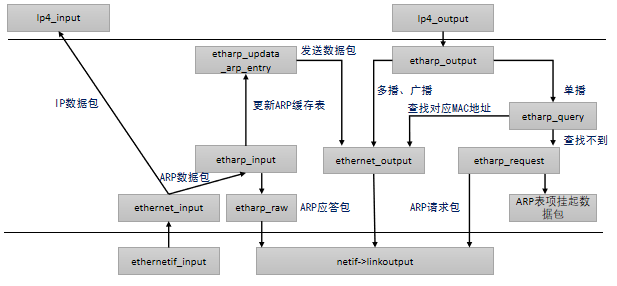

  - ARP 请求包发送

    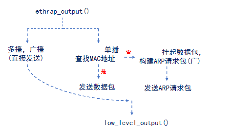

  - ARP 应答包接收

    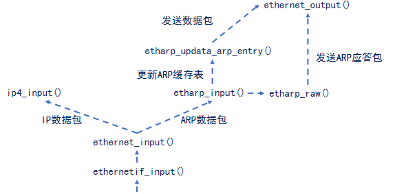

## 2. IP 协议

IP 指网际互连协议，Internet Protocol 的缩写，是 TCP/IP 体系中的网络层协议。设计 IP 的目的是提高网络的可扩展性：一是解决互联网问题，实现大规模、异构网络的互联互通；二是分割顶层网络应用和底层网络技术之间的耦合关系，以利于两者的独立发展。根据端到端的设计原则，IP 只为主机提供一种无连接、不可靠的、尽力而为的数据包传输服务。

**IP 协议是 TCP/IP 协议族中最为核心的协议，TCP、UDP、ICMP、IGMP数据都以 P 数据报格式传输（IPv4、IPv6）。**

IP 协议用于：寻址（对某个设备的IP地址定位）；路由（查看路由表确认路标）；分片（大于MTU，分片处理）；重组（对分片进行组合处理）。

- IP 数据报

  IP 层数据报也叫做 IP 数据报或者 IP 分组，IP 数据报组装在以太网帧中发送的，它通常由两个部分组成，即 IP 首部与数据区域，其中 IP 的首部是 20 字节大小，数据区域理论上可以多达 65535 个字节，由于以太网网络接口的最大传输单元为 1500，所以一个完整的数据包不能超出 1500 字节大小。

  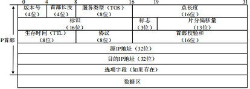

  > - **版本**： IP 协议的版本。通信双方使用的 IP 协议版本必须一致。广泛使用的 IP 协议版本号为 4（即 IPv4）。
  > - **首部长度**：可表示的最大十进制数值是 15。这个字段所表示数的单位是 32 位字长（1 个 32 位字长是 4 字节），因此，当 IP 的首部长度为 1111 时（即十进制的 15），
  >   首部长度就达到 60 字节。当 IP 分组的首部长度不是 4 字节的整数倍时，必须利用最后的填充，字段加以填充。
  > - **区分服务**：用来获得更好的服务。这个字段在旧标准中叫做服务类型，但实际上一直没有被使用过。
  > - **总长度**：总长度指首部和数据之和的长度，单位为字节。在 IP 层下面的每一种数据链路层都有自己的帧格式，其中包括帧格式中的数据字段的最大长度，这称为最大传送单元 MTU。当一个数据报封装成链路层的帧时，此数据报的总长度（即首部加上数据部分）一定不能超过下面的数据链路层的 MTU 值。
  > - **标识**：IP 软件在存储器中维持一个计数器，每产生一个数据报，计数器就加 1，并将此值赋给标识字段。但这个标识并不是序号，因为 IP 是无连接服务，数据报不存在按序接收的问题。当数据报由于长度超过网络的 MTU 而必须分片时，这个标识字段的值就被复制到所有的数据报的标识字段中。相同的标识字段的值使分片后的各数据报片最后能正确地重装成为原来的数据报。
  > - **标志**：只有 2 位有意义。
  >   1. 标志字段中的最低位记为 MF。`MF=1` 即表示后面还有分片的数据报。`MF=0` 表示这已是若干数据报片中的最后一个。
  >   2. 标志字段中间的一位记为 DF，不能分片。只有当 `DF=0` 时才允许分片。
  > - **片偏移**：片偏移为较长的分组在分片后，某片在原分组中的相对位置。也就是说，相对用户数据字段的起点，该片从何处开始。片偏移以 8 个字节为偏移单位。
  > - **生存时间**：表明数据报在网络中的寿命。由发出数据报的源点设置这个字段。其目的是防止无法交付的数据报无限制地在因特网中兜圈子，因而白白消耗网络资源。最初的设计是以秒作为 TTL 的单位。每经过一个路由器时，就把 TTL 减去数据报在路由器消耗掉的一段时间。若数据报在路由器消耗的时间小于 1 秒，就把 TTL 值减 1。当 TTL 值为 0 时，就丢弃这个数据报。后来把 TTL 字段的功能改为跳数限制（但名称不变）。路由器在转发数据报之前就把 TTL 值减 1。若 TTL 值减少到零，就丢弃这个数据报，不再转发。因此，TTL 的单位不再是秒，而是跳数。TTL 的意义是指明数据报在网络中至多可经过多少个路由器。显然，数据报在网络上经过的路由器的最大数值是 255。若把 TTL 的初始值设为 1，就表示这个数据报只能在本局域网中传送。
  > - **协议**：协议字段指出此数据报携带的数据是使用何种协议，以便使目的主机的 IP 层知道应将数据部分上交给哪个处理过程。
  > - **首部检验和**：这个字段只检验数据报的首部，但不包括数据部分。这是因为数据报每经过一个路由器，路由器都要重新计算一下首部检验和（一些字段，如生存时间、标志、片偏移等都可能发生变化）。不检验数据部分可减少计算的工作量。
  > - **源地址**
  > - **目的地址**
  > - **数据区域**
  
  为了描述 IP 数据报首部的信息，LwIP 定义了一个 `ip_hdr` 的结构体作为描述 IP 数据报首部， 同时还定义了很多获取 IP 数据报首部的宏定义与设置 IP 数据报首部的宏定义。
  
  ```c
   PACK_STRUCT_BEGIN
   struct ip_hdr
   {
       /* 版本 / 首部长度 */
       PACK_STRUCT_FLD_8(u8_t _v_hl);
       /* 服务类型 */
       PACK_STRUCT_FLD_8(u8_t _tos);
       /* 数据报总长度 */
       PACK_STRUCT_FIELD(u16_t _len);
       /* 标识字段 */
       PACK_STRUCT_FIELD(u16_t _id);
       /* 标志与偏移 */
       PACK_STRUCT_FIELD(u16_t _offset);
   #define IP_RF 0x8000U        /* 保留的标志位 */
   #define IP_DF 0x4000U        /* 不分片标志位 */
   #define IP_MF 0x2000U        /* 更多分片标志 */
   #define IP_OFFMASK 0x1fffU   /* 用于分段的掩码 */
       /* 生存时间 */
       PACK_STRUCT_FLD_8(u8_t _ttl);
       /* 上层协议*/
       PACK_STRUCT_FLD_8(u8_t _proto);
       /* 校验和 */
       PACK_STRUCT_FIELD(u16_t _chksum);
       /* 源IP地址与目标IP地址 */
       PACK_STRUCT_FLD_S(ip4_addr_p_t src);
       PACK_STRUCT_FLD_S(ip4_addr_p_t dest);
   } PACK_STRUCT_STRUCT;
   PACK_STRUCT_END
  
   /* 获取IP数据报首部各个字段信息的宏 */
  
   //获取协议版本
   #define IPH_V(hdr)  ((hdr)->_v_hl >> 4)
   //获取首部长度（字）
   #define IPH_HL(hdr) ((hdr)->_v_hl & 0x0f)
   //获取获取首部长度字节
   #define IPH_HL_BYTES(hdr) ((u8_t)(IPH_HL(hdr) * 4))
   //获取服务类型
   #define IPH_TOS(hdr) ((hdr)->_tos)
   //获取数据报长度
   #define IPH_LEN(hdr) ((hdr)->_len)
   //获取数据报标识
   #define IPH_ID(hdr) ((hdr)->_id)
   //获取分片标志位+偏移量
   #define IPH_OFFSET(hdr) ((hdr)->_offset)
   //获取偏移量大小(字节)
   #define IPH_OFFSET_BYTES(hdr) \
   ((u16_t)((lwip_ntohs(IPH_OFFSET(hdr)) & IP_OFFMASK) * 8U))
   //获取生存时间
   #define IPH_TTL(hdr) ((hdr)->_ttl)
   //获取上层协议
   #define IPH_PROTO(hdr) ((hdr)->_proto)
   //获取校验和
   #define IPH_CHKSUM(hdr) ((hdr)->_chksum)
  
   /* 用于填写IP数据报首部的宏*/
  
   //设置版本号跟首部长度
   #define IPH_VHL_SET(hdr, v, hl) \
   (hdr)->_v_hl = (u8_t)((((v) << 4) | (hl)))
   //设置服务类型
   #define IPH_TOS_SET(hdr, tos) (hdr)->_tos = (tos)
   //设置数据报总长度
   #define IPH_LEN_SET(hdr, len) (hdr)->_len = (len)
   //设置标识
   #define IPH_ID_SET(hdr, id) (hdr)->_id = (id)
   //设置分片标志与偏移量
   #define IPH_OFFSET_SET(hdr, off) (hdr)->_offset = (off)
   //设置生存时间
   #define IPH_TTL_SET(hdr, ttl) (hdr)->_ttl = (u8_t)(ttl)
   //设置上层协议
   #define IPH_PROTO_SET(hdr, proto) (hdr)->_proto = (u8_t)(proto)
   //设置校验和
   #define IPH_CHKSUM_SET(hdr, chksum) (hdr)->_chksum = (chksum)
  ```
  
- IP 数据报分片

  - 分片

    应用程序处理的数据是不确定的，可能超出网络接口最大传输单元，为此 TCP/IP 协议栈引入了分片概念，它是以 MTU 为界限对这个大型的数据切割成多个小型的数据包。这些小型的数据叫做 IP 的分组和分片，它们在接收方进行重组处理，这样，接收方的应用程序接收到这个大型的数据了。
    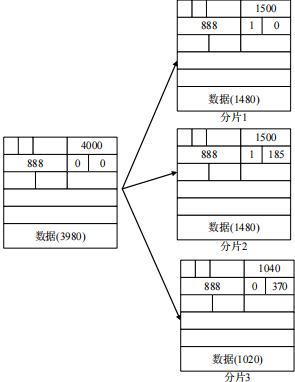

  - 分片重装
  
    由于 IP 分组在网络传输过程中到达目的地点的时间是不确定的，所以后面的分组可能比前面的分组先达到目的地点。为此，lwIP 内核需要将接收到的分组暂存起来，等所有的分组都接收完成之后，再将数据传递给上层。
  
- IP 数据报的发送和接收

  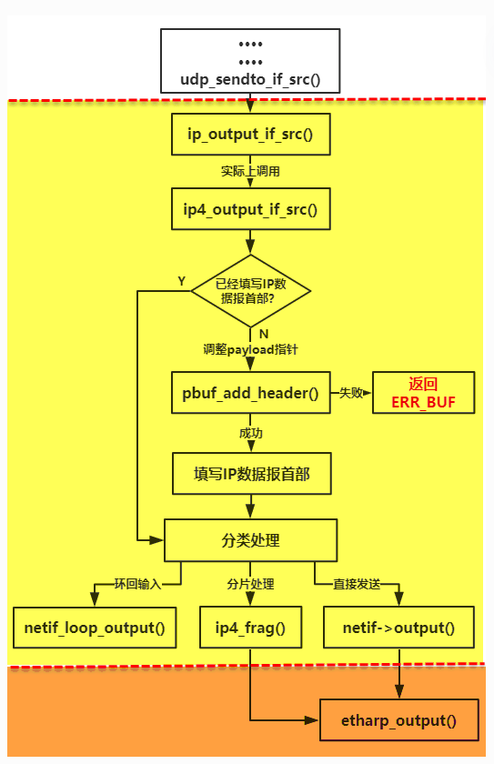

  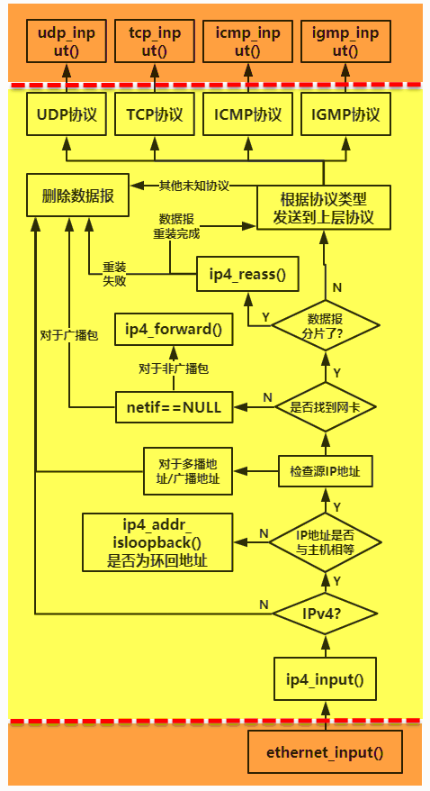

## 3. ICMP 协议

ICMP（Internet Control Message Protocol）Internet 控制报文协议。它是 TCP/IP 协议簇的一个子协议，用于在 IP 主机、路由器之间传递控制消息。控制消息是指网络通不通、主机是否可达、路由是否可用等网络本身的消息，这些控制消息虽然并不传输到用户数据，但是对于用户数据的传递起着重要的作用。

ICMP 协议是一种面向无连接的协议，用于传输出错报告控制信息。它是一个非常重要的协议，它对于网络安全具有极其重要的意义。它属于网络层协议，主要用于在主机与路由器之间传递控制信息，包括报告错误、交换受限控制和状态信息等。当遇到 IP 数据无法访问目标、IP 路由器无法按当前的传输速率转发数据包等情况时，会自动发送 ICMP 消息。

ICMP 报文在 IP 报文的数据区中。ICMP 报文分为两类：一类是 ICMP 差错报告报文，另一类是 ICMP 查询报文。

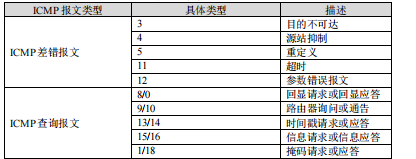

ICMP 报文由 8 字节首部和可变长度的数据部分组成。

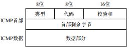

> - **类型字段**：表示使用 ICMP 的两类类型中的哪一个。
> - **代码字段**：产生 ICMP 报文的具体原因。
> - **校验和字段**：用于记录包括 ICMP 报文数据部分在内的整个 ICMP 数据报的校验和。
> - 首部剩余的 4 字节在每种类型的报文有特殊的定义，总的看来说：不同类型的报文，数据部分长度和含义存在差异，例如差错报文会引起差错的据报的信息，而查询报文携带查询请求和查询结果数据。

在 LwIP 中定义一个结构体对 ICMP 报文进行描述，该结构体名字为`icmp_echo_hdr`，此外 LwIP 还定义了很多宏与枚举类型的变量对ICMP的类型及代码字段进行描述。

```c
 PACK_STRUCT_BEGIN
 struct icmp_echo_hdr
 {
     PACK_STRUCT_FLD_8(u8_t type);
     PACK_STRUCT_FLD_8(u8_t code);
     PACK_STRUCT_FIELD(u16_t chksum);
     PACK_STRUCT_FIELD(u16_t id);
     PACK_STRUCT_FIELD(u16_t seqno);
 } PACK_STRUCT_STRUCT;
 PACK_STRUCT_END
 
 #define ICMP_ER   0    /* 回显应答 */
 #define ICMP_DUR  3    /* 目的不可达 */
 #define ICMP_SQ   4    /* 源站抑制 */
 #define ICMP_RD   5    /* 重定向 */
 #define ICMP_ECHO 8    /* 回显请求 */
 #define ICMP_TE  11    /* 超时 */
 #define ICMP_PP  12    /* 参数错误 */
 #define ICMP_TS  13    /* 时间戳请求 */
 #define ICMP_TSR 14    /* 时间戳应答 */
 #define ICMP_IRQ 15    /* 信息请求 */
 #define ICMP_IR  16    /* 信息应答 */
 #define ICMP_AM  17    /* 地址掩码请求 */
 #define ICMP_AMR 18    /* 地址掩码应答 */

 /** ICMP目标不可达代码字段 */
 enum icmp_dur_type
 {
     /** 网络不可达 */
     ICMP_DUR_NET   = 0,
     /** 主机不可达 */
     ICMP_DUR_HOST  = 1,
     /** 协议不可达 */
     ICMP_DUR_PROTO = 2,
     /** 端口不可达 */
     ICMP_DUR_PORT  = 3,
     /** 需要分片但设置了不分片 */
     ICMP_DUR_FRAG  = 4,
     /** 源站路由失败 */
     ICMP_DUR_SR    = 5
 };

 /** ICMP超时代码字段 */
 enum icmp_te_type
 {
     /** 生存时间超时 */
     ICMP_TE_TTL  = 0,
     /** 分片重装超时 */
     ICMP_TE_FRAG = 1
 };
```

- ICMP 差错报文

  - 目的站不可到达

    当路由器发送的数据报不能发送到指定目的地时，或者说当路由器不能够给数据报找到路由或主机不能够交付数据报时，就丢弃这个数据报，然后向发送数据报的源主机设备发回一个终点不可达数据报文。

    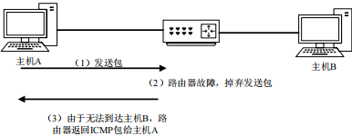

    ICMP 目的不可达差错报告报文产生差错的原因有很多，如网络不可达、主机不可达、协议不可达、端口不可达等，引起差错的原因会在 ICMP 报文中的代码字段（Code）记录。

    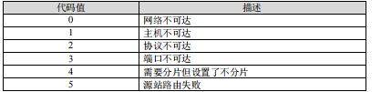

    目的站不可达报文如下：

    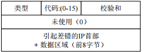

  - 源站抑制
  
    由于 IP 协议是面向无连接的，没有流量控制机制，数据在传输过程中是非常容易造成拥塞的现象。而 ICMP 源点抑制报文就是给 IP 协议提供一种流量监控的机制，因为 ICMP 源点抑制机制并不能控制流量的大小，但是能根据流量的使用情况，给源主机提供一些建议。这个报文的作用就是通知数据报在拥塞时被丢弃了，另外还会警告源主机流量出现了拥塞的情况，然后源主机根据反馈的 ICMP 源点抑制报文信息作出处理，至于源主机怎么就不关它的事了。
    
    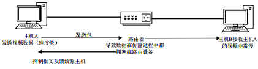
    
  - 端口不可达
    
    当目标系统收到一个 IP 数据报的某个服务请求时，如果本地没有此服务，则本地会向源头返回 ICMP 端口不可达信息。
    
  - 超时
    
  - 参数错误
  
- ICMP 查询报文
  
  ping 程序利用 ICMP 回显请求报文和回显应答报文（而不用经过传输层）来测试目标主机是否可达。它是一个检查系统连接性的基本诊断工具。
  ICMP 回显请求和 ICMP 回显应答报文是配合工作的。当源主机向目标主机发送了 ICMP 回显请求数据包后，它期待着目标主机的回答。目标主机在收到一个 ICMP 回显请求数据包后，它会交换源、目的主机的地址，然后将收到的 ICMP 回显请求数据包中的数据部分原封不动地
  封装在自己的 ICMP 回显应答数据包中，然后发回给发送 ICMP 回显请求的一方。如果校验正确，发送者便认为目标主机的回显服务正常，也即物理连接畅通。
  
  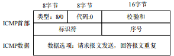
  
  
