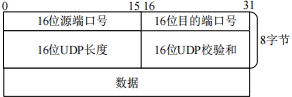
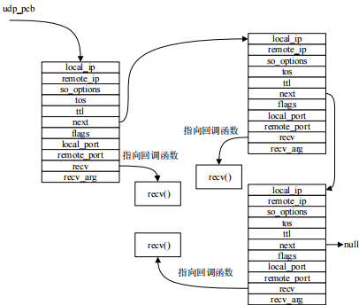
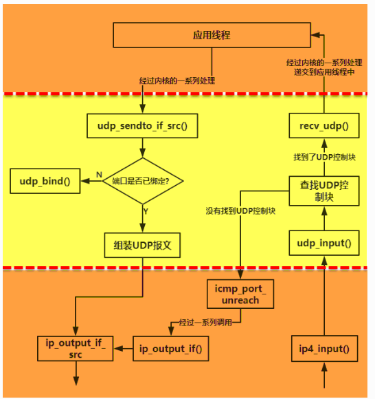
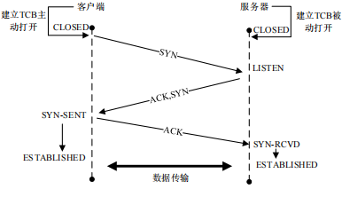
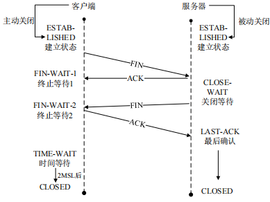
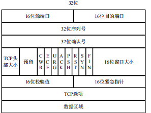
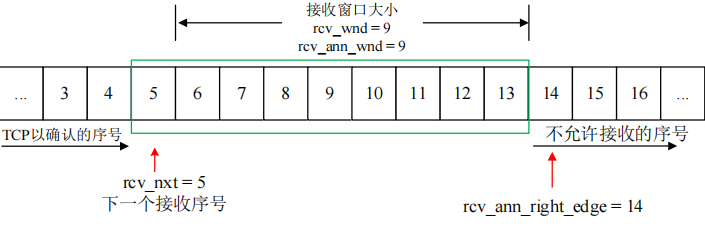
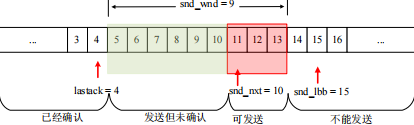
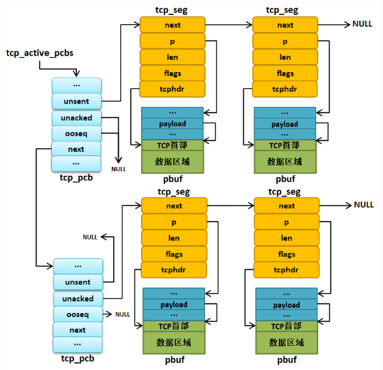
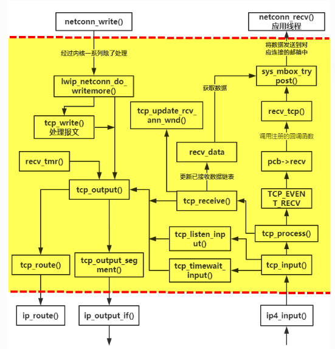

# STM32 LwIP 传输层协议

## 1. UDP 协议

UDP 协议是 TCP/IP 协议栈的传输层协议，是一个简单的面向数据报的协议。UDP 不提供数据包分组、组装，不能对数据包进行排序，当报文发送出去后无法知道是否安全、完整的到达。UDP 除了这些缺点外肯定有它自身的优势，由于 UDP 不属于连接型协议，因而消耗资源小，处理速度快，所以通常在音频、视频和普通数据传输时使用 UDP 较多。

- UDP 数据报

  

  > - 源端口：源端口号，需要对方回信时选用，不需要时全部置 0。
  > - 目的端口：目的端口号，在终点交付报文的时候需要用到。
  > - 长度：UDP 的数据报的长度（包括首部和数据）其最小值为 8（只有首部）。
  > - 校验和：检测 UDP 数据报在传输中是否有错，有错则丢弃。

  UDP 协议使用端口号为不同的应用保留各自的数据传输通道，UDP 和 采用端口号对同一时刻内多项应用同时发送和接收数据，而数据接收方则通过目标端口接收数据。有的网络应用只能使用预先为其预留或注册的静态端口；而另外一些网络应用则可以使用未被注册的动态端口。因为 UDP 报头使用两个字节存放端口号，所以端口号的有效范围是从 0 到 65535。一般来说，大于 49151 的端口号都代表动态端口。

  数据报的长度是指包括报头和数据部分在内的总字节数。因为报头的长度是固定的，所以该数据区域主要被用来计算可变长度的数据部分（又称为数据负载）。数据报的最大长度根据操作环境的不同而各异。从理论上说，包含报头在内的数据报的最大长度为 65535 字节。

  UDP 协议使用报头中的校验和来保证数据的安全。校验和首先在数据发送方通过特殊的算法计算得出，在传递到接收方之后，还需要再重新计算。如果某个数据报在传输过程中被第三方篡改或者由于线路噪音等原因受到损坏，发送和接收方的校验计算和将不会相符，由此 UDP 协议可以检测是否出错。
  
  LwIP定义了一个 UDP 报文首部数据结构体 `udp_hdr`。
  
  ```c
   PACK_STRUCT_BEGIN
   struct udp_hdr
   {
       PACK_STRUCT_FIELD(u16_t src);
       PACK_STRUCT_FIELD(u16_t dest);  /*src/dest UDP ports */
       PACK_STRUCT_FIELD(u16_t len);
       PACK_STRUCT_FIELD(u16_t chksum);
   } PACK_STRUCT_STRUCT;
   PACK_STRUCT_END
  ```
  
- UDP 控制块

  为了更好管理 UDP 报文，LwIP 定义了一个 UDP 控制块，记录与 UDP 通信的所有信息， 如源端口号、目标端口号、源 IP 地址、目标 IP 地址以及收到数据时候的回调函数等等， 系统会为每一个基于 UDP 协议的应用线程创建一个 UDP 控制块，并且将其与对应的端口绑定。

  ```c
   #define IP_PCB                             \
   /* 本地ip地址与远端IP地址 */             \
   ip_addr_t local_ip;                      \
   ip_addr_t remote_ip;                     \
   /* 网卡id */                             \
   u8_t netif_idx;                          \
   /* Socket 选项 */                        \
   u8_t so_options;                         \
   /* 服务类型   */                         \
   u8_t tos;                                \
   /* 生存时间 */                           \
   u8_t ttl                                 \
   IP_PCB_NETIFHINT
  
   /** UDP控制块 */
   struct udp_pcb
   {
  
       IP_PCB;
  
       //指向下一个控制块
       struct udp_pcb *next;
  
       //控制块状态
       u8_t flags;
  
       /** 本地端口号与远端端口号 */
       u16_t local_port, remote_port;
  
       /** 接收回调函数 */
       udp_recv_fn recv;
       /** 回调函数参数 */
       void *recv_arg;
   };
  ```

  LwIP 会把多个 UDP 控制块用一个链表连接起来，在处理的时候遍历列表， 然后对控制块进行操作。

  

- UDP 报文发送与接收

  - 调用`udp_sendto_if_src()`函数进行发送 UDP 报文；
  - 调用`udp_input()`函数将报文传递到传输层。

  

## 2. TCP 协议

TCP（Transmission Control Protocol 传输控制协议）是一种面向连接的、可靠的、基于字节流的传输层通信协议。TCP 为了保证数据包传输的可靠行，会给每个包一个序号，同时此序号也保证了发送到接收端主机能够按序接收。然后接收端主机对成功接收到的数据包发回一个相应的确认字符（ACK），如果发送端主机在合理的往返时延（RTT）内未收到确认字符 ACK，那么对应的数据包就被认为丢失并将被重传。

TCP 协议是基于连接的一种传输层协议，在发送数据之前要求系统需要在不可靠的信道上建立可靠连接，称之为三次握手。建立连接完成之后客户端与服务器才能互发数据，不需要发送数据时，可以可以断开连接，称之为四次挥手。

- TCP 连接建立

  握手之前主动打开连接的客户端结束 CLOSED 阶段，被动打开的服务器端也结束 CLOSED 阶段，并进入 LISTEN 阶段。随后开始三次握手。

  - TCP 服务器进程先创建传输控制块 TCB，时刻准备接受客户进程的连接请求，此时服务器就进入了 LISTEN（监听）状态。
  - TCP 客户进程也是先创建传输控制块 TCB，然后向服务器发出连接请求报文，这时报文首部中的同部位 `SYN=1`，同时选择一个初始序列号 `seq=x` ，此时，TCP 客户端进程进入了`SYN-SENT`（同步已发送状态）状态。TCP 规定，SYN 报文段（`SYN=1` 的报文段）不能携带数据，但需要消耗掉一个序号。
  - TCP 服务器收到请求报文后，如果同意连接，则发出确认报文。确认报文中应该 `ACK=1`，`SYN=1`，确认号是 `ack=x+1`，同时也要为自己初始化一个序列号 `seq=y`，此时，TCP 服务器进程进入了 `SYN-RCVD`（同步收到）状态。这个报文也不能携带数据，但是同样要消耗一个序号。
  - TCP 客户进程收到确认后，还要向服务器给出确认。确认报文的 `ACK=1`，`ack=y+1`，自己的序列号 `seq=x+1`，此时，TCP 连接建立，客户端进入 `ESTABLISHED`（已建立连接）状态。TCP 规定，ACK 报文段可以携带数据，但是如果不携带数据则不消耗序号。当服务器收到客户端的确认后也进入`ESTABLISHED` 状态，此后双方就可以开始通信。
  
  
  
- TCP 连接关闭

  - 第一次挥手：客户端发送释放报文，并停止发送数据。释放数据报文首部，`FIN=1`，其序列号为 `seq=u`。此时，客户端进入 `FIN-WAIT1`（等待服务器应答 `FIN` 报文）。
  - 第二次挥手：服务器收到客户端的 `FIN` 报文后，发出确认报文 `ACK=1`、`ack=u+1`，并携带自己的序列号 `seq=v`。此时，服务器进入 `CLOSE-WAIT`（关闭等待）状态。客户端收到服务端确认请求，此时，客户端进入 `FIN-WAIT2`（终止等待 2）状态，等待服务器发送连接释放报文。
  - 第三次挥手：服务器向客户端发送连接释放报文 `FIN=1`、`ack=u+1`，此时，服务器进入了 `LAST-ACK`（最后确认）等待客户端的确认。客户端接收到服务器的连接释放报文后，必须发送确认 `ack=1`、`ack=w+1`，客户端的序列号为 `seq=u+1`，此时，客户端进入 `TIME-WAIT`（时间等待）。
  - 第四次挥手：服务器接收到客户端的确认报文，立刻进入 `CLOSED` 状态。
  
  
  
- TCP 数据报

  

  > - **源、目标端口号字段**：TCP 协议通过使用端口来标识源端和目标端的应用进程。端口号可以使用 0 到 65535 之间的任何数字。在收到服务请求时，操作系统动态地为客户端的应用程序分配端口号。在服务器端，每种服务在众所周知的端口（Well-Know Port）为用户提供服务。
  >
  > - **序列号字段**：用来标识从 TCP 源端向 TCP 目标端发送的数据字节流，它表示在这个报文段中的第一个数据字节。
  >
  > - **确认号字段**：只有 ACK 标志为 1 时，确认号字段才有效。它包含目标端所期望收到源端的下一个数据字节。
  >
  > - **头部长度字段**：给出头部占 32 比特的数目。没有任何选项字段的 TCP 头部长度为 20 字节；最多可以有 60 字节的 TCP 头部。
  >
  > - **标志位字段**：各比特的含义如下：
  >
  >   - URG：紧急指针有效。
  >
  >   - ACK：为 1 时，确认序号有效。
  >
  >   - PSH：为 1 时，接收方应该尽快将这个报文段交给应用层。
  >
  >   - RST：为 1 时，重建连接。
  >
  >   - SYN：为 1 时，同步程序，发起一个连接。
  >
  >   - FIN：为 1 时，发送端完成任务，释放一个连接。
  >
  > - **窗口大小字段**：此字段用来进行流量控制。单位为字节数，这个值是本机期望一次接收的字节数。
  >     
  > - **TCP 校验和字段**：对整个 TCP 报文段，即 TCP 头部和 TCP 数据进行校验和计算，并由目标端进行验证。
  >     
  > - **紧急指针字段**：它是一个偏移量，和序号字段中的值相加表示紧急数据最后一个字节的序号。
  >     
  > - **选项字段**：可能包括窗口扩大因子、时间戳等选项。
  
  在 LwIP 中，TCP 报文段首部采用一个名字叫 `tcp_hdr` 的结构体进行描述。
  
  ```c
   PACK_STRUCT_BEGIN
   struct tcp_hdr
   {
       PACK_STRUCT_FIELD(u16_t src);           /* 源端口 */
       PACK_STRUCT_FIELD(u16_t dest);          /* 目标端口 */
       PACK_STRUCT_FIELD(u32_t seqno);         /* 序号 */
       PACK_STRUCT_FIELD(u32_t ackno);         /* 确认序号 */
       PACK_STRUCT_FIELD(u16_t _hdrlen_rsvd_flags); /* 首部长度+保留位+标志位 */
       PACK_STRUCT_FIELD(u16_t wnd);           /* 窗口大小 */
       PACK_STRUCT_FIELD(u16_t chksum);                /* 校验和 */
       PACK_STRUCT_FIELD(u16_t urgp);          /* 紧急指针 */
   } PACK_STRUCT_STRUCT;
   PACK_STRUCT_END
  ```
  
- TCP 窗口

  TCP协议的发送和接收都会给每个字节的数据进行编号，这个编号可以理解为相对序号。

  发送方将数据分成多个数据段，按顺序发送到接收方。每个数据段都包含一个序列号，标识数据在发送方发送窗口中的位置。

  - 接收窗口

    TCP控制块中关于接收窗口的成员变量有`rcv_nxt`、`rcv_wnd`、`rcv_ann_wnd`、`rcv_ann_right_edge`， 其中`rcv_nxt`表示下次期望接收到的数据编号， `rcv_wnd`表示接收窗口的大小，`rcv_ann_wnd`用于告诉发送方窗口的大小，`rcv_ann_right_edge`记录了窗口的右边界。

    

    > 窗口左侧已收到并确认，窗口右侧未收到且不可接收，窗口内部未收到且可接收。
    >
    > 在上图中绿色框是窗口大小（`rcv_wnd` = 9），也就是说可以接收 9 个数据，而 `rcv_ann_wnd = 9` 就是通知对方窗口大小的值，而 `rcv_ann_right_edge` 记录了上一次窗口通告时窗口右边界取值（14），当然下一次接收时，这四个变量就不一定是上述图中的值了，它们会随着数据的发送与接收动态改变。当接收到数据后，数据会被放在接收窗口中等待上层调用，`rcv_nxt` 字段会指向下一个期望接收的编号，同时窗口值 `rcv_wnd` 值会减少，当上层取走相关的数据后，窗口的值会增加；`rcv_ann_wnd` 在整个过程中都是动态计算的，当 `rcv_wnd` 值改变时，内核会计算一个合理的窗口值 `rcv_ann_wnd`（并不一定与 `rcv_wnd` 相等），在下一次报文发送时，通告窗口的值（`rcv_ann_wnd `）会被填入报文的首部，同时右边界值`rcv_ann_right_edge` 也在报文发送后更新数值。

  - 发送窗口

    TCP 控制块中关于发送窗口的成员变量`lastack`、`snd_nxt`、`snd_lbb`、`snd_wnd`，`lastack`记录了已经确认的最大序号，`snd_nxt`表示下次要发送的序号，`snd_lbb`是表示下一个将被应用线程缓冲的序号，而 `snd_wnd` 表示发送窗口的大小。
    
    
    
    > 可以看出，左边部分是已经发送并确认的数据，绿色框是已经发送但未确认的数据（需要等待对方确认），红色框可以发送的数据，最右边的是不能发送的。上面这四个字段的值也是动态变化的，每当收到接收方的一个有效 ACK 后，`lastack` 的值就做相应的增加，指向下一个待确认数据的编号，当发送一个报文后，`snd_nxt` 的值就做相应的增加，指向下一个待发送数据。`snd_nxt` 和 `lastack` 之间的差值不能超过 `snd_wnd` 的大小。由于实际数据发送时是按照报文段的形式组织的，因此可能存在这样的情况：即使发送窗口允许，但并不是窗口内的所有数据都能被发送以填满窗口，如上图中编号为 11~13 的数据，可能因为它们太小不能组织成一个有效的报文段，因此不会被发送。发送方会等到新的确认到来，从而使发送窗口向右滑动，使得更多的数据被包含在窗口中，这样再启动下一个报文段的发送。
    
  
- TCP 控制块

  为了描述TCP协议，LwIP 定义了一个名字叫 `tcp_pcb` 的结构体，称之为TCP控制块，其内定义了大量的成员变量，基本定义了整个TCP协议运作过程的所有需要的东西，如发送窗口、接收窗口、数据缓冲区。

  ```c
   #define IP_PCB                             \
   /* 本地ip地址与远端IP地址 */             \
   ip_addr_t local_ip;                      \
   ip_addr_t remote_ip;                     \
   /* 绑定netif索引 */                      \
   u8_t netif_idx;                          \
   /* 套接字选项 */                         \
   u8_t so_options;                         \
   /* 服务类型 */                           \
   u8_t tos;                                \
   /* 生存时间 */                           \
   u8_t ttl                                 \
   /* 链路层地址解析提示 */                 \
   IP_PCB_NETIFHINT
  
   #define TCP_PCB_COMMON(type) \
   type *next; /* 指向链表中的下一个控制块 */ \
   void *callback_arg; \
   TCP_PCB_EXTARGS \
   enum tcp_state state; /* TCP状态 */ \
   u8_t prio; \
   /* 本地主机端口号 */ \
   u16_t local_port
  
   /** TCP协议控制块 */
   struct tcp_pcb
   {
       IP_PCB;
       /** 协议特定的PCB成员 */
       TCP_PCB_COMMON(struct tcp_pcb);
  
       /* 远端端口号 */
       u16_t remote_port;
  
       tcpflags_t flags;
   #define TF_ACK_DELAY   0x01U   /* 延迟发送ACK */
   #define TF_ACK_NOW     0x02U   /* 立即发送ACK. */
   #define TF_INFR        0x04U   /* 在快速恢复。 */
   #define TF_CLOSEPEND   0x08U   /* 关闭挂起 */
   #define TF_RXCLOSED    0x10U   /* rx由tcp_shutdown关闭 */
   #define TF_FIN         0x20U   /* 连接在本地关闭 */
   #define TF_NODELAY     0x40U   /* 禁用Nagle算法 */
   #define TF_NAGLEMEMERR 0x80U   /* 本地缓冲区溢出 */
   #define TF_TIMESTAMP   0x0400U   /* Timestamp option enabled */
   #endif
   #define TF_RTO         0x0800U /* RTO计时器 */
  
       u8_t polltmr, pollinterval;
       /* 控制块被最后一次处理的时间 */
       u8_t last_timer;
       u32_t tmr;
  
       /* 接收窗口相关的字段 */
       u32_t rcv_nxt;   /* 下一个期望收到的序号 */
       tcpwnd_size_t rcv_wnd;   /* 接收窗口大小 */
       tcpwnd_size_t rcv_ann_wnd; /* 告诉对方窗口的大小 */
       u32_t rcv_ann_right_edge; /* 窗口的右边缘 */
  
       /* 重传计时器。*/
       s16_t rtime;
  
       u16_t mss;   /* 最大报文段大小 */
  
       /* RTT（往返时间）估计变量 */
       u32_t rttest; /* RTT估计，以为500毫秒递增 */
       u32_t rtseq;  /* 用于测试RTT的报文段序号 */
       s16_t sa, sv; /* RTT估计得到的平均值与时间差 */
  
       s16_t rto;    /* 重传超时 */
       u8_t nrtx;    /* 重传次数 */
  
       /* 快速重传/恢复 */
       u8_t dupacks;
       u32_t lastack; /* 接收到的最大确认序号 */
  
       /* 拥塞避免/控制变量 */
       tcpwnd_size_t cwnd;     /* 连接当前的窗口大小 */
       tcpwnd_size_t ssthresh; /* 拥塞避免算法启动的阈值 */
  
       u32_t rto_end;
  
       u32_t snd_nxt;   /* 下一个要发送的序号 */
       u32_t snd_wl1, snd_wl2; /* 上一次收到的序号和确认号 */
       u32_t snd_lbb;       /* 要缓冲的下一个字节的序列号 */
       tcpwnd_size_t snd_wnd;   /* 发送窗口大小 */
       tcpwnd_size_t snd_wnd_max; /* 对方的最大发送方窗口 */
  
       /* 可用的缓冲区空间（以字节为单位）。 */
       tcpwnd_size_t snd_buf;
  
       tcpwnd_size_t bytes_acked;
  
       struct tcp_seg *unsent;   /* 未发送的报文段 */
       struct tcp_seg *unacked;  /* 已发送但未收到确认的报文段 */
       struct tcp_seg *ooseq;  /* 已收到的无序报文 */
       /* 以前收到但未被上层处理的数据 */
       struct pbuf *refused_data;
  
   #if LWIP_CALLBACK_API || TCP_LISTEN_BACKLOG
       struct tcp_pcb_listen* listener;
   #endif
  
   //TCP协议相关的回调函数
   #if LWIP_CALLBACK_API
       /* 当数据发送成功后被调用 */
       tcp_sent_fn sent;
       /* 接收数据完成后被调用 */
       tcp_recv_fn recv;
       /* 建立连接后被调用 */
       tcp_connected_fn connected;
       /* 该函数被内核周期调用 */
       tcp_poll_fn poll;
       /* 发送错误时候被调用 */
       tcp_err_fn errf;
   #endif
  
       /* 保持活性 */
       u32_t keep_idle;
       /* 坚持计时器计数器值 */
       u8_t persist_cnt;
       u8_t persist_backoff;
       u8_t persist_probe;
  
       /* 保持活性报文发送次数 */
       u8_t keep_cnt_sent;
  
   };
  ```

  LwIP 中除了定义了一个完整的 TCP 控制块之外，还定义了一个删减版的TCP控制块，叫 `tcp_pcb_listen`， 用于描述处于监听状态的连接，因为分配完整的TCP控制块是比较消耗内存资源的，而 TCP 协议在连接之前，是无法进行数据传输的，那么在监听的时候只需要把对方主机的相关信息得到，然后无缝切换到完整的 TCP 控制块中，这样就能节省不少资源。

  ```c
  /** 用于监听的TCP协议控制块 */
   struct tcp_pcb_listen
   {
       /** 所有PCB类型的通用成员 */
       IP_PCB;
       /** 协议特定的PCB成员 */
       TCP_PCB_COMMON(struct tcp_pcb_listen);
   };
  ```
  
  为了描述 TCP 控制块，LwIP 内核定义了四条链表来链接处于不同状态下的控制块，TCP 操作一般对于链表上的控制块进行查找。
  
  ```c
   /* The TCP PCB lists. */
   /** 新绑定的端口 */
   struct tcp_pcb *tcp_bound_pcbs;
   /** 处于监听状态的TCP控制块 */
   union tcp_listen_pcbs_t tcp_listen_pcbs;
   /** 其他状态的TCP控制块*/
   struct tcp_pcb *tcp_active_pcbs;
   /** 处于TIME_WAIT状态的控制块 */
   struct tcp_pcb *tcp_tw_pcbs;
  ```
  
  在内核中，所有待发送的数据或者已经接收的数据都会以报文的形式保存，一般都是保存在 `pbuf` 中，为了很好的管理报文段的 `pbuf`，内核引用了一个 `tcp_seg` 的结构体，该结构体的作用就是把所有报文段连接起来，当然这些报文段可以是无发送、已发送并未确认的或者是以收到的报文，它们都保存在 TCP 控制块缓冲区中。
  
  ```c
   struct tcp_seg
   {
       struct tcp_seg *next;    /* 指向下一个tcp_seg */
       struct pbuf *p;          /* 指向报文段的pbuf */
       u16_t len;               /* 报文段的数据长度 */
  
       u8_t  flags;             /* 报文段标志属性 */
   #define TF_SEG_OPTS_MSS         (u8_t)0x01U
   #define TF_SEG_OPTS_TS          (u8_t)0x02U
   #define TF_SEG_DATA_CHECKSUMMED (u8_t)0x04U
   #define TF_SEG_OPTS_WND_SCALE   (u8_t)0x08U
   #define TF_SEG_OPTS_SACK_PERM   (u8_t)0x10U
       struct tcp_hdr *tcphdr;  /* 指向报文段首部*/
   };
  ```
  
  每个控制块中都维护了三个缓冲队列，`unsent`、`unacked`、`ooseq` 三个字段。`unsent` 用于连接还未被发送出去的报文段、`unacked` 用于连接已经发送出去但是还未被确认的报文段、`ooseq` 用于连接接收到的无序报文段。
  
  

- TCP 报文发送和接收

  - 处理 TCP 报文段缓冲等操作是在 `tcp_write()` 函数中，在这个函数里，LwIP 会写入数据，但是不会立即发送，也就是存储在缓冲区里面，等待更多的数据进行高效的发送，这也是著名的 Nagle 算法，然后在调用 `tcp_output()` 函数进行发送出去。
  - IP数据报中如果是递交给 TCP 协议的数据，就会调`tcp_input()`函数往上层传递，而 TCP 协议收到数据就会对这些数据进行一系列的处理与验证。

  