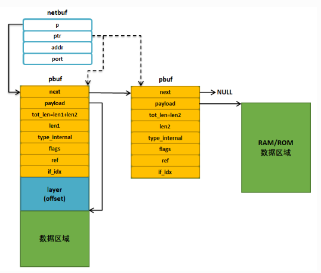
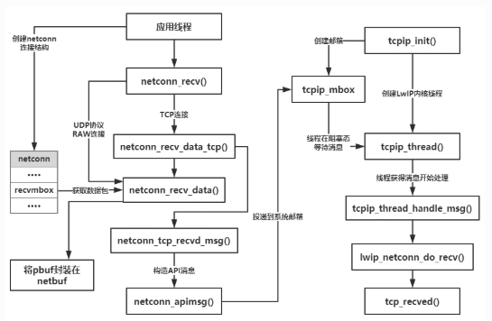

# STM32 LwIP NETCONN接口

RAW 编程接口使得程序效率高，但是需要对 LwIP 有深入的了解，而且不适合大数据量等场合。使用 NETCONN API 时需要有操作系统的支持，可以使得用户专注于用户代码。

## 1. NETCONN 接口

### `netbuf` 结构体

LwIP 为了更好描述应用线程发送与接收的数据，并且为了更好管理这些数据的缓冲区，LwIP 定义了一个 `netbuf` 结构体，它是基于 `pbuf` 上更高一层的封装，记录了主机的 IP 地址与端口号。

```c
 struct netbuf
 {
     struct pbuf *p, *ptr;          
     ip_addr_t addr;               
     u16_t port;                  
 };
```



`netbuf` 是 LwIP 描述用户数据很重要的一个结构体，因为 LwIP 是不可能让用户直接操作 `pbuf` 的，因为分层的思想，应用数据必然是由用户操作的，因此 LwIP 会提供很多函数接口让用户对 `netbuf` 进行操作，无论是 UDP 报文还是 TCP 报文段，其本质都是数据，要发送出去的数据都会封装在 `netbuf` 中，然后通过邮箱发送给内核线程（`tcpip_thread` 线程），然后经过内核的一系列处理，放入发送队列中，然后调用底层网卡发送函数进行发送，反之，应用线程接收到数据，也是通过 `netbuf` 进行管理。

对于 TCP连接，用户只需要提供待发送数据的起始地址和长度，内核会根据实际情况将数据封装在合适大小的数据包中，并放入发送队列中，对于 UDP 来说，用户需要自行将数据封装在 `netbuf` 结构中，当发送函数被调用的时候内核直接将数据包中的数据发送出去。

`netbuf` 的操作函数如下：

|函数 | 描述|
|-|-|
|`netbuf_new()` |申请一个 `netbuf` 空间，但是不会分配任何数据空间(不指向任何的 `pbuf`)，真正的数据存储区域需要调用 `netbuf_alloc()`函数来分配|
|`netbuf_delete()` |释放一个 `netbuf` 的内存，如果 `netbuf` 中的 `p` 指针上还记录有数据，则相应的 pbuf 也会被释放掉|
|`netbuf_alloc()` |为 `netbuf` 结构分配指定大小的数据空间，数据空间是通过 `pbuf` 的形式表现的，函数返回成功分配的数据空间起始地址(`pbuf` 的 `payload` 指向的地址)|
|`netbuf_free()` |释放 `netbuf` 中的 `p` 指向的 `pbuf` 数据空间内存|
|`netfub_ref()`|和 `netbuf_alloc` 类似，不过只是分配一个 `pbuf` 首部结构(首部结构中包含协议的首部空间)，`pbuf` 中的 `payload` 指向参数 `dataptr`，这种描述数据包的方式在静态数据包的发送时经常用到|
|`netbuf_chain()` |将参数 `tail` 的 `pbuf` 连接到参数 `head` 的 `pbuf` 的后面，调用此函数后参数 `tail` 结构会被删除掉|
|`netbuf_data()` |将 `netbuf` 结构中的 `ptr` 指针记录的 `pbuf` 数据起始地址填入参数 `dataptr` 中，同时将该 `pbuf` 中的数据长度填入到参数 `len` 中|
|`netbuf_next()` |将 `netbuf` 结构的 `ptr` 指针指向 `pbuf` 链表中的下一个 `pbuf` 结构|
|`netbuf_first()` |将 `netbuf` 结构的 `ptr` 指针指向 `pbuf` 链表中的第一个 `pbuf` 结构|

### `netconn` 结构体

在使用 RAW 编程接口的时候，对于 UDP 和 TCP 连接使用的是两种不同的编程函数：`udp_xxx` 和 `tcp_xxx`。NETCONN 对于这两种连接提供了统一的编程接口，用于使用同一的连接结构和编程函数，在 `api.h` 中定义了 `netcon` 结构体。

```c
struct netconn
 {
     /** netconn类型 */
     enum netconn_type type;
     /** 当前netconn状态 */
     enum netconn_state state;
     /** LwIP的控制块指针，如TCP控制块、UDP控制块 */
     union
     {
         struct ip_pcb  *ip;
         struct tcp_pcb *tcp;
         struct udp_pcb *udp;
         struct raw_pcb *raw;
     } pcb;
     err_t pending_err;/** 这个netconn最后一个异步未报告的错误 */
     sys_sem_t op_completed; //信号量
     /** 消息邮箱，存储接收的数据，直到它们被提取 */
     sys_mbox_t recvmbox;
     /** 用于TCP服务器上的请求连接缓冲区 */
     sys_mbox_t acceptmbox;

     /** socket描述符，用于Socket API */
 #if LWIP_SOCKET
     int socket;
 #endif /* LWIP_SOCKET */

     /** 标志 */
     u8_t flags;
 #if LWIP_TCP
     /** 当调用netconn_write()函数发送的数据不适合发送缓冲区时，
         数据会暂时存储在current_msg中，等待数据合适的时候进行发送 */
     struct api_msg *current_msg;
 #endif /* LWIP_TCP */
     /** 连接相关的回调函数 */
     netconn_callback callback;
 };
```

在 `api.h` 文件中还定义了连接状态和连接类型，这两个都是枚举类型。

```c
/* 枚举类型，用于描述连接类型 */
enum netconn_type {
 NETCONN_INVALID = 0, 					/* 无效类型 */
 NETCONN_TCP = 0x10, 					/* TCP */
 NETCONN_UDP = 0x20, 					/* UDP */
 NETCONN_UDPLITE = 0x21, 				/* UDPLite */
 NETCONN_UDPNOCHKSUM = 0x22, 			/* 无校验 UDP */
 NETCONN_RAW = 0x40 					/* 原始链接 */
};
/* 枚举类型，用于描述连接状态，主要用于 TCP 连接中 */
enum netconn_state
{
 NETCONN_NONE, 							/* 不处于任何状态 */
 NETCONN_WRITE, 						/* 正在发送数据 */
 NETCONN_LISTEN, 						/* 侦听状态 */
 NETCONN_CONNECT, 						/* 连接状态 */
 NETCONN_CLOSE 							/* 关闭状态 */
};
```

- `netconn` 函数接口：

  |函数 |描述|
  |-|-|
  |`netconn_new()`|这个函数其实就是一个宏定义，用来为新连接申请一个连接结构 `netconn` 空间|
  |`netconn_delete()` |该函数的功能是删除一个 `netconn` 连接结构|
  |`netconn_getaddr()` |该函数用来获取一个 `netconn` 连接结构的源 IP 地址和源端口号或者|
  |`netconn_bind()` |将一个连接结构与本地 IP 地址和端口号进行绑定|
  |`netconn_connect()` | 将一个连接结构与目的 IP 地址和端口号进行绑定|
  |`netconn_disconnect()` |只能用在 UDP 连接结构中，用来断开与服务器的连接|
  |`netconn_listen()` |这个函数就是一个宏定义，只在 TCP 服务器程序中使用，用来将连接结构 `netconn` 置为侦听状态|
  |`netconn_accept()`|这个函数也只用与 TCP 服务器程序中，服务器调用此函数可以获得一个新的连接|
  |`netconn_recv()` |从连接的 `recvmbox` 邮箱中接收数据包，可用于 TCP 连接，也可用于 UDP 连接|
  |`netconn_send()` |用于在已建立的 UDP 连接上发送数据|
  |`netconn_write()` |用于在稳定的 TCP 连接上发送数据|
  |`netconn_close()` |关闭一个 TCP 连接|

  - `netconn_new()`
  
    创建一个新的连接结构，连接结构的类型可以选择为 TCP 或 UDP 等，参数 `type` 描述了连接的类型，可以为`NETCONN_TCP` 或 `NETCONN_UDP` 等。
  
    ```c
    #define netconn_new(t)   netconn_new_with_proto_and_callback(t, 0, NULL)
    
    struct netconn *netconn_new_with_proto_and_callback(enum netconn_type t,u8_t proto,netconn_callback callback);
    ```
  
  - `netconn_delete()`
  
    用于删除一个 `netconn` 连接结构，对于 TCP 连接，如果此时是处于连接状态的，在调用该函数后，将请求内核执行终止连接操作，此时应用线程是无需理会到底是怎么运作的，因为LwIP 内核将会完成所有的挥手过程，需要注意的是此时的 TCP 控制块还是不会立即被删除的，因为需要完成真正的断开挥手操作。而对于 UDP 协议，UDP 控制块将被删除，终止通信。
  
    ```c
    err_t netconn_delete(struct netconn *conn)
    ```
  
  - `netconn_getaddr()`
  
    获取一个 `netconn` 连接结构的源 IP 地址、端口号与目标IP地址、端口号等信息， 并且 IP 地址保存在 `addr` 中，端口号保存在 `port` 中，而 `local` 指定需要获取的信息是本地IP 地址（源 IP 地址） 还是远端 IP 地址（目标 IP 地址），如果是 1 则表示获取本地 IP 地址与端口号，如果为 0 表示远端 IP 地址与端口号。
  
    ```C
    err_t netconn_getaddr(struct netconn *conn,ip_addr_t *addr,u16_t *port,u8_t local);
    ```
  
  - `netconn_bind()`
  
    将一个 IP 地址及端口号与 `netconn` 连接结构进行绑定，如果作为服务器端，这一步操作是必然需要的，同样的， 该函数会调用 `netconn_apimsg()` 函数构造一个 API 消息，并且请求内核执行 `lwip_netconn_do_bind()` 函数， 然后通过`netconn` 连接结构的信号量进行同步，事实上内核线程的处理也是通过函数调用 `xxx_bind`(具体是哪个函数内核是根据`netconn` 的类型决定)完成相应控制块的绑定工作。
  
    ```c
    err_t netconn_bind(struct netconn *conn,const ip_addr_t *addr,u16_t port);
    ```
  
  - `netconn_connect()`
  
    主动建立连接的函数，它一般在客户端中调用，将服务器端的 IP 地址和端口号与本地的 `netconn` 连接结构绑定，当 TCP 协议使用该函数的时候就是进行握手的过程，调用的应用线程将阻塞至握手完成； 而对于 UDP 协议来说，调用该函数只是设置 UDP 控制块的目标 IP 地址与目标端口号，这个函数也是通过调用 `netconn_apimsg()` 函数构造一个API消息，并且请求内核执行 `lwip_netconn_do_connect()` 函数， 然后通过`netconn` 连接结构的信号量进行同步，在`lwip_netconn_do_connect()`函数中，根据 `netconn` 的类型不同，调用对应的 `xxx_connect()`函数进行对应的处理。
  
    ```c
    err_t netconn_connect(struct netconn *conn,const ip_addr_t *addr,u16_t port);
    ```
  
  - `netconn_disconnect()`
  
    用于终止一个 UDP 协议的通信。
  
    ```c
    err_t netconn_disconnect(struct netconn *conn);
    ```
  
  - `netconn_listen()`
  
    只适用于 TCP 服务器中调用，让 `netconn` 连接结构处于监听状态，同时让 TCP 控制块的状态处于 LISTEN 状态， 以便客户端连接，它通过 `netconn_apimsg()`函数请求内核执行`lwip_netconn_do_listen()`处理 TCP 连接的监听状态，并且在这个函数中会创建一个连接邮箱 ——  `acceptmbox` 邮箱在`netconn`  连接结构中， 然后在 TCP  控制块中注册连接回调函数 —— `accept_function()`，当有客户端连接的时候，这个回调函数被执行，并且向 `acceptmbox` 邮箱发送一个消息，通知应用程序有一个新的客户端连接，以便用户去处理这个连接。在 `lwip_netconn_do_listen()` 函数处理完成的时候会释放一个信号量，以进行线程间的同步。
  
    ```c
    #define netconn_listen(conn) netconn_listen_with_backlog(conn, TCP_DEFAULT_LISTEN_BACKLOG)
    
    err_t netconn_listen_with_backlog(struct netconn *conn, u8_t backlog);
    ```
  
  - `netconn_accept()`
  
    用于 TCP 服务器中，接受远端主机的连接，内核会在`acceptmbox` 邮箱中获取一个连接请求，如果邮箱中没有连接请求，将阻塞应用程序，直到接收到从远端主机发出的连接请求。调用这个函数的应用程序必须处于监听（LISTEN）状态，因此在调用 `netconn_accept()` 函数之前必须调用 `netconn_listen()` 函数进入监听状态，在与远程主机的连接建立后，函数返回一个连接结构 `netconn`；该函数在并不会构造一个 API 消息，而是直接获取 `acceptmbox` 邮箱中的连接请求，如果没有连接请求，将一直阻塞，当接收到远端主机的连接请求后，它会触发一个连接事件的回调函数（`netconn` 结构体中的回调函数字段），连接的信息由 `accept_function()` 函数完成。
  
    ```c
    err_t netconn_accept(struct netconn *conn, struct netconn **new_conn);
    ```
  
  - `netconn_recv()`
  
    接收一个 UDP 或者 TCP 的数据包，从 `recvmbox` 邮箱中获取数据包，如果该邮箱中没有数据包，那么线程调用这个函数将会进入阻塞状态以等待消息的到来，如果在等待TCP连接上的数据时，远端主机终止连接，将返回一个终止连接的错误代码（ERR_CLSD），应用程序可以根据错误的类型进行不一样的处理。
  
    对应TCP连接，`netconn_recv()` 函数将调用`netconn_recv_data_tcp()` 函数去获取 TCP 连接上的数据，在获取数据的过程中，调用`netconn_recv_data()`函数从`recvmbox` 邮箱获取 `pbuf`，然后通过`netconn_tcp_recvd_msg()`->`netconn_apimsg()`函数构造一个API消息投递给系统邮箱，请求内核执行`lwip_netconn_do_recv()`函数，该函数将调用`tcp_recved()`函数去更新 TCP 接收窗口， 同时`netconn_recv() `函数将完成 `pbuf` 数据包封装在 `netbuf` 中，返回应用程序；而对于 UDP 协议、RAW连接，将直接调用`netconn_recv_data()`函数获取数据，完成 `pbuf` 封装在`netbuf` 中，返回给应用程序。
  
    
  
    ```c
    err_t netconn_recv(struct netconn *conn, struct netbuf **new_buf);
    ```
  
  - `netconn_send()`
  
    用于 UDP 协议、RAW 连接发送数据， 通过参数 `conn` 选择指定的 UDP 或者 RAW 控制块发送参数 `buf` 中的数据，UDP/RAW 控制块中已经记录了目标 IP 地址与目标端口号。这些数据被封装在 `netbuf`中，如果没有使用 IP 数据报分片功能，那么这些数据不能太大，数据长度不能大于网卡最大传输单元 MTU，因为这个 API 目前还没有提供直接获取底层网卡最大传输单元 MTU 数值的函数，这就需要采用其它的途径来避免超过 MTU 值，所以规定了一个上限，即 `netbuf` 中包含的数据不能大于1000个字节，需要在发送数据的时候注意，使用了 IP 数据报分片功能是，不用管这些限制。该函数会调用 `netconn_apimsg()` 函数构造一个 API 消息，并且请求内核执行`lwip_netconn_do_send() `函数，这个函数会通过消息得到目标 IP 地址与端口号以及 `pbuf`数据报等信息，然后调用 `raw_send()`/`udp_send()` 等函数发送数据，最后通过 `netconn` 连接结构的信号量进行同步。
  
    ```c
    err_t netconn_send(struct netconn *conn, struct netbuf *buf);
    ```
  
  - `netconn_write()`
  
    处于稳定连接状态的 TCP 协议发送数据。
  
    当 `apiflags` 的值为 `NETCONN_COPY` 时，`dataptr`指针指向的数据将会被拷贝到为这些数据分配的内部缓冲区，在调用本函数之后可以直接对这些数据进行修改而不会影响数据，但是拷贝的过程是需要消耗系统资源的，CPU 需要参与数据的拷贝，而且还会占用新的内存空间。
  
    如果 `apiflags` 值为 `NETCONN_NOCOPY` ，数据不会被拷贝而是直接使用`dataptr`指针来引用。但是这些数据在函数调用后不能立即被修改，因为这些数据可能会被放在当前 TCP 连接的重传队列中，以防对方未收到数据进行重传，而这段时间是不确定的。但是如果用户需要发送的数据在 ROM 中（静态数据），无需拷贝数据，直接引用数据即可。
  
    如果 `apiflags` 值为 `NETCONN_MORE`，那么接收端在组装这些 TCP 报文段的时候，会将报文段首部的 PSH 标志置一，这些数据完成组装的时候，将会被立即递交给上层应用。
  
    如果 `apiflags` 值为 `NETCONN_DONTBLOCK`，表示在内核发送缓冲区满的时候，再调用 `netconn_write()` 函数将不会被阻塞，而是会直接返回一个错误代码 `ERR_VAL` 告诉应用程序发送数据失败，应用程序可以自行处理这些数据，在适当的时候进行重传操作。
  
    如果 `apiflags` 值为 `NETCONN_NOAUTORCVD`，表示在 TCP 协议接收到数据的时候，调用 `netconn_recv_data_tcp() `函数的时候不会去更新接收窗口，只能由用户自己调用 `netconn_tcp_recvd()` 函数完成接收窗口的更新操作。
  
    ```c
    err_t netconn_write_partly(struct netconn *conn,const void *dataptr,size_t size,u8_t apiflags,size_t *bytes_written);
    ```
  
  - `netconn_close()`
  
    `netconn_close()` 函数用于主动终止一个 TCP 连接，它通过调用`netconn_apimsg()` 函数构造一个API消息，并且请求内核执行 `lwip_netconn_do_close()`函数，然后通过 `netconn` 连接结构的信号量进行同步，内核会完成终止 TCP 连接的全过程。
  
    ```c
    err_t netconn_close(struct netconn *conn)
    {
         return netconn_close_shutdown(conn, NETCONN_SHUT_RDWR);
    }
    
    static err_t netconn_close_shutdown(struct netconn *conn, u8_t how)
    ```
  
    