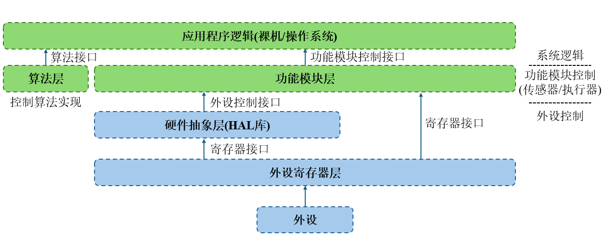
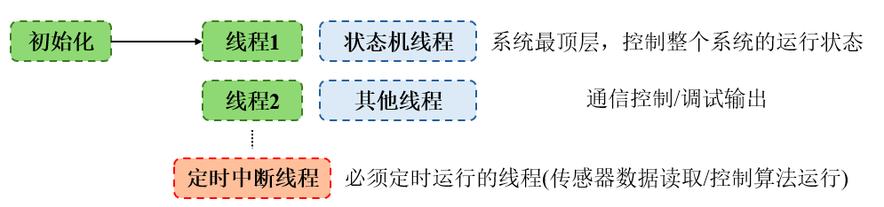
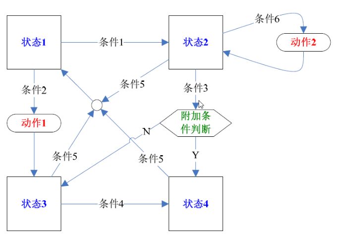

# 工程框架

大型工程中的工程框架是十分重要的，框架搭的好，代码就会十分易读。笔者这里介绍自己常用的工程框架搭建方法。

## 1. 分层架构

分层架构对于嵌入式工程是必要的。常见的分层架构体系如下：



通常需要实现**算法层**，**功能模块层**和**应用程序逻辑层**。以笔者自己设计的 FOC 电机控制台架代码为例，其文件架构如下：

```
FOC_Project
├─ Usercode											// 应用程序逻辑层，实现FOC算法框架
│  ├─ drivefoc.c
│  ├─ drivefoc.h
│  ├─ loadfoc.c
│  ├─ loadfoc.h
│  ├─ userinit.c
│  ├─ userinit.h
│  ├─ usermain.c
│  ├─ usermain.h
│  ├─ userpara.c
│  ├─ userpara.h
│  ├─ user_transfunc.c
│  └─ user_transfunc.h
├─ HFI												// 应用程序逻辑层
│  ├─ square_hfi.c
│  └─ square_hfi.h
├─ Hardwarecode										// 应用程序逻辑层，实现其他小型功能
│  ├─ hwdac.c
│  ├─ hwdac.h
│  ├─ hwinit.c
│  ├─ hwinit.h
│  ├─ hwit.c
│  ├─ hwit.h
│  └─ hwprint.c
├─ FOC												// 算法层
│  ├─ coordinate_transform.c
│  ├─ coordinate_transform.h
│  ├─ curr_sample.c
│  ├─ curr_sample.h
│  ├─ foc_math.c
│  ├─ foc_math.h
│  ├─ svpwm.c
│  └─ svpwm.h
├─ Encoder											// 功能模块层
│  ├─ ad2s1210.c
│  └─ ad2s1210.h
├─ Core												// (系统生成)硬件抽象层	
│  ├─ Src
│  │  ├─ adc.c
│  │  ├─ dac.c
│  │  ├─ gpio.c
│  │  ├─ main.c
│  │  ├─ memorymap.c
│  │  ├─ spi.c
│  │  ├─ stm32h7xx_hal_msp.c
│  │  ├─ stm32h7xx_it.c
│  │  ├─ system_stm32h7xx.c
│  │  ├─ tim.c
│  │  └─ usart.c
│  └─ Inc
│     ├─ adc.h
│     ├─ dac.h
│     ├─ gpio.h
│     ├─ main.h
│     ├─ memorymap.h
│     ├─ spi.h
│     ├─ stm32h7xx_hal_conf.h
│     ├─ stm32h7xx_it.h
│     ├─ tim.h
│     └─ usart.h
```

对于算法层和功能模块层，要点在于**不应当设置全局变量**，应当设置对应算法/功能模块的**数据类型(数据)**和**调用方法**。

比如 MT6701 编码器控制文件：

```c
// mt6701.h
/**
 * @file    STM32 MT6701 磁编码器驱动程序
 * @brief   MT6701 是 14Bit 的单圈绝对角度检测传感器,拥有 ABZ/PWM/模拟量/I2C/SPI 等多种信息输出方式,这里采用 IIC 进行数据输出
 * @attention   使用前请选择驱动方式(硬件/软件IIC)
 *              使用时使用MT6701_Init()进行初始化
 *              在一个循环的程序中定时运行MT6701_Get_Angle()
 * @author  SSC
 */
#ifndef __MT6701_H
#define __MT6701_H

#include "stm32g4xx.h"

/************************ 驱动方式选择 ********************************/

#define MT6701_SoftWare_IIC 1 // 使用软件IIC
#define MT6701_HardWare_IIC 0 // 使用硬件IIC

/*************************** 端口定义 *********************************/

#if (MT6701_SoftWare_IIC == 1)

#define MT6701_SCL_Port GPIOA
#define MT6701_SDA_Port GPIOB
#define MT6701_SCL_Pin  GPIO_PIN_15
#define MT6701_SDA_Pin  GPIO_PIN_7

#endif

/************************** 寄存器定义 ********************************/

#define MT6701_ANGLE_REG 0x03 // 角度寄存器

#define MT6701_ADDR      0x06 // 设备地址

/*************************** 函数定义 *********************************/
void MT6701_Get_Angle(float *encoder_angle);

#endif
```

```c
// mt6701.c
#include "mt6701.h"

/*******************宏定义部分*************************/

/* 如果使能软件IIC */
#if (MT6701_SoftWare_IIC == 1)
#include <inttypes.h>
#include "gpio.h"
#define IIC_WR 0 /* 写控制bit */
#define IIC_RD 1 /* 读控制bit */
#define IIC_SCL(x)                                                                                                                                        \
    do {                                                                                                                                                  \
        (x == 1) ? HAL_GPIO_WritePin(MT6701_SCL_Port, MT6701_SCL_Pin, GPIO_PIN_SET) : HAL_GPIO_WritePin(MT6701_SCL_Port, MT6701_SCL_Pin, GPIO_PIN_RESET); \
    } while (0)

#define IIC_SDA(x)                                                                                                                                        \
    do {                                                                                                                                                  \
        (x == 1) ? HAL_GPIO_WritePin(MT6701_SDA_Port, MT6701_SDA_Pin, GPIO_PIN_SET) : HAL_GPIO_WritePin(MT6701_SDA_Port, MT6701_SDA_Pin, GPIO_PIN_RESET); \
    } while (0)

#define IIC_SDA_READ() HAL_GPIO_ReadPin(MT6701_SDA_Port, MT6701_SDA_Pin) /* 读SDA口线状态 */
#endif

/* 如果使能硬件IIC */
#if (MT6701_HardWare_IIC == 1)

#include "i2c.h"
#define MT6701_WRITE_ADDR (0x0C) // MT6701 写地址
#define MT6701_READ_ADDR  (0x0D) // MT6701 读地址

#endif

/*****************IIC基础驱动函数**********************/

/* 如果使能软件IIC */

#if (MT6701_SoftWare_IIC == 1)
/**
 * @brief               IIC 总线延迟，最快为400kHz
 * @attention           循环次数为10时，SCL频率 = 205KHz
                        循环次数为7时，SCL频率 = 347KHz， SCL高电平时间1.5us，SCL低电平时间2.87us
                        循环次数为5时，SCL频率 = 421KHz， SCL高电平时间1.25us，SCL低电平时间2.375us
*/
static void _IIC_Delay(void)
{
    uint8_t i;

    for (i = 0; i < 10; i++);
}

/**
 * @brief       CPU发起IIC总线启动信号
 * @attention   当SCL高电平时，SDA出现一个下跳沿表示IIC总线启动信号
 */
static void _IIC_Start(void)
{
    IIC_SDA(1);
    IIC_SCL(1);
    _IIC_Delay();
    IIC_SDA(0);
    _IIC_Delay();
    IIC_SCL(0);
    _IIC_Delay();
}

/**
 * @brief       CPU发起IIC总线停止信号
 * @attention   当SCL高电平时，SDA出现一个上跳沿表示IIC总线停止信号
 */
static void _IIC_Stop(void)
{
    IIC_SDA(0);
    IIC_SCL(1);
    _IIC_Delay();
    IIC_SDA(1);
}

/**
 * @brief       CPU向IIC总线设备发送8bit数据
 * @param       byte    发送的8字节数据
 */
static void _IIC_Send_Byte(uint8_t byte)
{
    uint8_t i;

    /* 先发送字节的高位bit7 */
    for (i = 0; i < 8; i++) {
        if (byte & 0x80) {
            IIC_SDA(1);
        } else {
            IIC_SDA(0);
        }
        _IIC_Delay();
        IIC_SCL(1);
        _IIC_Delay();
        IIC_SCL(0);
        if (i == 7) {
            IIC_SDA(1); // 释放总线
        }
        byte <<= 1; // 左移一位
        _IIC_Delay();
    }
}

/**
 * @brief   CPU产生一个ACK信号
 */
static void _IIC_Ack(void)
{
    IIC_SDA(0); /* CPU驱动SDA = 0 */
    _IIC_Delay();
    IIC_SCL(1); /* CPU产生1个时钟 */
    _IIC_Delay();
    IIC_SCL(0);
    _IIC_Delay();
    IIC_SDA(1); /* CPU释放SDA总线 */
}

/**
 * @brief   CPU产生1个NACK信号
 */
static void _IIC_NAck(void)
{
    IIC_SDA(1); /* CPU驱动SDA = 1 */
    _IIC_Delay();
    IIC_SCL(1); /* CPU产生1个时钟 */
    _IIC_Delay();
    IIC_SCL(0);
    _IIC_Delay();
}

/**
 * @brief   CPU从IIC总线设备读取8bit数据
 * @return  读取的数据
 */
static uint8_t _IIC_Read_Byte(uint8_t ack)
{
    uint8_t i;
    uint8_t value;

    /* 读到第1个bit为数据的bit7 */
    value = 0;
    for (i = 0; i < 8; i++) {
        value <<= 1;
        IIC_SCL(1);
        _IIC_Delay();
        if (IIC_SDA_READ()) {
            value++;
        }
        IIC_SCL(0);
        _IIC_Delay();
    }
    if (ack == 0)
        _IIC_NAck();
    else
        _IIC_Ack();
    return value;
}

/**
 * @brief   CPU产生一个时钟，并读取器件的ACK应答信号
 * @return  返回0表示正确应答，1表示无器件响应
 */
static uint8_t _IIC_Wait_Ack(void)
{
    uint8_t re;

    IIC_SDA(1); /* CPU释放SDA总线 */
    _IIC_Delay();
    IIC_SCL(1); /* CPU驱动SCL = 1, 此时器件会返回ACK应答 */
    _IIC_Delay();
    if (IIC_SDA_READ()) /* CPU读取SDA口线状态 */
    {
        re = 1;
    } else {
        re = 0;
    }
    IIC_SCL(0);
    _IIC_Delay();
    return re;
}

/**
 * @brief   配置IIC总线的GPIO，采用模拟IO的方式实现
 * @attention   在CubeMX里实现，选择高速开漏输出
 */
void _IIC_GPIO_Init(void)
{
    MX_GPIO_Init();
    _IIC_Stop();
}

/**
 * @brief   检测IIC总线设备，CPU向发送设备地址，然后读取设备应答来判断该设备是否存在
 * @param   _Address 设备的IIC总线地址
 * @return  0表示正确,1表示未探测到
 */
static uint8_t _IIC_CheckDevice(uint8_t _Address)
{
    uint8_t ucAck;

    _IIC_GPIO_Init();                  /* 配置GPIO */
    _IIC_Start();                      /* 发送启动信号 */
    _IIC_Send_Byte(_Address | IIC_WR); /* 发送设备地址+读写控制bit（0 = w， 1 = r) bit7 先传 */
    ucAck = _IIC_Wait_Ack();           /* 检测设备的ACK应答 */
    _IIC_Stop();                       /* 发送停止信号 */

    return ucAck;
}

/**
 * @brief   IIC连续写
 * @param   addr    器件地址
 * @param   reg     寄存器地址
 * @param   len     写入长度
 * @param   buf     数据区
 */
uint8_t MT6701_Write_Len(uint8_t addr, uint8_t reg, uint8_t len, uint8_t *buf)
{
    uint8_t i;
    _IIC_Start();
    _IIC_Send_Byte((addr << 1) | 0); // 发送器件地址+写命令
    if (_IIC_Wait_Ack())             // 等待应答
    {
        _IIC_Stop();
        return 1;
    }
    _IIC_Send_Byte(reg); // 写寄存器地址
    _IIC_Wait_Ack();     // 等待应答
    for (i = 0; i < len; i++) {
        _IIC_Send_Byte(buf[i]); // 发送数据
        if (_IIC_Wait_Ack())    // 等待ACK
        {
            _IIC_Stop();
            return 1;
        }
    }
    _IIC_Stop();
    return 0;
}

/**
 * @brief   IIC连续读
 * @param   addr    器件地址
 * @param   reg     寄存器地址
 * @param   len     写入长度
 * @param   buf     数据区
 */
uint8_t MT6701_Read_Len(uint8_t addr, uint8_t reg, uint8_t len, uint8_t *buf)
{
    _IIC_Start();
    _IIC_Send_Byte((addr << 1) | 0); // 发送器件地址+写命令
    if (_IIC_Wait_Ack())             // 等待应答
    {
        _IIC_Stop();
        return 1;
    }
    _IIC_Send_Byte(reg); // 写寄存器地址
    _IIC_Wait_Ack();     // 等待应答
    _IIC_Start();
    _IIC_Send_Byte((addr << 1) | 1); // 发送器件地址+读命令
    _IIC_Wait_Ack();                 // 等待应答
    while (len) {
        if (len == 1)
            *buf = _IIC_Read_Byte(0); // 读数据,发送nACK
        else
            *buf = _IIC_Read_Byte(1); // 读数据,发送ACK
        len--;
        buf++;
    }
    _IIC_Stop(); // 产生一个停止条件
    return 0;
}

/**
 * @brief   IIC写字节
 * @param   reg     寄存器地址
 * @param   data    数据
 */
static uint8_t MT6701_Write_Byte(uint8_t reg, uint8_t data)
{
    _IIC_Start();
    _IIC_Send_Byte((MT6701_ADDR << 1) | 0); // 发送器件地址+写命令
    if (_IIC_Wait_Ack())                    // 等待应答
    {
        _IIC_Stop();
        return 1;
    }
    _IIC_Send_Byte(reg);  // 写寄存器地址
    _IIC_Wait_Ack();      // 等待应答
    _IIC_Send_Byte(data); // 发送数据
    if (_IIC_Wait_Ack())  // 等待ACK
    {
        _IIC_Stop();
        return 1;
    }
    _IIC_Stop();
    return 0;
}

/**
 * @brief   IIC读字节
 * @param   reg     寄存器地址
 */
static uint8_t MT6701_Read_Byte(uint8_t reg)
{
    uint8_t res;
    _IIC_Start();
    _IIC_Send_Byte((MT6701_ADDR << 1) | 0); // 发送器件地址+写命令
    _IIC_Wait_Ack();                        // 等待应答
    _IIC_Send_Byte(reg);                    // 写寄存器地址
    _IIC_Wait_Ack();                        // 等待应答
    _IIC_Start();
    _IIC_Send_Byte((MT6701_ADDR << 1) | 1); // 发送器件地址+读命令
    _IIC_Wait_Ack();                        // 等待应答
    res = _IIC_Read_Byte(0);                // 读取数据,发送nACK
    _IIC_Stop();                            // 产生一个停止条件
    return res;
}

#endif

/* 如果使能硬件IIC */
#if (MT6701_HardWare_IIC == 1)

/**
 * @brief   MT6701 向寄存器内写字节
 * @param   reg     寄存器地址
 * @param   value   数据
 */
static uint8_t MT6701_Write_Byte(uint8_t reg, uint8_t data)
{
    return HAL_I2C_Mem_Write(&hi2c1, MT6701_WRITE_ADDR, reg, I2C_MEMADD_SIZE_8BIT, &data, 1, 50);
}

/**
 * @brief   MT6701 向寄存器内连续写
 * @param   reg     寄存器地址
 * @param   value   数据
 * @param   len     数据长度
 */
static uint8_t MT6701_Write_Len(uint8_t addr, uint8_t reg, uint8_t len, uint8_t *buf)
{
    return HAL_I2C_Mem_Write(&hi2c1, MT6701_WRITE_ADDR, reg, I2C_MEMADD_SIZE_8BIT, buf, len, 50);
}

/**
 * @brief   MT6701 从寄存器内连续读
 * @param   reg     寄存器地址
 * @param   buf     数据
 * @param   len     数据长度
 */
static uint8_t MT6701_Read_Len(uint8_t addr, uint8_t reg, uint8_t len, uint8_t *buf)
{
    return HAL_I2C_Mem_Read(&hi2c1, MT6701_READ_ADDR, reg, I2C_MEMADD_SIZE_8BIT, buf, len, 50);
}

#endif

/*********************************用户函数*******************************************/

/**
 * @brief   MT6701 初始化函数
 */
void MT6701_Init(void)
{
#if (MT6701_SoftWare_IIC == 1)
    _IIC_GPIO_Init(); // 初始化IIC总线
#endif
}

/**
 * @brief   MT6701 读取角度
 * @param   angle  绝对角度值
 */
void MT6701_Get_Angle(float *angle)
{
    uint8_t temp[2];
    int16_t encoder_angle;
    MT6701_Read_Len(MT6701_ADDR, MT6701_ANGLE_REG, 2, temp);

    encoder_angle = ((int16_t)temp[0] << 6) | (temp[1] >> 2);
    *angle        = (float)encoder_angle * (2 * 3.141592654f) / 16384.f;
}
```

或者控制算法文件：

```c
// user_transfunc.h
#ifndef __USER_TRANSFUNC_H
#define __USER_TRANSFUNC_H

#include "foc_math.h"

/**
 * PID 相关定义
 */
typedef struct {
    float KP;        // PID参数P
    float KI;        // PID参数I
    float KD;        // PID参数D
    float fdb;       // PID反馈值
    float ref;       // PID目标值
    float cur_error; // 当前误差
    float error[2];  // 前两次误差
    float output;    // 输出值
    float outputMax; // 最大输出值的绝对值
    float outputMin; // 最小输出值的绝对值用于防抖
} PID_t;

/**
 * IIR 滤波器相关定义
 */
typedef struct
{
    float tsample;     // 采样时间
    float wc;          // 截止频率
    float alpha;       // 滤波器系数
    float input;       // 当前输入值
    float output_last; // 前次输出值
    float output;      // 当前输出值
} LPF_t;

void PID_init(PID_t *pid, float kp, float ki, float kd, float outputMax);
void PID_Calc(PID_t *pid, uint8_t enable, float t_sample);

void LPF_Init(LPF_t *lpf, float f_c, float t_sample);
void LPF_Calc(LPF_t *lpf, uint8_t enable);

#endif
```

```c
// user_transfunc.c
#include "user_transfunc.h"

/****************************** PID 控制器 ********************************* */

/**
 * @brief   增量式 PID 控制器初始化
 * @param   pid         PID 控制器句柄
 * @param   kp          Kp  比例参数
 * @param   ki          Ki  积分参数(考虑采样时间)
 * @param   kd          Kd  微分参数
 * @param   outputMax   输出饱和值
 */
void PID_init(PID_t *pid, float kp, float ki, float kd, float outputMax)
{
    pid->KP        = kp;
    pid->KI        = ki;
    pid->KD        = kd;
    pid->outputMax = outputMax;
}

/**
 * @brief   增量式PID计算
 * @param   pid         PID 控制器句柄
 * @param   enable      使能信号    若此值为0,PID控制器的输入,反馈和输出都置为0
 * @param   t_sample    采样时间
 */
void PID_Calc(PID_t *pid, uint8_t enable, float t_sample)
{
    if (enable == 1) {
        pid->cur_error = pid->ref - pid->fdb;
        pid->output += pid->KP * (pid->cur_error - pid->error[1]) + pid->KI * t_sample * pid->cur_error + pid->KD * (pid->cur_error - 2 * pid->error[1] + pid->error[0]);
        pid->error[0] = pid->error[1];
        pid->error[1] = pid->ref - pid->fdb;
        /*设定输出上限*/
        if (pid->output > pid->outputMax) pid->output = pid->outputMax;
        if (pid->output < -pid->outputMax) pid->output = -pid->outputMax;
    } else {
        pid->ref       = 0;
        pid->fdb       = 0;
        pid->output    = 0;
        pid->cur_error = 0;
        pid->error[0]  = 0;
        pid->error[1]  = 0;
    }
}

/****************************** IIR 滤波器 ********************************* */

/**
 * @brief   数字一阶低通滤波器初始化(后向差分法)
 * @param   lpf         滤波器句柄
 * @param   f_c         截止频率
 * @param   t_sample    采样时间
 */
void LPF_Init(LPF_t *lpf, float f_c, float t_sample)
{
    lpf->wc          = 2 * M_PI * f_c;
    lpf->tsample     = t_sample;
    lpf->alpha       = (lpf->wc * lpf->tsample) / ((lpf->wc * lpf->tsample) + 1.0f);
    lpf->output_last = 0;
    lpf->output      = 0;
    lpf->input       = 0;
}

/**
 * @brief   数字一阶低通滤波器计算(后向差分法)
 * @param   lpf         滤波器句柄
 * @param   enable      滤波器使能参数
 */
void LPF_Calc(LPF_t *lpf, uint8_t enable)
{
    if (enable == 1) {
        lpf->output      = lpf->output_last + lpf->alpha * (lpf->input - lpf->output_last);
        lpf->output_last = lpf->output;
    } else {
        lpf->output      = 0;
        lpf->output_last = 0;
        lpf->input       = 0;
    }
}
```

> 层内调用函数(层外不调用)应当内联(使用`inline`关键字/`static`关键字)。

## 2. 应用程序逻辑的实现



系统需要一个状态机控制整体的运行状态，同时必要的采样/控制算法需要在定时器中断内运行。其他线程(如通讯控制/屏幕显示/调试输出print)可以在主线程内(裸机)，也可以放在主线程外(操作系统)。

对应的文件架构如下(以 FOC 电机台架为例)：

```c
// usermain.c

#include "usermain.h"

/**
 * @brief   Init Program
 */
static void init(void)
{
    // User init
    user_init();
    // Hardware init
    hw_init();
}

/**
 * @brief   主函数
 */
void usermain(void)
{
    init();
    while (1) {
        // DAC Print
        // Usart Print
        if (system_print == 0) {
            printf("U:%f,%f\r\n", Drive_AD2S.Electrical_Angle, Drive_hfi.theta_obs);
        } else if (system_print == 1) {
            printf("U:%f,%f\r\n", Drive_AD2S.Speed, Drive_hfi.speed_obs);
        } else if (system_print == 2) {
            printf("U:%f,%f\r\n", Drive_ish_filter.output, Drive_hfi.ish);
        } else if (system_print == 3) {
            printf("U:%f\r\n", Drive_hfi.u_h);
        }
    }
}

/**
 * @brief   ADC Injected Channel interrupt Callback function
 */
void HAL_ADCEx_InjectedConvCpltCallback(ADC_HandleTypeDef *hadc)
{
    HAL_GPIO_WritePin(GPIOF, GPIO_PIN_4, 0); // Caculate running time

    /**********************************
     * @brief   Sample Calculate
     */
    hw_curr_sample(hadc);

    // Angle and Speed Sample
    AD2S1210_Angle_Get(); // Angle Sample
    AD2S1210_Speed_Get(); // Speed Sample
    /**********************************
     * @brief   FOC Calculate
     */
    drive_foc_calc();
    load_foc_calc();

    /**********************************
     * @brief   Voltage-Source Inverter Control
     */
    if (system_enable == 0) {
        TIM8->CCR1 = 0;
        TIM8->CCR2 = 0;
        TIM8->CCR3 = 0;
        TIM1->CCR1 = 0;
        TIM1->CCR2 = 0;
        TIM1->CCR3 = 0;
    } else {
        TIM8->CCR1 = Drive_duty_abc.dutya * TIM8->ARR;
        TIM8->CCR2 = Drive_duty_abc.dutyb * TIM8->ARR;
        TIM8->CCR3 = Drive_duty_abc.dutyc * TIM8->ARR;
        TIM1->CCR1 = Load_duty_abc.dutya * TIM1->ARR;
        TIM1->CCR2 = Load_duty_abc.dutyb * TIM1->ARR;
        TIM1->CCR3 = Load_duty_abc.dutyc * TIM1->ARR;
    }

    /**********************************
     * @brief   DAC Output
     */
    hw_dac_output();
    HAL_DAC_SetValue(&hdac1, DAC_CHANNEL_1, DAC_ALIGN_12B_R, system_dac_value1);
    HAL_DAC_SetValue(&hdac1, DAC_CHANNEL_2, DAC_ALIGN_12B_R, system_dac_value2);

    HAL_GPIO_WritePin(GPIOF, GPIO_PIN_4, 1); // Caculate running time
}

/**
 * @brief   Timer interrupt
 */
void HAL_TIM_PeriodElapsedCallback(TIM_HandleTypeDef *htim)
{
    if (htim->Instance == TIM8) {
    }
}
```

> - `usermain.c`文件和 CubeMX 生成的 `main.c` 文件地位一致，通常 `main.c` 文件执行完外设初始化后，就会直接进入`usermain.c` 内的 `usermain()` 函数，也就是说 `usermain()` 函数是真正的 main 函数。这样可以避免 CubeMX 生成代码导致的可读性低。
> - `usermain.c` 文件只放入系统最上层的线程(状态机/通信控制/中断线程)，为保证可读性(`usermain.c` 文件降低行数)，笔者更习惯于列出这些线程后对内部的内容进行二次封装。
> - `usermain.h` 文件包含了所有头文件。

1. 中断线程可以分为快中断线程和慢中断线程，这取决于所需的控制频率和采样频率。

2. 控制算法应当精简，**中断占用率不能太高**，不然会死机。

3. 状态机可以采用 `switch-case` 架构：

   ```
   switch(状态变量):
   	case 状态1：
   		// 设置该状态下启动的线程/指令变化
   		// 设置该状态下的状态转换条件
   		break;
   	case 状态2:
   		...
   	default:
   		// 默认状态
   		break;
   ```

   状态机可以控制指令的变化/子线程的解挂和挂起。在设计状态机前，可以**绘制状态转换图**帮助明确转换条件和每个状态下的动作。

   

4. **全局变量可以在应用程序逻辑中出现。**