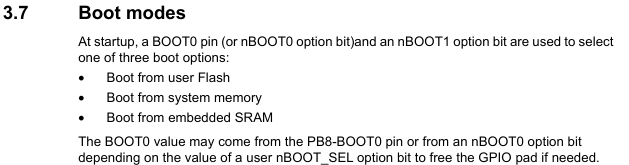
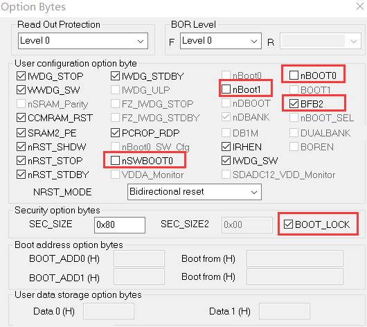

# Boot0 的软件配置

[参考链接](https://shequ.stmicroelectronics.cn/thread-631814-1-1.html)

STM32 一般可以通过 BOOT0 和 BOOT1 的不同组合来设置启动方式。但是在引脚资源稀缺的情况下，有些时候需要将 BOOT0 的引脚配置为其他的功能（比如IIC，此时需要硬件上拉）。

BOOT0 可以通过 BOOT0 引脚来设置，也可以通过 `Option Byte` 中的 `nBOOT0 option bit` 来设置，现在不能通过前者来设置，只能通过 `Option Byte` 中的 `nBOOT0 option bit` 来设置系统的启动方式。

需要通过把 `nSWBOOT0` 位设置为 0 来选择使用软件 BOOT0，接下来把 `nBOOT0` 位设置为 0 即可。

使用 STM32 ST-LINK Utility 来操作，连接上 STM32 之后，点击 Target -> Option Bytes 之后，按照下图修改即可：

