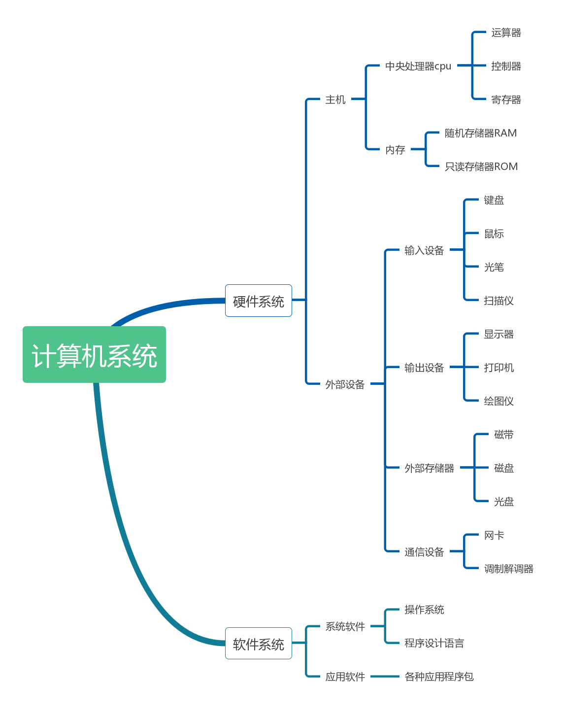
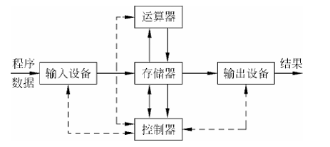
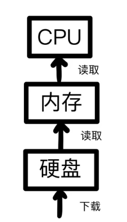
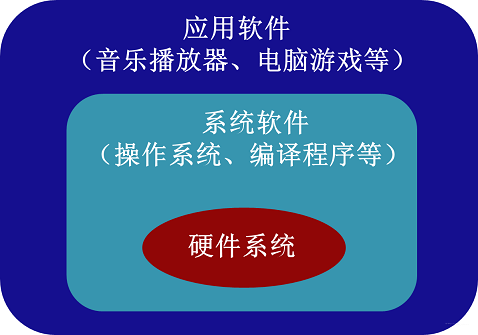
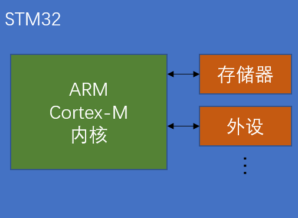
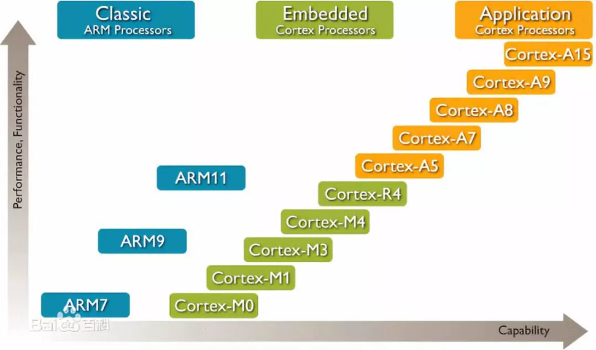
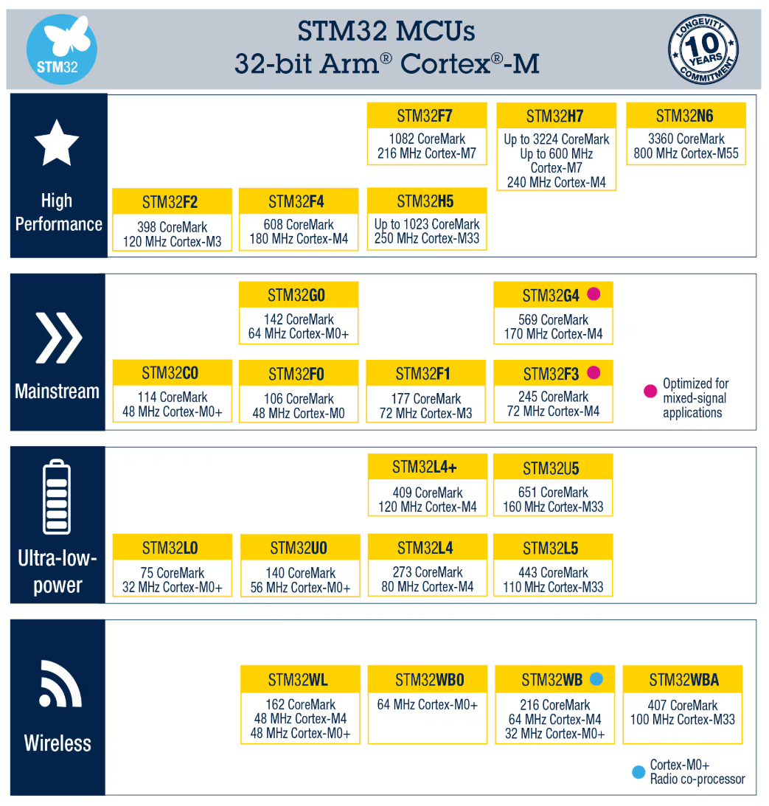
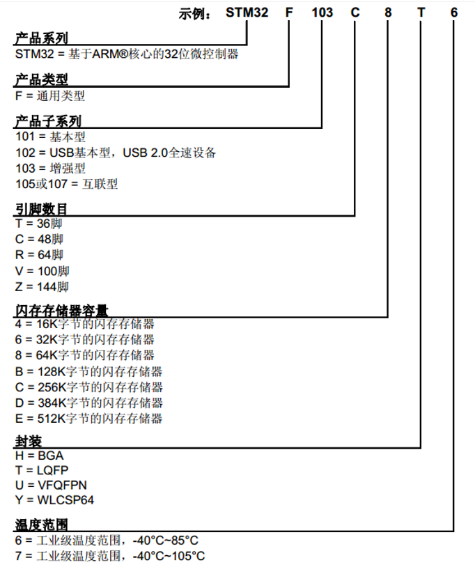

# STM32 1_嵌入式系统的基本概念

> 嵌入式系统本质上就是一个资源及其有限的电脑，个人电脑包含各种硬件外设 (比如鼠标，键盘，显示器)，而嵌入式系统只能包含十分简单的外设。学习基本的嵌入式系统，就相当于学习怎么驱动各种外设以及计算机系统的基本工作原理。
>
> 对于控制而言，嵌入式系统是一个工具，实时性很高的工具，初学时可以学习怎么使用，而后学到深入时或实际运用时再细究其原理。

## 1. 计算机的基本组成

计算机是一种能够按照程序对数据进行自动处理的电子设备。组成计算机硬件的主体是电子器件和电子线路，计算机存储和处理的是数字信息，存储在计算机中的程序通过控制器控制计算机的信息处理工作。

目前主流的计算机使用的是冯诺依曼计算机体系。

   

图1.计算机基本组成
 

### 1. 硬件子系统

   

图2.计算机硬件的基本组成,实线为数据线,虚线为控制线和反馈线
 

计算机硬件由**控制器、运算器、存储器、输入设备和输出设备**5个部分组成。

> 1. 运算器(arithmetic unit)用来完成算术运算和逻辑运算。
> 2. 存储器(memory)用来存放数据和程序。 
> 3. 控制器(control unit)用来协调与控制程序和数据的输入、程序的执行以及运算结果的处理。控制器工作的依据是存储在存储器中的程序，即控制器是按程序的要求控制计算机各个部分协调一致地工作，完成程序规定的任务。 
> 4. 输入设备(input device)用于将数据与程序输入计算机，常用输入设备有键盘、鼠标和扫描仪等。 
> 5. 输出设备(output device)用于将程序执行结果输出，常用输出设备有显示器、打印机和绘图仪等。

- 运算器和控制器通常统称为中央处理器 CPU。

- 存储器

  - 程序和数据在计算机中以二进制的形式存放于存储器中。存储容量的大小以字节为单位来度量。经常使用KB（千字节）、MB（兆字节）、GB（千兆字节）和TB来表示。它们之间的关系是：1KB=1024B，1MB=1024KB，1GB=1024MB，1TB=1024GB。

  - 位（bit）：是计算机存储数据的最小单位。机器字中一个单独的符号 0 或 1被称为一个二进制位，它可存放一位二进制数。

  - 字节（Byte，简称B）：字节是计算机存储容量的度量单位，也是数据处理的基本单位，8个二进制位构成一个字节。一个字节的存储空间称为一个存储单元。

  - 字（Word）：计算机处理数据时，一次存取、加工和传递的数据长度称为字。一个字通常由若干个字节组成。

  - 字长（Word Long）：中央处理器可以同时处理的数据的长度为字长。字长决定CPU的寄存器和总线的数据宽度。现代计算机的字长有8位、16位、32位、64位。

  - 根据存储器与CPU联系的密切程度可分为内存储器（主存储器）和外存储器（辅助存储器）两大类。**内存在计算机主机内，它直接与运算器、控制器交换信息，容量虽小，但存取速度快，一般只存放那些正在运行的程序和待处理的数据**。为了扩大内存储器的容量，引入了外存储器，**外存作为内存储器的延伸和后援，间接和CPU联系，用来存放一些系统必须使用，但又不急于使用的程序和数据，程序必须调入内存方可执行**。外存存取速度慢，但存储容量大，可以长时间地保存大量信息。（**内存断电时存储数据消失，但是外存不会；内存的运行速度快于外存**）

    

   
    
图3.内存,外存和CPU的关系
 

计算机的基本工作原理：

> 1. 根据要完成任务的详细工作步骤，编写出相应的程序，程序由若干条指令（指令集）组成，每条指令完成一个特定的小功能，其实程序就是告诉计算机如何一步一步地完成所要完成的任务。
> 2. 通过键盘等输入设备把编好的程序输入到计算机的存储器中，存储器是由大量的存储单元组成的，输入的程序按顺序存放在若干个存储单元中，一条指令根据其功能的不同,可 能占用一个单元，也可能占用若干个单元。
> 3. 程序执行时，控制器从存储器中读出程序的第一条指令，然后分析该指令的功能，即该指令要求计算机做什么，根据指令的功能要求，控制器指挥计算机的其他部分完成相应的工作，如需要输入数据，就让键盘来做，如需要计算，就让运算器来做，如需要输出数据，就通知输出设备来完成。
> 4. 一条指令执行完，控制器读取下一条指令，按同样的方式分析指令的功能，指挥其他部分完成指令的功能，一直到把所有的指令执行完。

### 2. 软件子系统

软件系统主要分为系统软件和应用软件，是指计算机正常运行所需的各种各样的计算机程序。

> 1. **系统软件**：操作系统、驱动程序、语言处理程序、数据库管理系统等。
> 2. **应用软件**：浏览器、文本编辑器、音频播放器等。
>
> 

   
> 
图4.软件系统示意图
 

系统软件：既要保证计算机硬件的正常工作，又要使计算机硬件的性能得到充分发挥，并且为计算机用户提供一个比较直观、方便和友好的使用界面。

操作系统：是一种方便用户管理和控制计算机软硬件资源的系统软件，也是一个大型的软件系统，其功能复杂，体系庞大，在整个计算机系统中具有承上启下的地位。用户操作计算机实际上是通过操作系统来进行的，它是所有软件的基础和核心。

语言处理程序：也称为编译程序，作用是把程序员用某种编程语言（如Python）所编写的程序，翻译成计算机可执行的机器语言。机器语言也被称为机器码，是可以通过CPU进行分析和执行的指令集。

## 2. 嵌入式系统

嵌入式系统是嵌入到对象体中的专用计算机系统。不同于个人电脑，嵌入式系统的体积十分的小，专用性更强，更偏向于硬件开发。

> - 三要素
>
> 1. **嵌入性**：嵌入到对象体系中，有对象环境要求；（功能，性能，接口，环境，安全）
> 2. **专用性**：软硬件按照对象要求进行裁减；
> 3. **计算机**：实现对象的智能化功能。

嵌入式系统包括硬件和软件两部分。

> - 软件：应用程序，操作系统
> - 硬件：输入/输出，处理器，存储器

嵌入式系统具有**可靠性，实时性，专用性，小型性，软硬件设计一体化(可移植性差)，需要交叉开发环境(开发在PC上完成)**的特点。

嵌入式系统设计目标是**实现特定的任务**。

嵌入式系统可**按实时性要求**分为**非实时系统**(Linux/Windows)，**软实时系统**(消费级，超时导致性能下降)，**硬实时系统**(军工级，超时会导致任务失败(FreeRTOS绝对延时))，**按芯片封装功能丰富程度**分为MCU，MPU，DSP，Soc。

> - MPU(嵌入式微处理器)：通用计算机CPU的微缩版，体积小，功耗低，速度较慢。需要在片外接存储器。
> - **MCU(嵌入式微控制器，单片机)：将CPU，RAM，ROM，TIM和多种I/O接口集成为微处理器，片内自带存储器**。
> - DSP(数字信号处理器)：有自身的存储器，包括控制单元，运算单元，寄存器和存储单元，且可外接存储器，可与外接设备进行通信。DSP的本质是微控制器(DSC，数字信号控制器)。
> - Soc(片上系统)：多种芯片模块构成，包括逻辑控制模块，CPU内核模块，DSP模块，存储器模块，通信接口模块，电源功耗管理模块，射频前端模块。

## 3. STM32 简介

STM32 是 ST 公司的一系列32位单片机的总称。STM32 系列32位微控制器基于Arm® Cortex®-M处理器（CPU），旨在为 MCU 用户提供更高的开发自由度。该系列产品结合了高性能、实时功能、数字信号处理、低功耗/低电压操作和出色的连接性，同时保持高度集成和易于开发的特点。

STM32 常应用在嵌入式领域，如智能车、无人机、机器人、无线通信、物联网、工业控制、娱乐电子产品等，通用性较强。

### 1. ARM 内核

STM32 使用 ARM 公司开发的 ARM 内核 CPU。ARM公司是全球领先的半导体知识产权（IP）提供商，全世界超过95%的智能手机和平板电脑都采用 ARM 架构。

   

图5.STM32 和 ARM 的关系
 

ARM公司设计ARM内核，半导体厂商完善内核周边电路并生产芯片。

   

图6.ARM 内核系列
 

### 2. STM32 各系列简介

   

图7.STM32 各系列图(见官网)
 

> 1. C0，F0，G0，F1，F3，G4系列是通用型系列，其中 G 系列常用于运动控制。
> 2. F2，F4，H5，F7，H7，N6系列是高性能系列，主要用于处理高性能工作。
> 3. L0，U0，L4，L5，U5系列是低功耗系列。
> 4. W 系列是无线通信系列。

- STM32 基本命名规则

  

   
  
图8.STM32 命名规则
 
