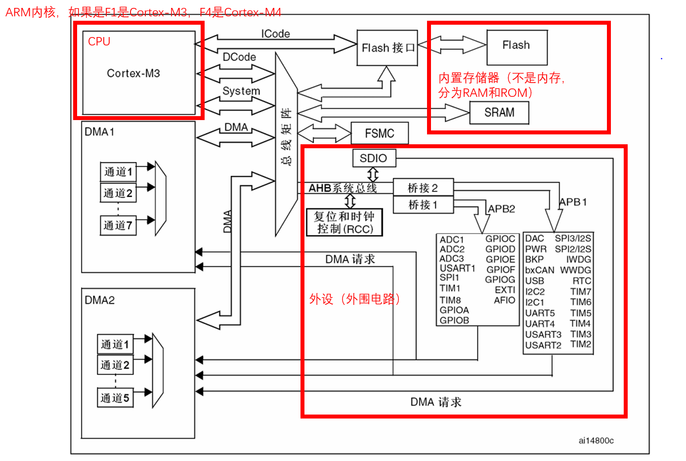
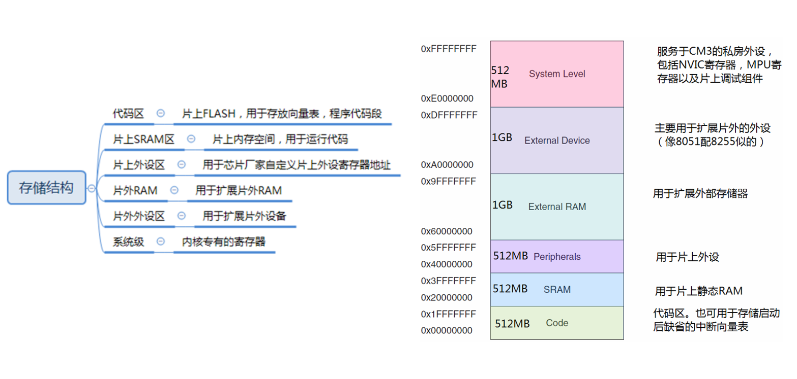
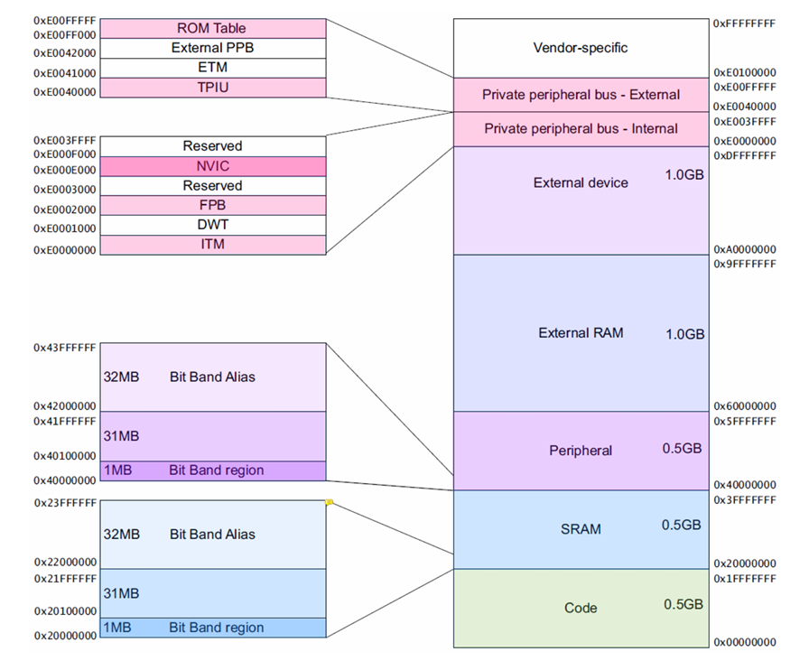
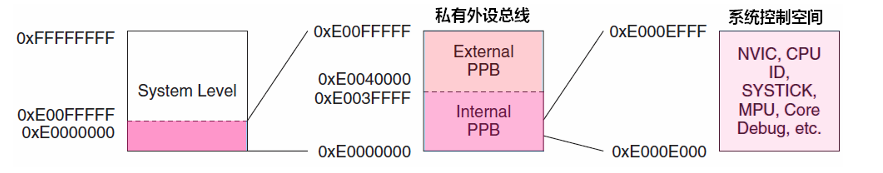
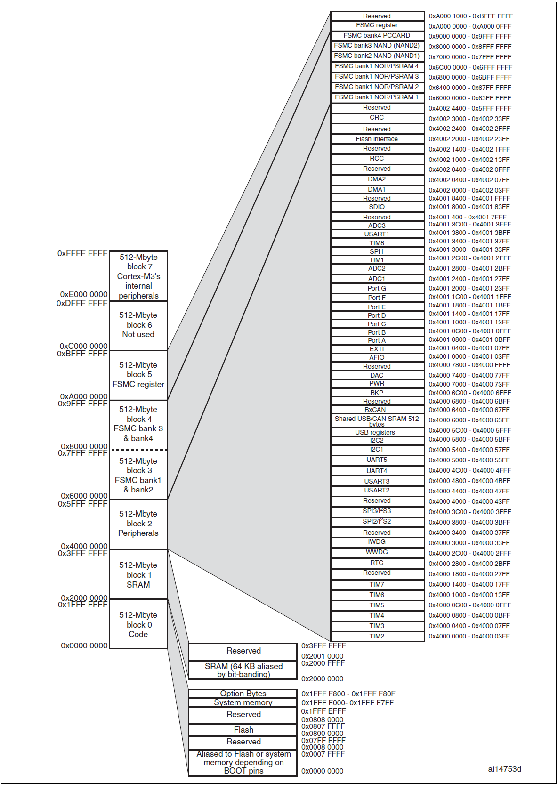
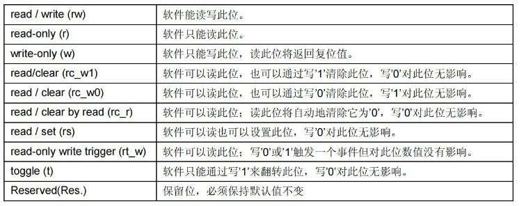
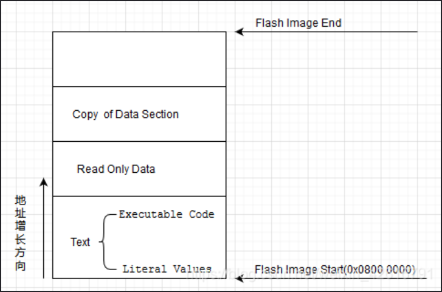
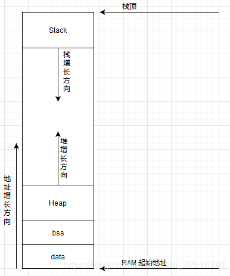
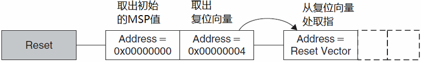
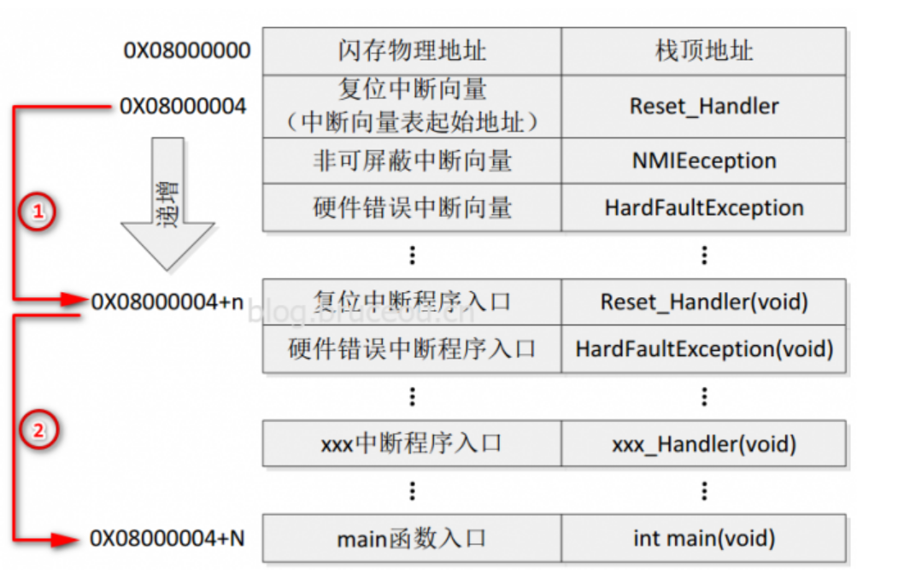

# STM32 3_STM32的总体架构

> 本节参考 STM32F1 的参考手册第1，2部分。

## 1. STM32 的总体架构



上图中可以很清晰的看到，STM32 已经包含了计算机的基本要素，基本上就是计算机。STM32 的学习首先是从外设开始学习，然后是学习内置存储器，最后可以学习 ARM 的指令集（内核指令）。

> 1. ICode 总线（指令总线）：该总线将Cortex™-M3内核的指令总线与闪存指令接口相连接。指令预取在此总线上完成。 
>
> 2. DCode 总线（数据总线）：该总线将Cortex™-M3内核的DCode总线与闪存存储器的数据接口相连接(常量加载和调试访 问)。
>
> 3. System 总线（系统总线）：此总线连接Cortex™-M3内核的系统总线(外设总线)到总线矩阵，总线矩阵协调着内核和 DMA 间的访问。
>
> 4. DMA 总线：此总线将 DMA 的 AHB 主控接口与总线矩阵相联，总线矩阵协调着 CPU 的DCode 和 DMA 到  SRAM、闪存和外设的访问。
>
> 5. 总线矩阵：总线矩阵协调内核系统总线和 DMA 主控总线之间的访问仲裁，仲裁利用轮换算法。在互联型产品中，总线矩阵包含5个驱动部件(CPU 的 DCode、系统总线、以太网 DMA、DMA1 总线和  DMA2 总线)和3个从部件(闪存存储器接口(FLITF)、SRAM 和 AHB2APB 桥)。在其它产品中总线矩阵包含4个驱动部件(CPU 的 DCode、系统总线、DMA1 总线和DMA2 总线)和4个被动部件(闪存存储器接口(FLITF)、SRAM、FSMC 和 AHB2APB 桥)。  
>
>    AHB外设通过总线矩阵与系统总线相连，允许DMA访问。
>
> 6. AHB 桥：两个 AHB/APB 桥在 AHB 和2个 APB 总线间提供同步连接。APB1 操作速度限于 36MHz，APB2 操作于全速(最高72MHz)。 

> **每个芯片的架构不尽相同，学习芯片使用时，根据芯片手册提供的总体架构了解芯片提供的外设，芯片的基本架构分布是十分重要的。**

## 2. STM32 的存储器架构

### Cortex-M 存储架构

32位单片机有32根地址线(4G)(导通或不导通)；(n根地址线存储大小为$2^n$)，ARM将这4G空间从低地址到高地址依次划分为代码区（Code）、片上SRAM区（SRAM）、片上外设（Peripheral）、片外RAM（External RAM）、片外外设（External Device）和系统级（System level），程序存储器、数据存储器、寄存器和 I/O 端口排列在同一个顺序的 4 GB 地址空间内。各字节按小端格式在存储器中编码。字中编号最低的字节被视为该字的最低有效字节，而编号最高的字节被视为最高有效字节。



存储器映射由半导体厂家（ST）决定，Cortex‐M3预先定义好了大致的存储器映射。通过把片上外设的寄存器映射到外设区，就可以简单地以访问内存的方式来访问这些外设的寄存器，从而控制外设的工作。结果，片上外设可以使用C语言来操作。这种预定义的映射关系，也使得对访问速度可以做高度的优化，而且对于片上系统的设计而言更易集成。

存储空间的一些位置用于调试组件等私有外设，这个地址段被称为私有外设区。私有外设区的组件包括：闪存地址重载及断点单元(FPB)、数据观察点单元(DWT)、指令跟踪宏单元(ITM)、嵌入式跟踪宏单元(ETM)、跟踪端口接口单元(TPIU) 、ROM 表。

Cortex‐M3 的地址空间是 4GB, 程序可以在代码区，内部 SRAM 区以及外部 RAM 区中执行。但是因为指令总线与数据总线是分开的，最理想的是把程序放到代码区，从而使取指令和数据访问各自使用自己的总线。



内部 SRAM 区的大小是 512MB，用于让芯片制造商连接片上的 SRAM，这个区通过系统总线来访问。在这个区的下部，有一个1MB的位带区，该位带区还有一个对应的 32MB 的位带别名(alias)区，容纳了 8M 个位变量。位带区对应的是最低的 1MB 地址范围，而位带别名区里面的每个字对应位带区的一个比特。位带操作只适用于数据访问，不适用于取指。

地址空间的另一个 512MB 范围由片上外设（的寄存器）使用。这个区中也有一条 32MB 的位带别名，以便于快捷地访问外设寄存器。例如，可以方便地访问各种控制位和状态位。 要注意的是，外设内不允许执行指令。

还有两个1GB的范围，分别用于连接外部RAM和外部设备，它们之中没有位带。两者的区别在于外部 RAM 区允许执行指令，而外部设备区则不允许。 

最后还剩下 0.5GB 的系统区，包括了系统级组件，内部私有外设总线，外部私有外设总线，以及由提供者定义的系统外设。

> 1. AHB 私有外设总线，只用于 CM3 内部的 AHB 外设，它们是：NVIC, FPB, DWT和ITM。 
> 2. APB 私有外设总线，既用于CM3内部的 APB 设备，也用于外部设备（这里的外部是对内核而言）。CM3 允许器件制造商再添加一些片上 APB 外设到 APB 私有总线上，它们通过 APB 接口来访问。

NVIC 所处的区域叫做系统控制空间（SCS），在 SCS 里的还有SysTick、MPU以及代码调试控制所用的寄存器。



### STM32 存储架构



可以看到，STM32F1 的存储器映射是按照 Cortex-M3 的存储器映射而继续细分的。

| 存储块 | 功能         | 地址范围                |
| ------ | ------------ | ----------------------- |
| Block0 | Code(FLASH)  | 0x0000 0000~0x1FFF FFFF |
| Block1 | SRAM         | 0x2000 0000~0x3FFF FFFF |
| Block2 | 片上外设     | 0x4000 0000~0x5FFF FFFF |
| Block3 | FSMC Bank1&2 | 0x6000 0000~0x7FFF FFFF |
| Block4 | FSMC Bank3&4 | 0x8000 0000~0x9FFF FFFF |
| Block5 | FSMC寄存器   | 0xA000 0000~0xBFFF FFFF |
| Block6 | 备用         | 0xC000 0000~0xDFFF FFFF |
| Block7 | Cortex M3    | 0xE000 0000~0xFFFF FFFF |

- 片内 FLASH 存储架构

  | 存储块 | 功能                           | 地址范围                |
  | ------ | ------------------------------ | ----------------------- |
  | Block0 | FLASH或系统存储器别名区        | 0x0000 0000~0x0007 FFFF |
  |        | 备用                           | 0x0008 0000~0x07FF FFFF |
  |        | 用户FLASH，存储用户代码        | 0x0800 0000~0x0807 FFFF |
  |        | 备用                           | 0x0808 0000~0x1FFF EFFF |
  |        | 系统存储器，存储出厂BootLoader | 0x1FFF F000~0x1FFF F7FF |
  |        | 选项字节，配置读保护           | 0x1FFF F800~0x1FFF F80F |
  |        | 备用                           | 0x1FFF F810~0x1FFF FFFF |

- 寄存器的概念

  在 Block2 外设区，设计的是片上外设，它们以四个字节为一个单元，共32bit，每一个单元称为寄存器，对应不同的功能，控制这些单元时就可以驱动外设工作。

  寄存器每一个位的类型如下，**每一个位都对应外设的一个配置**：
  
  
  
  |            |                |                                                              |
  | ---------- | -------------- | ------------------------------------------------------------ |
  | 内核寄存器 | 内核相关寄存器 | R0~R15,特殊功能寄存器                                        |
  |            | 中断控制寄存器 | NVIC和SCB相关寄存器(NVIC: ISER,ICER,ISPR,IP)(SCB: VTOR,AIRCR,SCR) |
  |            | Systick寄存器  | CTRL,LOAD,VAL,CALIB                                          |
  |            | 内存保护寄存器 |                                                              |
  |            | 调试系统寄存器 | ETM,ITM,DWT,IPIU                                             |
  | 外设寄存器 |                | GPIO,UART,IIC,SPI,TIM                                        |
  |            |                | DMA,ADC,DAC,PTC,I/WWDG,PWR,CAN,USB                           |
  
  可以找到每个寄存器的起始地址，然后通过C语言指针的操作方式来访问这些寄存器，如果每次都是通过这种地址的方式来访问，不仅不好记忆还容易出错。
  
  根据每个寄存器功能的不同，以功能为名给这个寄存器取一个别名，这个别名就是寄存器名，这个给已经分配好地址的有特定功能的寄存器取别名的过程就叫寄存器映射。
  
  比如下例：
  
  ```c
  #define GPIOA_ODR *(unsigned int *)(0x4001080C)
  GPIOA_ODR = 0xFFFF;
  ```
  
  > 寄存器地址分为3部分：
  >
  > - 总线基地址(`BUS_BASE_ADDR`)
  > - 外设基于总线基地址的偏移量(`PERIPH_OFFSET`)
  > - 寄存器相对于相对于外设基地址的偏移量(`REG_OFFSET`)
  >
  > $$
  > 寄存器地址 = BUS\_BASE\_ADDR + PERIPH\_OFFSET +REG\_OFFSET
  > $$
  >
  > | 总线                          | 基地址      | 偏移量   |
  > | ----------------------------- | ----------- | -------- |
  > | APB1(外设基地址`PERIPH_BASE`) | 0x4000 0000 | 0        |
  > | APB2                          | 0x4001 0000 | 0x1 0000 |
  > | AHB                           | 0x4001 8000 | 0x1 8000 |

### 代码和变量的存储

- FLASH（ROM） 的存储

  

  Flash = Code + RO-Data + RW-Data（.data）; Code 代表运行代码；RO-Data 代表只读数据，定义的全局常量位于此处；RW-Data 代表已初始化的读写数据，定义且初始化的全局变量和静态变量位于此处。

  对应的，Flash 分为文本段`Text`，包含可执行代码`Executable Code`和常量`Literal Value`，在文本段之后就是只读数据区域 `Read Only Data`，只读数据段后面接着的就是数据复制段 `Copy of Data Section`，存放程序中初始化为非 0 值的全局变量的初始值。

- RAM 的存储

  

  SRAM = RW-data+ZI-data(.bss+heap+stack) ;

  ZI-Data 表示未初始化的读写数据，如果全局变量初值为0也可以存储在此处。

  对应的，`.bss`存放未初始化或者是初始化为 0 的全局变量，`stack`存放局部变量和函数调用时的返回地址，`heap`由 malloc 申请，由 free 释放。

  STM32 中，栈向下生长，堆向上生长，因此需要设置栈顶以及堆栈大小。

- map 文件

  map 文件是MDK编译代码后，产生的集程序、数据及IO空间的一种映射列表文件，包括了各种.c文件、函数、符号等的地址、大小、引用关系等信息。

  > **map 文件可以看到变量和函数的位置，在调试时很有用处。**

  > |文件类型|	简介|
  > |---|---|
  > |.o|	可重定向对象文件，每个.c/.s文件都对应一个.o文件|
  > |.axf|	可执行对象文件，由.o文件链接生成，仿真的时候需要用到此文件|
  > |.hex| INTEL Hex格式文件，用于下载到MCU运行，由.axf转换而来（相当于.exe） |
  > |.map|	连接器生成的列表文件，对分析程序存储占用情况非常有用|
  > |其他|	.crf、.d、.dep、.lnp、.lst、.htm、.build_log、.htm等一般用不到|

## 3. STM32 的启动过程

### 启动过程简介

- 启动过程
  1. 内核复位；
  2. 从地址 0x0000 0000 处取出堆栈指针 MSP 的初始值，该值就是栈顶地址;
  3. 从地址 0x0000 0004 处取出程序计数器指针 PC 的初始值，该值是复位向量(RESET_Handler)；
  4. 通过外部的 BOOT 引脚把0x0000 0000和0x0000 0004地址映射到其它的地址；
  5. 在系统复位后，SYSCLK的第4个上升沿，BOOT引脚的值将被锁存，启动模式确定；
  
- 启动模式

  | BOOT1 | BOOT0 | 启动模式     | 0x00000000映射地址 | 0x00000004映射地址 |
  | ----- | ----- | ------------ | ------------------ | ------------------ |
  | x     | 0     | 主闪存存储器 | 0x08000000         | 0x08000004         |
  | 0     | 1     | 系统存储器   | 0x1FFFF000         | 0x1FFFF004         |
  | 1     | 1     | 内置SRAM     | 0x20000000         | 0x20000004         |
  
  1. 从主FLASH启动：将主 Flash 地址 0x0800 0000 映射到 0x0000 0000，这样代码启动之后就相当于从 0x08000000 开始。一般使用 JTAG 或者 SWD 模式下载程序时，就是下载到这个里面，重启后也直接从这启动程序。

  2. 从系统存储器启动：从系统存储器地址 0x1FFF F000 开始执行代码。系统存储器是芯片内部一块特定的区域，芯片出厂时在这个区域预置了一段 Bootloader，就是通常说的 ISP 程序。这个区域的内容在芯片出厂后没有人能够修改或擦除，即它是一个 ROM 区。启动的程序功能由厂家设置。系统存储器存储的其实就是 STM32 自带的 bootloader 代码。

  3. 从内置SRAM启动：将 SRAM 地址 0x20000000 映射到 0x00000000，这样代码启动之后就相当于从 0x20000000 开始。内置 SRAM，也就是STM32的内存，既然是SRAM，自然也就没有程序存储的能力了，这个模式一般用于程序调试。假如我只修改了代码中一个小小的地方，然后就需要重新擦除整个Flash，比较的费时，可以考虑从这个模式启动代码，用于快速的程序调试，等程序调试完成后，在将程序下载到SRAM中。

### STM32 的启动文件

1. 堆栈定义

    ```assembly
    ; Amount of memory (in bytes) allocated for Stack
    ; Tailor this value to your application needs
    ; <h> Stack Configuration
    ;   <o> Stack Size (in Bytes) <0x0-0xFFFFFFFF:8>
    ; </h>
    
    Stack_Size		EQU     0x400
    
                    AREA    STACK, NOINIT, READWRITE, ALIGN=3
    Stack_Mem       SPACE   Stack_Size
    __initial_sp
    ```
    
    > 1. 行7：表示开辟栈的大小为 0X00000400（1KB），EQU是伪指令，相当于 C 中的 #define。
    > 1. 行9：开辟一段可读可写数据空间，ARER 伪指令表示下面将开始定义一个代码段或者数据段。此处是定义数据段。ARER 后面的关键字表示这个段的属性。段名为STACK，可以任意命名；NOINIT 表示不初始化；READWRITE 表示可读可写，ALIGN=3，表示按照 8 字节对齐。
    > 1. 行10：SPACE 用于分配大小等于 Stack_Size连续内存空间，单位为字节。
    > 1. 行11：`__initial_sp`表示栈顶地址。栈是由高向低生长的。
    
    ```assembly
    ; <h> Heap Configuration
    ;   <o>  Heap Size (in Bytes) <0x0-0xFFFFFFFF:8>
    ; </h>
    
    Heap_Size      EQU     0x200
    
                    AREA    HEAP, NOINIT, READWRITE, ALIGN=3
    __heap_base
    Heap_Mem        SPACE   Heap_Size
    __heap_limit
    ```
    
    > 1. 行5：开辟堆的大小为 0X00000200（512 字节）；
    > 2. 行7：堆名名字为 HEAP，NOINIT 即不初始化，可读可写，8字节对齐。
    > 3. 行8-行10：`__heap_base` 表示对的起始地址，`__heap_limit` 表示堆的结束地址。

2. 向量表

   ```assembly
   ; Vector Table Mapped to Address 0 at Reset
                   AREA    RESET, DATA, READONLY
                   EXPORT  __Vectors
                   EXPORT  __Vectors_End
                   EXPORT  __Vectors_Size
   
   __Vectors       DCD     __initial_sp                      ; Top of Stack
                   DCD     Reset_Handler                     ; Reset Handler
                   DCD     NMI_Handler                       ; NMI Handler
                   DCD     HardFault_Handler                 ; Hard Fault Handler
                   DCD     MemManage_Handler                 ; MPU Fault Handler
                   DCD     BusFault_Handler                  ; Bus Fault Handler
                   DCD     UsageFault_Handler                ; Usage Fault Handler
                   DCD     0                                 ; Reserved
                   DCD     0                                 ; Reserved
                   DCD     0                                 ; Reserved
                   DCD     0                                 ; Reserved
                   DCD     SVC_Handler                       ; SVCall Handler
                   DCD     DebugMon_Handler                  ; Debug Monitor Handler
                   DCD     0                                 ; Reserved
                   DCD     PendSV_Handler                    ; PendSV Handler
                   DCD     SysTick_Handler                   ; SysTick Handler
   
                   ; External Interrupts
                   DCD     WWDG_IRQHandler                   ; Window WatchDog interrupt ( wwdg1_it)                                         
                   DCD     PVD_AVD_IRQHandler                ; PVD/AVD through EXTI Line detection    ...
   
   __Vectors_End                
   ```

   > 1. 行2：定义一块代码段，段名字是RESET，READONLY 表示只读。
   > 2. 行3-行5：使用EXPORT将3个标识符申明为可被外部引用，声明 `__Vectors`、`__Vectors_End` 和`__Vectors_Size` 具有全局属性。
   > 3. 行7-行27：`__Vectors` 表示向量表起始地址，DCD 表示分配 1 个 4 字节的空间。每行 DCD 都会生成一个 4 字节的二进制代码，中断向量表存放的实际上是中断服务程序的入口地址。当异常（也即是中断事件）发生时，CPU 的中断系统会将相应的入口地址赋值给 PC 程序计数器，之后就开始执行中断服务程序。
   > 4. 行28：`__Vectors_End` 为向量表结束地址。

3. 复位程序

   ```assembly
   ; Reset handler
   Reset_Handler    PROC
                    EXPORT  Reset_Handler             [WEAK]
        IMPORT  __main
        IMPORT  SystemInit
                    LDR     R0, =SystemInit
                    BLX     R0
                    LDR     R0, =__main
                    BX      R0
                    ENDP
   ```

   > 1. 行2：定义了一个服务程序，`PROC`表示程序的开始。
   > 2. 行3：使用`EXPORT`将`Reset_Handler`申明为可被外部引用，后面`WEAK`表示弱定义，如果外部文件定义了该标号则首先引用该标号，如果外部文件没有声明也不会出错。这里表示复位程序可以由用户在其他文件重新实现，这种写法在HAL库中是很常见的。
   > 3. 行4-行5：表示该标号来自外部文件，`SystemInit()`是一个库函数，在`system_stm32f1xx.c`中定义的，`__main` 是一个标准的 C 库函数，主要作用是初始化用户堆栈，这个是由编译器完成的，该函数最终会调用main函数，从而进入C代码中。
   > 4. 行6：这是一条汇编指令，表示从存储器中加载`SystemInit`到一个寄存器R0的地址中。
   > 5. 行7：汇编指令，表示跳转到寄存器R0的地址，并根据寄存器的 LSE 确定处理器的状态，还要把跳转前的下条指令地址保存到 LR。

4. 中断服务程序

   ```assembly
   ; Dummy Exception Handlers (infinite loops which can be modified)
   
   NMI_Handler     PROC
                   EXPORT  NMI_Handler                      [WEAK]
                   B       .
                   ENDP
   HardFault_Handler\
                   PROC
                   EXPORT  HardFault_Handler                [WEAK]
                   B       .
                   ENDP
   MemManage_Handler\
                   PROC
                   EXPORT  MemManage_Handler                [WEAK]
                   B       .
                   ENDP
   ...
   ```

5. 堆栈初始化

   ```assembly
   ;*******************************************************************************
   ; User Stack and Heap initialization
   ;*******************************************************************************
                    IF      :DEF:__MICROLIB
                   
                    EXPORT  __initial_sp
                    EXPORT  __heap_base
                    EXPORT  __heap_limit
                   
                    ELSE
                   
                    IMPORT  __use_two_region_memory
                    EXPORT  __user_initial_stackheap
                    
   __user_initial_stackheap
   
                    LDR     R0, =  Heap_Mem
                    LDR     R1, =(Stack_Mem + Stack_Size)
                    LDR     R2, = (Heap_Mem +  Heap_Size)
                    LDR     R3, = Stack_Mem
                    BX      LR
   
                    ALIGN
   
                    ENDIF
   
                    END
   ```

   > 如果没有定义`__MICROLIB` ， 则会使用双段存储器模式，且声明了`__user_initial_stackheap` 具有全局属性，这需要开发者自己来初始化堆栈。

### STM32 的启动流程



Cortex-M3 内核规定，起始地址必须存放栈顶指针，而第二个地址则必须存放复位中断入口向量地址，这样在 Cortex-M3 内核复位后，会自动从起始地址的下一个 32 位空间取出复位中断入口向量，跳转执行复位中断服务程序。Cortex-M3 内核固定了中断向量表的位置, 但是起始地址是可变化的。(代码区都从0x00000000开始，只不过映射到的位置不同)

STM32 的启动流程如下：


