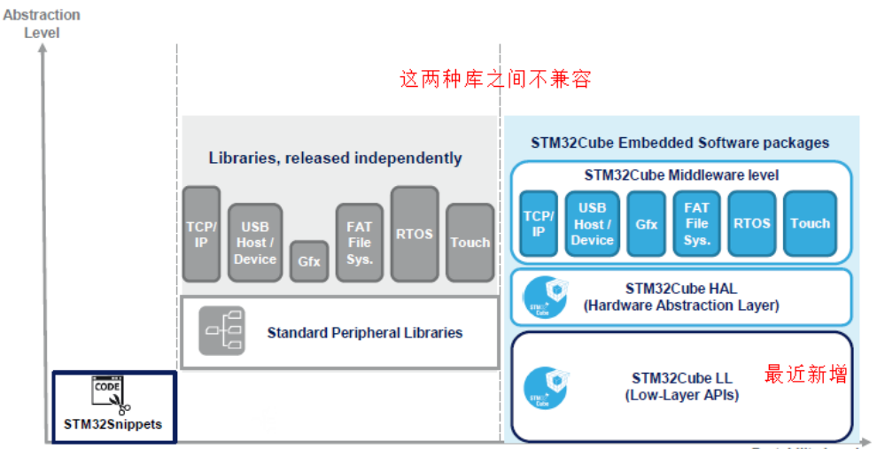

# STM32 4_HAL库简介

ST为开发者提供了非常方便的开发库。到目前为止，有标准外设库(STD库)、HAL库、LL库 三种。

### 标准外设库(标准库)

标准外设库（Standard Peripherals Library）是对STM32芯片的一个完整的封装，包括所有标准器件外设的器件驱动器。~~这应该是目前使用最多的ST库~~。几乎全部使用C语言实现。但是，标准外设库也是针对某一系列芯片而言的，没有可移植性。
  相对于HAL库，标准外设库仍然接近于寄存器操作，主要就是将一些基本的寄存器操作封装成了C函数。开发者需要关注所使用的外设是在哪个总线之上，具体寄存器的配置等底层信息。

标准库不支持从STM32 L0，L4和F7开始的之后的STM32系列芯片。

ST为各系列提供的标准外设库稍微有些区别。例如，STM32F1x的库和STM32F3x的库在文件结构上就有些不同，此外，在内部的实现上也稍微有些区别，这个在具体使用（移植）时，需要注意一下！但是，不同系列之间的差别并不是很大，而且在设计上是相同的。STM32的标准外设库涵盖以下3个抽象级别：

- 包含位，位域和寄存器在内的完整的寄存器地址映射
- 涵盖所有外围功能（具有公共API的驱动器）的例程和数据结构的集合。
- 一组包含所有可用外设的示例，其中包含最常用的开发工具的模板项目。

### HAL 库

HAL是Hardware Abstraction Layer的缩写，中文名：硬件抽象层。HAL库是ST为STM32最新推出的抽象层嵌入式软件，可以更好的确保跨STM32产品的最大可移植性。该库提供了一整套一致的中间件组件，如RTOS，USB，TCP / IP和图形等。
  HAL库是基于一个非限制性的BSD许可协议（Berkeley Software Distribution）而发布的开源代码。 ST制作的中间件堆栈（USB主机和设备库，STemWin）带有允许轻松重用的许可模式， 只要是在ST公司的MCU 芯片上使用，库中的中间件(USB 主机/设备库,STemWin)协议栈即被允许随便修改，并可以反复使用。至于基于其它著名的开源解决方案商的中间件（FreeRTOS，FatFs，LwIP和PolarSSL）也都具有友好的用户许可条款。
  可以说HAL库就是用来取代之前的标准外设库的。相比标准外设库，STM32Cube HAL库表现出更高的抽象整合水平，HAL API集中关注各外设的公共函数功能，这样便于定义一套通用的用户友好的API函数接口，从而可以轻松实现从一个STM32产品移植到另一个不同的STM32系列产品。HAL库是ST未来主推的库，从前年开始ST新出的芯片已经没有STD库了，比如F7系列。目前，HAL库已经支持STM32全线产品。

### LL 库

LL库（Low Layer）是ST最近新增的库，与HAL捆绑发布，文档也是和HAL文档在一起的，比如：在STM32F3x的HAL库说明文档中，ST新增了LL库这一章节，但是在F2x的HAL文档中就没有。
  LL库更接近硬件层，对需要复杂上层协议栈的外设不适用，直接操作寄存器。其支持所有外设。使用方法：

- 独立使用，该库完全独立实现，可以完全抛开HAL库，只用LL库编程完成。在使用STM32CubeMX生成项目时，直接选LL库即可。如果使用了复杂的外设，例如USB，则会调用HAL库。
- 混合使用，和HAL库结合使用。