# STM32 HAL库 15_存储器简介

## 1. 存储器简介

### 存储器的基本分类

存储器分为 RAM 和 ROM 两大类。

- RAM：**随机访问存储器(Random Access Memory)，易失性**。是与CPU直接交换数据的内部存储器，它可以随时读写，而且速度很快，通常作为操作系统或其他正在运行中的程序的临时数据存储媒介。当电源关闭时RAM不能保留数据。如果需要保存数据，就必须把它们写入一个长期的存储设备中（例如硬盘）。

- ROM：**只读存储器(Read Only Memory)，非易失性**。一般是装入整机前事先写好的，整机工作过程中只能读出，而不像随机存储器那样能快速地、方便地加以改写。ROM所存数据稳定，断电后所存数据也不会改变。计算机中的ROM主要是用来存储一些系统信息，或者启动程序BIOS程序，这些都是非常重要的，只可以读一般不能修改，断电也不会消失。

**RAM和ROM相比，两者的最大区别是RAM在断电以后保存在上面的数据会自动消失，而ROM不会自动消失，可以长时间断电保存。**

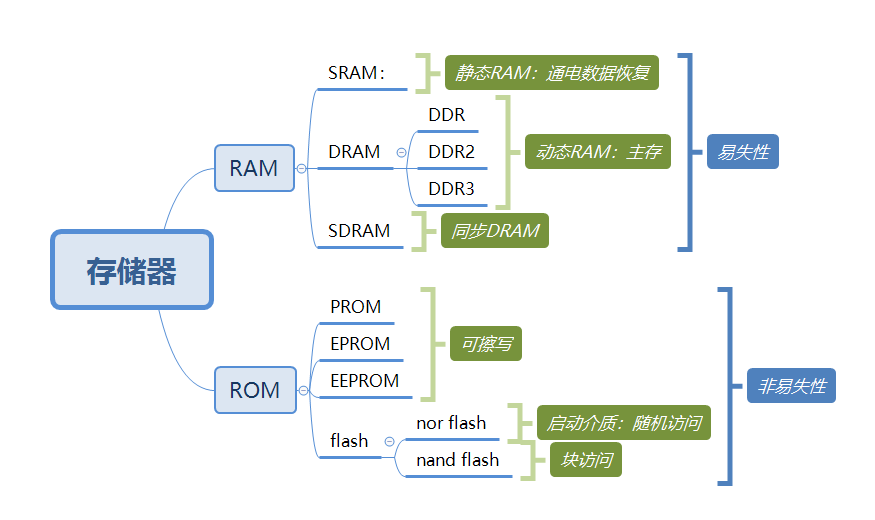

### 只读存储器 ROM

ROM指的是“只读存储器”，即Read-Only Memory。这是一种线路最简单半导体电路，通过掩模工艺， 一次性制造，其中的代码与数据将永久保存，不能进行修改，即使机器停电，这些数据也不会丢失。ROM一般用于存放计算机的基本程序和数据，如BIOS ROM。其物理外形一般是双列直插式（DIP）的集成块。在微机的发展初期，BIOS都存放在ROM（Read Only Memory，只读存储器）中。如果发现内部数据有错，则只有舍弃不用，重新订做一份。

现在比较流行的只读存储器是闪存(Flash Memory)，它属于 EEPROM(电擦除可编程只读存储器)的升级，可以通过电学原理反复擦写。现在大部分BIOS程序就存储在Flash ROM芯片中。U盘和固态硬盘(SSD)也是利用闪存原理做成的。

**ROM分为 可编程ROM 和 Flash ROM**，可编程ROM用分为 PROM、EPROM、EEPROM；Flash ROM 又分为 NOR Flash 和 NAND Flash。

#### PROM

PROM 是 可编程ROM，PROM是一次性的，也就是软件灌入后，就无法修改了，这种是早期的产品，现在已经不可能使用了。

#### EPROM

EPROM 是 可擦除可编程ROM，EPROM 是通过紫外光的照射擦出原先的程序，是一种通用的存储器。

#### EEPROM

EEPROM 是 可擦除可编程ROM，。EEPROM 的擦除不需要借助于其它设备，它是以电子信号来修改其内容的，而且是以 Byte 为最小修改单位，不必将资料全部洗掉才能写入，彻底摆脱了 EPROM Eraser 和编程器的束缚。

#### FLASH ROM

FLASH ROM 指的是闪存，也是一种非易失性的内存，属于EEPROM的改进产品，FLASH 属于真正的单电压芯片，它的读和写操作都是在单电压下进行。它的最大特点是**必须按块( Block 或 Sector )擦除**(每个区块的大小不定，不同厂家的产品有不同的规格)， 而**EEPROM则可以一次只擦除一个字节 (Byte) **。Flash ROM 是利用浮置栅上的电容存储电荷来保存信息，因为浮置栅不会漏电，所以断电后信息仍然可以保存。

FLASH 结合了 ROM 和 RAM 的长处，不仅具备电子可擦除可编程（EEPROM）的性能，还不会断电丢失数据同时可以快速读取数据（NVRAM的优势），U盘 和 MP3 里用的就是这种存储器。在过去的20年里，嵌入式系统一直使用 ROM（EPROM）作为它们的存储设备，然而近年来 FLASH 全面代替了 ROM（EPROM）在嵌入式系统中的地位，用作存储 Bootloader 以及操作系统 或者 程序代码 或者 直接当硬盘使用（U盘）。

**FLASH ROM 包括 NOR FLASH ROM 和 NAND FLASH ROM**。

- NOR FLASH 的读取和常见的 SDRAM 的读取是一样的，用户可以直接运行装载在 NOR FLASH 里面的代码，这样可以减少 SRAM 的容量从而节约了成本。

- NAND FLASH 没有采取内存的随机读取技术，它的读取是以一次读取一块的形式来进行的，通常是一次读取512个字节，采用这种技术的 FLASH 比较廉价。用户不能直接运行NAND FLASH 上的代码。

一般小容量的用NOR FLASH，因为其读取速度快，多用来存储操作系统等重要信息，而大容量的用NAND FLASH。

### 随机读写存储器 RAM

随机存储器（Random Access Memory）既可以从中读取数据，也可以写入数据。当机器电源关闭时，存于其中的数据就会丢失。我们通常购买或升级的内存条就是用作电脑的内存，内存条（SIMM）就是将RAM集成块集中在一起的一小块电路板，它插在计算机中的内存插槽上，以减少RAM集成块占用的空间。目前市场上常见的内存条有1G/条，2G/条，4G/条等。

**RAM 分为两种：SRAM（Static RAM/静态存储器）和DRAM（Dynamic RAM/动态存储器）。**

#### SRAM

SRAM的速率高、性能好，它主要有如下应用：CPU与主存之间的高速缓存；CPU内部的L1／L2或外部的L2高速缓存。

Cache也就是平常看到的一级缓存(L1 Cache）、二级缓存(L2 Cache）、三级缓存(L3 Cache）这些数据，它**位于CPU与内存之间，是一个读写速度比内存更快的存储器。**当CPU向内存中写入或读出数据时，这个数据也被存储进高速缓冲存储器中。**当CPU再次需要这些数据时，CPU就从高速缓冲存储器读取数据，而不是访问较慢的内存**，当然，如需要的数据在Cache中没有，CPU会再去读取内存中的数据。

Cache一般使用SRAM制造，它与CPU之间交换数据的速度高于DRAM，所以被称作"高速缓冲存储器"，简称为"高速缓存"。由于CPU的信息处理速度常常超过其它部件的信息传递速度，所以使用一般的DRAM来作为信息存储器常常使CPU处于等待状态，造成资源的浪费。Cache就是为了解决这个问题而诞生的。在操作系统启动以后，CPU就把DRAM中经常被调用的一些系统信息暂时储存在Cache里面，以后当CPU需要调用这些信息时，首先到Cache里去找，如果找到了，就直接从Cache里读取，这样利用Cache的高速性能就可以节省很多时间。大多数CPU在自身中集成了一定量的Cache，一般被称作"一级缓存"或"内置Cache"。这部分存储器与CPU的信息交换速度是最快的，但容量较小。大多数主板上也集成了Cache，一般被称作"二级缓存"或"外置Cache"，比内置Cache容量大些，一般可达到256K。

> SSRAM（Synchronous SRAM）即同步静态随机存取存储器。同步是指Memory工作需要同步时钟，内部的命令的发送与数据的传输都以它为基准；随机是指数据不是线性依次存储，而是由指定地址进行数据读写。 
>
> 对于 SSRAM 的所有访问都在时钟的上升/下降沿启动。地址、数据输入和其它控制信号均于时钟信号相关。这一点与异步SRAM不同，异步SRAM的访问独立于时钟，数据输入和输出都由地址的变化控制。

#### SDRAM

SDRAM (Synchronous Dynamic RAM，同步动态随机存储器) 采用3.3V工作电压，内存数据位宽64位。 SDRAM与CPU通过一个相同的时钟频率锁在一起，使两者以相同的速度同步工作。 SDRAM它在每一个时钟脉冲的上升沿传输数据。

#### DDR SDRAM

( Double data Rate SDRAM，双倍速率同步动态随机存储器)采用2.5V工作电压，内存数据位宽64位。 DDR SDRAM (简称DDR内存)一个时钟脉冲传输两次数据，分别在时钟脉冲的上升沿和下降沿各传输一次数据，因此称为双倍速率的SDRAM。

> `EFMPT`：用于表示FIFO的状态：0，表示FIFO非空；1，表示FIFO为空，表示数据传输完成。计算ECC时，必须等待`EFMPT`为1，再去读取ECCRx寄存器的值，确保数据全部传输完毕。

## 2. 外接 SRAM 驱动

（本部分描述外接的 SRAM 驱动，注意不是 STM32 的内部 SRAM）

### 外接 SRAM 芯片（XM8A51216）

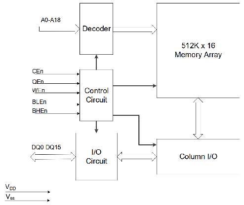

- 芯片引脚定义

  | 引脚       | 含义                         |
  | ---------- | ---------------------------- |
  | `A[18:0]`  | 地址线                       |
  | `DQ[15:0]` | 数据线（并行接口）           |
  | `CEn`      | 芯片使能信号，低电平有效     |
  | `OEn`      | 输出(读)使能信号，低电平有效 |
  | `WEn`      | 写使能信号，低电平有效       |
  | `BLEn`     | 低字节控制信号               |
  | `BHEn`     | 高字节控制信号               |

- 芯片控制时序 —— 8080 并口时序

  1. 读时序

     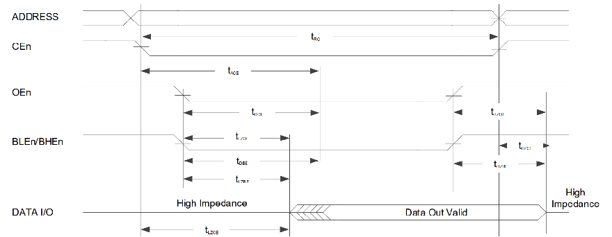

     - $t_{RC}$： 读周期时间；
     - $t_{ACE}$ ：地址建立时间，从接收到地址信号到给有效数据的时间。
     - $t_{DOE}$：OE建立时间，从接收到读使能信号到给有效数据的时间。

     

  2. 写时序

     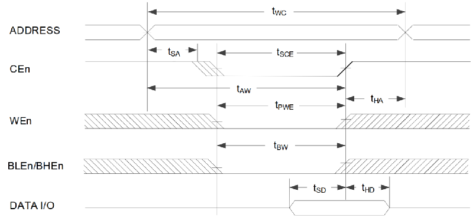

     - $t_{WC}$： 写周期时间；
     - $t_{SA}$ ：地址建立时间，从发送地址信号到给写使能信号的时间。
     - $t_{PWE}$：WE脉冲，从接收到写使能信号到数据采集时间。

     

### FSMC 外设驱动 SRAM

#### FSMC 外设

FSMC，灵活的**静态存储控制器**，能驱动SRAM、NOR/NAND Flash等存储器。（注意不能驱动 DRAM）。使用 FSMC 后，**无需关心具体的时序实现，只需要进行上层的接口配置即可**。

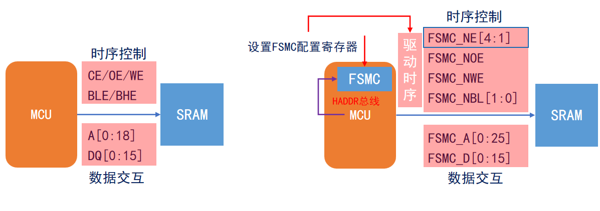

> 右图即为 FSMC 的工作原理，STM32 设置 FSMC 的寄存器以控制 FSMC 和 SRAM 交互。

- FSMC 的接口

  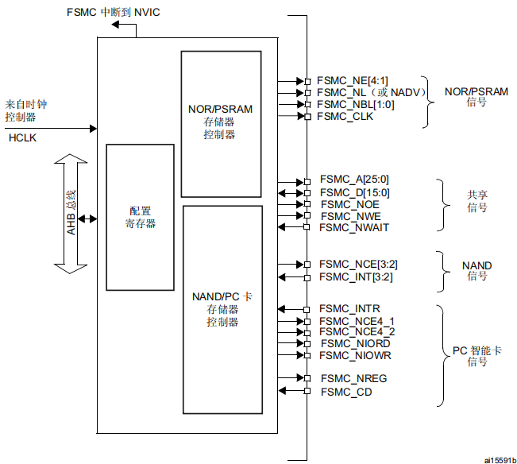

- FSMC 定义下的外部器件映射：

  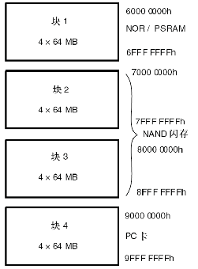

  > 从 FSMC 的角度，外部存储器被划分为 4 个固定大小的存储区域(Bank)，每个存储区域的大小为 256 MB。

  - NOR/PSRAM 地址映射

    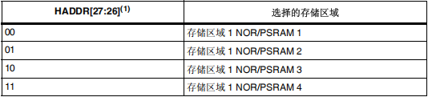

    > `HADDR[25:0]` 包含外部存储器地址。由于 `HADDR` 为字节地址，而存储器按字寻址，所以根据存储器数据宽度不同，实际向存储器发送的地址也将有所不同。
    >
    > 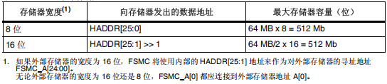

- FSMC 的 NOR Flash/PSRAM 控制器

  - 外部接口信号

    1. NOR Flash,不复用 IO

       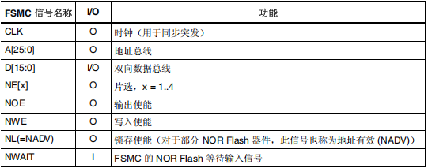

    2. NOR Flash,复用 IO

       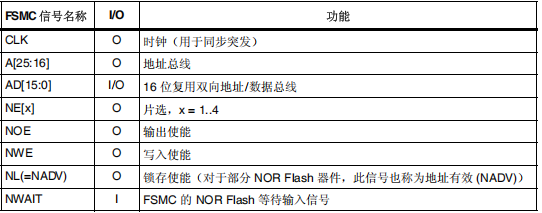

    3. PSRAM/SRAM，非复用 I/O

       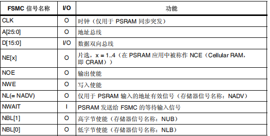

    4. PSRAM，复用 I/O

       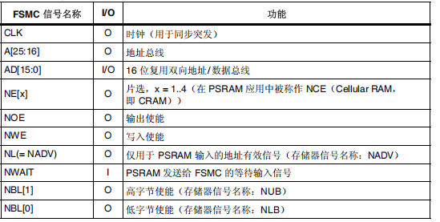

  - 支持的存储器和事务

    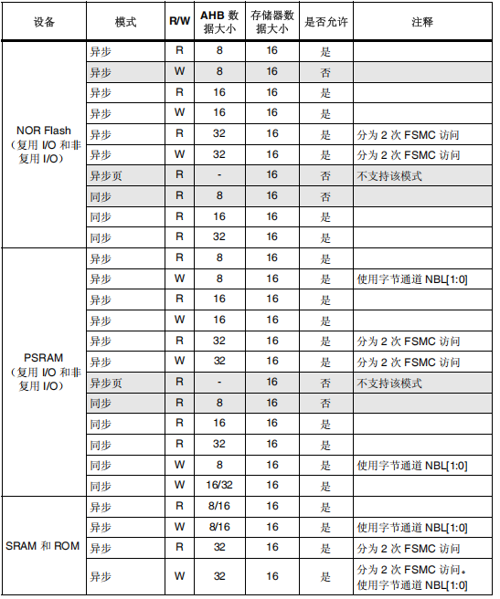

    SRAM 仅支持异步事务。即 FSMC 产生异步时序和 SRAM 通信。

  - NOR Flash/PSRAM 控制器异步事务（异步静态存储器（NOR Flash、PSRAM、SRAM）
    
    - 模式1 —— SRAM/PSRAM (CRAM)
    
      设置参数`ADDSET`，`DATAST`。
    
      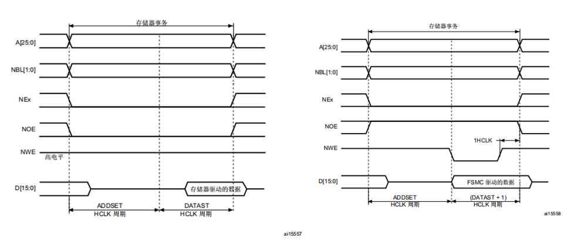
    
    - 模式A —— SRAM/PSRAM (CRAM)(OE 切换)
    
      设置参数`ADDSET`，`DATAST`。
    
      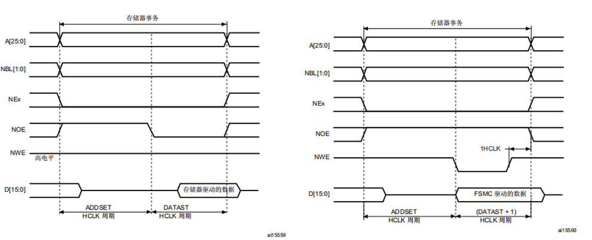
    
    - 模式 2/B - NOR Flash
    
      设置参数`ADDSET`，`DATAST`。
    
      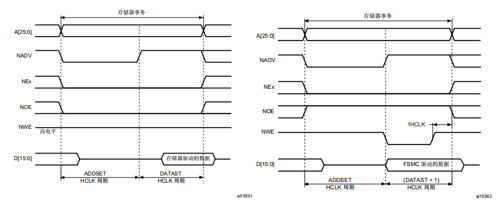
    
    - 模式 C - NOR Flash(OE 切换)
    
      设置参数`ADDSET`，`DATAST`。
    
      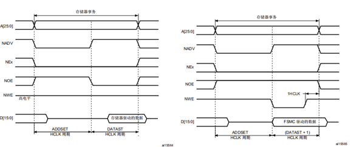
    
    - 模式 D - 扩展地址异步访问
    
      设置参数`ADDSET`、`DATAST`、`ADDHLD`。
      
      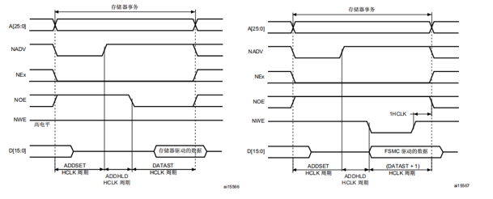
      

#### FSMC 驱动 SRAM

- 时序配置

  使用 FSMC 接口产生时序驱动 SRAM。(使用模式A)

  1. 写时序 
     $$
     t_{RC} = (ADDSET + 1 + DATAST + 1 + 2)t_{HCLK} > 15ns \\
     t_{ACE} = (ADDSET + 1)t_{HCLK}  < 12ns \\
     t_{DOE} = (DATAST + 1)t_{HCLK} < 3.4ns
     $$
     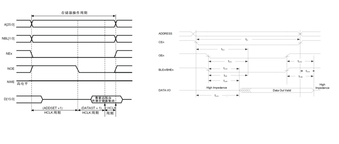
  
  2. 读时序
     $$
     t_{WC} = (ADDSET + 1 + DATAST + 1)t_{HCLK} > 15ns \\
     t_{SA} = (ADDSET + 1)t_{HCLK} > 0ns \\
     t_{PWE} = (DATAST + 1)t_{HCLK} > 0.7ns
     $$
     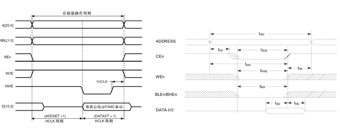
  
- 芯片连接

  | **SRAM** | **FSMC**     |
  | -------- | ------------ |
  | A[0:18]  | FSMC_A[0:18] |
  | D[0:15]  | FSMC_D[0:15] |
  | UB       | FSMC_NBL1    |
  | LB       | FSMC_NBL0    |
  | OE       | FSMC_NOE     |
  | WE       | FSMC_NWE     |
  | CE       | FSMC_NE3     |

- CubeMX 配置

  1. 存储区域选择

     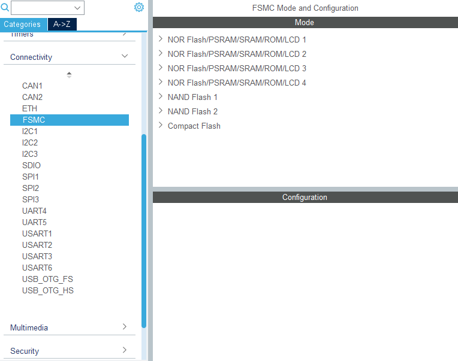

  2. 引脚配置

     先勾选需要的引脚，再进行地址线和数据线配置。

     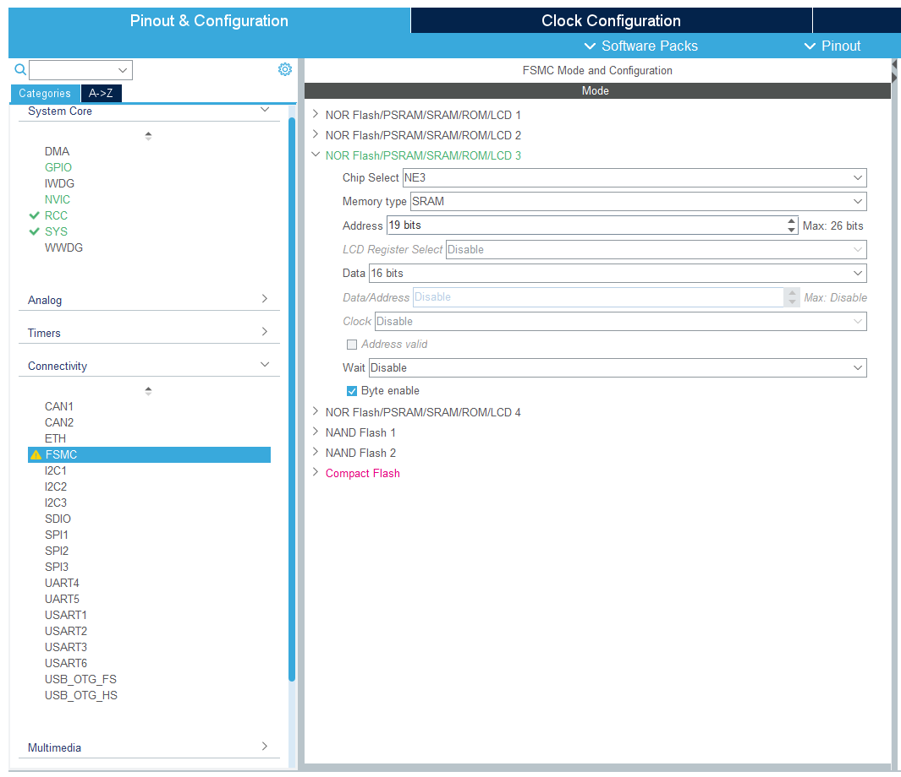

     > `Chip Select`：片选引脚；
     >
     > `Memory Type`：存储类型；
     >
     > `Address`：地址位数；
     >
     > `Data`：数据长度；
     >
     > `Byte Enable`：高低字节。

  3. 控制器配置

     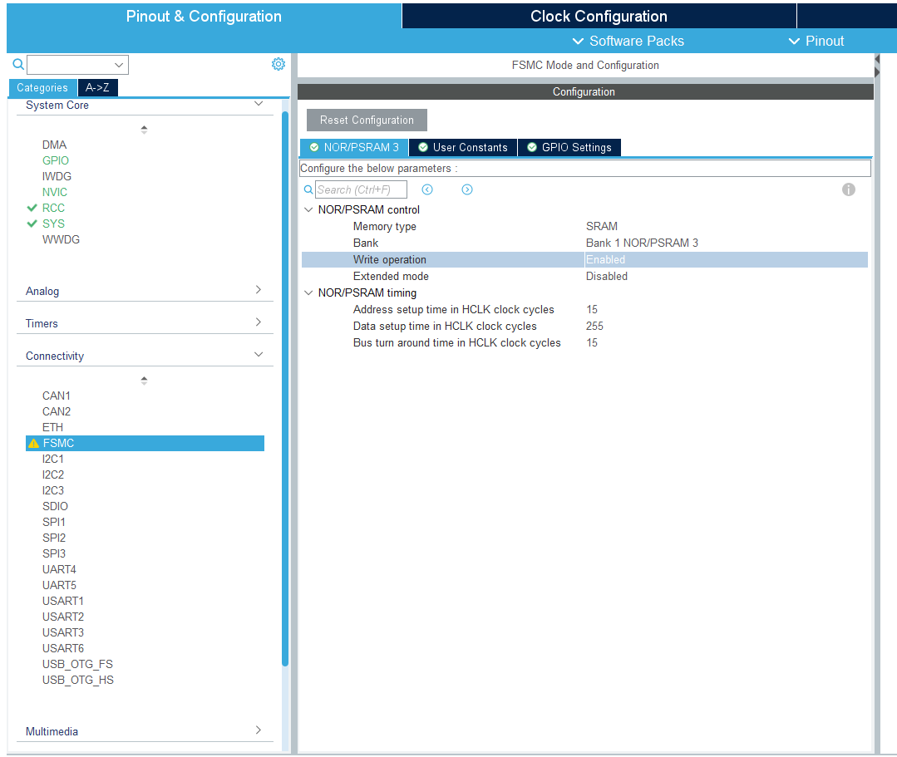

     > `Write Operation`：存储器写使能；
     >
     > `Address setup time in HCLK clock cycles`：`ADDSET`；
     >
     > `Data setup time in HCLK clock cycles`：`DATAST`。

- HAL 库使用

  直接向指定地址读写即可，无需使用 HAL 库函数。

## 3. 外接 SDRAM 驱动

### 外接 SDRAM 芯片（W9825G6KH）

 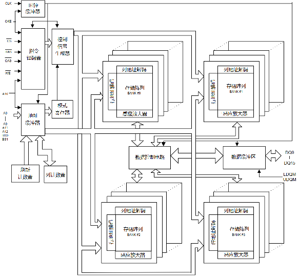

- 芯片引脚定义

  | 引脚     | 含义                                           |
  | -------- | ---------------------------------------------- |
  | CLK      | 时钟信号，提供SDRAM工作时钟                    |
  | CKE      | 时钟使能                                       |
  | CS       | 片选信号，低电平有效                           |
  | RAS      | 行地址选通信号，低电平有效，表示行地址         |
  | CAS      | 列地址选通信号，低电平有效，表示列地址         |
  | WE       | 读写指令切换信号  低电平:写指令，高电平:读指令 |
  | A[12:0]  | 地址线（行 / 列）                              |
  | BS0/BS1  | BANK地址线                                     |
  | DQ[15:0] | 数据线                                         |
  | L/UDQM   | 数据掩码，表示DQ的有效部分                     |

  > SDRAM 寻址方法：
  >
  > 1. 指定 BANK；
  >
  > 2. 指定 BANK 内的行和列。
  >
  >   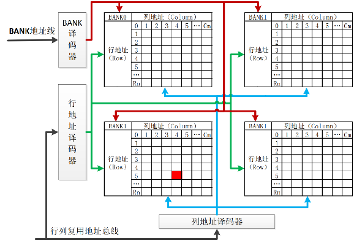
  >
  >   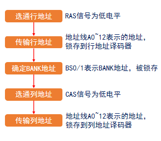
  
- 芯片操作指令
  
  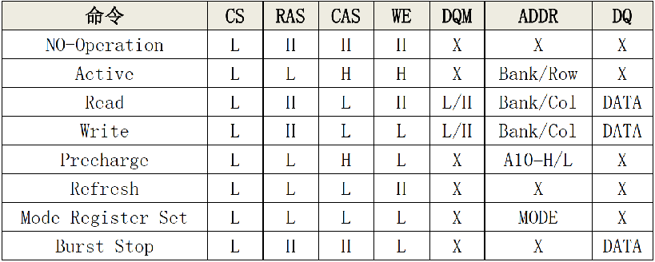
  
    
  
  1. `No-operation`
  
     空操作命令，用于选中 SDRAM，防止SDRAM接受错误的命令，为接下来的命令发送做准备。
  
  2. `Active`
  
     激活命令，该命令必须在读写操作之前被发送，用于设置所需要的 BANK 和行地址（同时设置），BANK 地址由 BS0(BA0)/BS1(BA1) 决定，行地址由 A[12:0] 决定。
  
  3. `Read/Write`
  
     读 / 写命令，在发送完激活命令后， 再发送列地址就可以完成对 SDRAM 的寻址，并进行读写操作。读/写命令和列地址的发送，是通过一次传输完成的。
  
  4. `Precharge`
  
     预充电指令，用于关闭 BANK 中所打开的行地址，准备打开新行。进行完读写操作后，要对同一 BANK 的另一行进行寻址，就要将原来有效(打开)的行关闭，重新发送行/列地址。 
  
     > 1. 通过指令线发送预充电命令；
     > 2. 通过 A10 控制操作区域（高电平：所有BANK都预充电；低电平：使用BA线选择要预充电 BANK）
  
  5. `Refresh`
  
     刷新指令，用于刷新一行数据，可以依次对所有的行进行刷新操作。
  
     - 自动刷新：依靠刷新计数器(行地址生成器)自动依次生成要刷新的行地址。刷新周期（完成一次所有行的刷新所需要的时间）64ms。刷新过程中，所有 Bank 停止工作。（ CKE 为高电平）
     - 自我刷新：用于休眠低功耗状态下的数据保存。（发出AR命令后，将CKE至于无效状态(低电平)），进入自我刷新模式后，不再依靠系统时钟工作，根据内部时钟进行刷新操作。CKE高电平时退出自刷新模式进入正常操作模式。
  
  6. `Mode Register Set`
  
     设置模式寄存器。SDRAM芯片内部有一个逻辑控制单元，控制单元的相关参数由模式寄存器提供。该命令在每次对SDRAM进行初始化时都需要用到。
  
-  SDRAM 工作流程
  
   - 初始化
   
     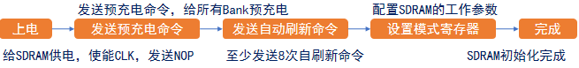
   
     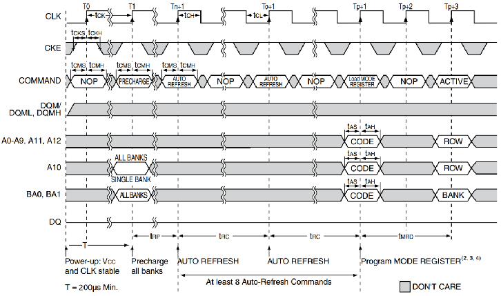
   
     > $t_{RC}$：自动刷新命令间隔时间；
     >
     > $t_{MRD}$：MRS 与其他命令延迟；
   
     > 1. 给 SDRAM 上电，并提供稳定的时钟，延时100-200us；
     > 2. 发送空操作 (NOP) 预充电命令，给所有 Bank 预充电；
     > 3. 发送预充电 (PRECHARGE) 命令，控制所有 Bank 进行预充电，并等待 $t_{RP}$ 时间，$t_{RP}$ 表示预充电与其它命令之间的延迟；
     > 4. 发送至少 2 次自动刷新 (AUTO REFRESH) 命令，每一个自刷新命令之间的间隔时间为 $t_{RC}$；
     > 5. 发送加载模式寄存器 (LOAD MODE REGISTER) 命令，配置 SDRAM 的工作参数，并等待 $t_{MRD}$ 时间， $t_{MRD}$ 表示加载模式寄存器命令与行有行或刷新命令之间的延迟；
     > 6. 初始化流程完毕，可以开始读写数据。
   
   - 写操作
   
     
   
     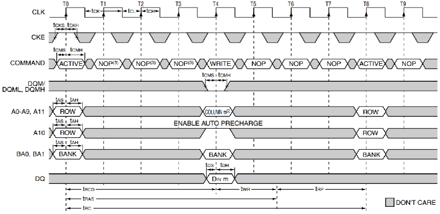
   
     > $t_{RCD}$：行有效与写命令间延迟；
     >
     > $t_{RAS}$：行有效与预充电间延迟；
     >
     > $t_{WR}$：写命令和预充电间延迟；
     >
     > $t_{RP}$：预充电与其他命令间延迟。
   
     > 1. 发送行有效 (ACTIVE) 命令，发送命令的同时包含行地址和 Bank 地址，然后等待 $t_{RCD}$ 时间，$t_{RCD}$ 表示行有效命令与读/写命令之间的延迟；
     >
     > 2. 发送写 (WRITE) 命令，在发送命令的同时发送列地址，完成寻址的地址输入。写命令是没有 CL 延迟的，主机在发送写命令的同时就可以把要写入的数据用 DQ 输入到 SDRAM 中，这是读命令与写命令的时序最主要的区别。
     >
     >    SDRAM 接收到带预充电要求的读/写命令后，并不会立即预充电，而是等待 $t_{WR}$ 时间才开始，$t_{WR}$ 表示写命令与预充电之间的延迟；
     >
     > 3. 读/写命令都通过拉高 A10 地址线，控制自动预充电，执行预充电 (auto precharge) 命令后，需要等待 $t_{RP}$ 时间，$t_{RP}$ 表示预充电与其它命令之间的延迟；
     >
     > 4. 发送第二次行有效 (ACTIVE) 命令准备读写下一个数据。
   
   - 读操作
   
     
     
     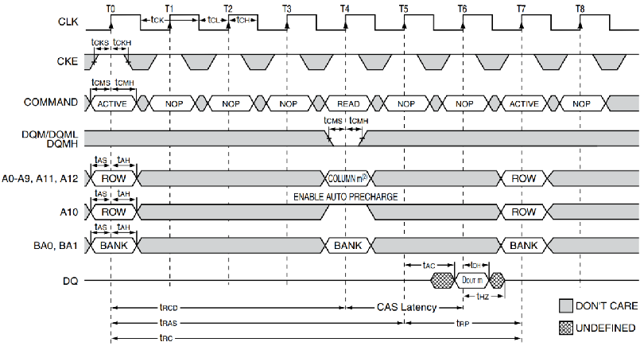
     
     > 1. 发送行有效 (ACTIVE) 命令，发送命令的同时包含行地址和 Bank 地址，然后等待 $t_{RCD}$ 时间，$t_{RCD}$ 表示行有效命令与读/写命令之间的延迟；
     > 2. 发送读 (READ) 命令，在发送命令的同时发送列地址，完成对 SDRAM 的寻址。
     > 3. 读/写命令都通过拉高 A10 地址线，控制自动预充电，执行预充电 (auto precharge) 命令后，需要等待 $t_{RP}$ 时间，$t_{RP}$ 表示预充电与其它命令之间的延迟；
     > 4. 发送第二次行有效 (ACTIVE) 命令准备读写下一个数据。

### FMC 外设驱动 SDRAM

#### FMC 外设

FMC，灵活的存储控制器，能驱动SRAM、NOR/NAND Flash以及SDRAM等存储器。(注意和FSMC的区别)

- FMC 的接口

  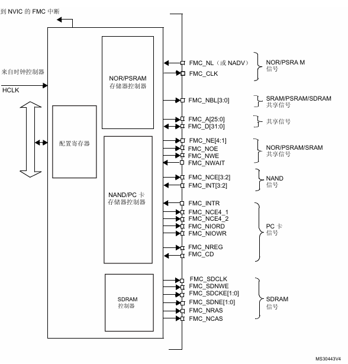

- FMC 定义下的外部器件映射

  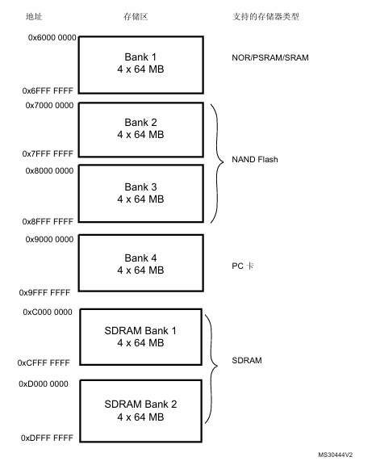

  - SDRAM 地址映射

    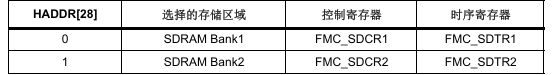

    > `HADDR[27:0]` 位将转换为外部 SDRAM 地址，具体取决于 SDRAM 控制器配置。
    >
    > - 数据大小：8、16 或 32 位；
    > - 行大小：11、12 或 13 位；
    > - 列大小：8、9、10 或 11 位；
    > - 内部存储区域数量：两个或四个内部存储区域。
    >
    > 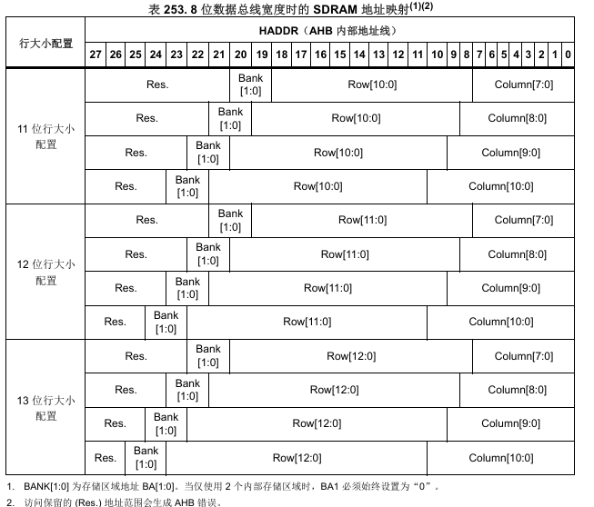

#### FMC 驱动 SDRAM

- 芯片连接

  | **SDRAM** | **FMC**     |
  | --------- | ----------- |
  | A[0:12]   | FMC_A[0:18] |
  | BS[0:1]   | FMC_BA[0:1] |
  | D[0:15]   | FMC_D[0:15] |
  | CKE       | FMC_SDCKE0  |
  | CLK       | FMC_SDCLK   |
  | UDQM      | FMC_NBL1    |
  | LDQM      | FMC_NBL0    |
  | WE        | FMC_SDNWE   |
  | CAS       | FMC_SDNCAS  |
  | RAS       | FMC_SDNRAS  |
  | CS        | FMC_SDNE0   |

- CubeMX 配置

  - 引脚配置

    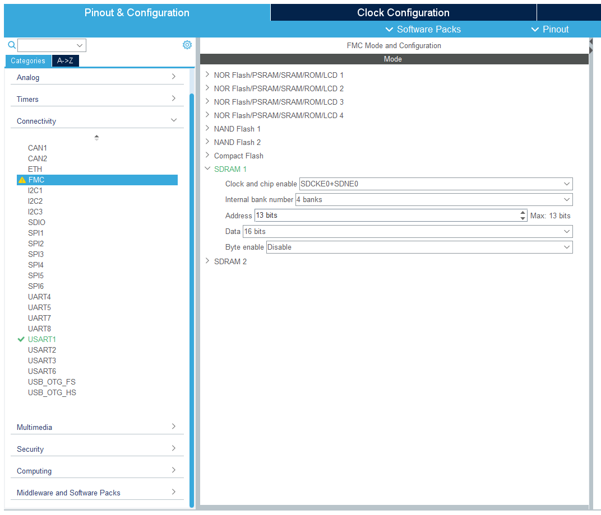

    > `Clock and chip enable`：时钟使能引脚和片选引脚；
    >
    > `Bank`：Bank个数；
    >
    > `Address`：地址位数；
    >
    > `Data`：数据位数；
    >
    > `Byte Enable`：高低字节选择；

  - 控制寄存器配置（`FMC_SDCRx`）

    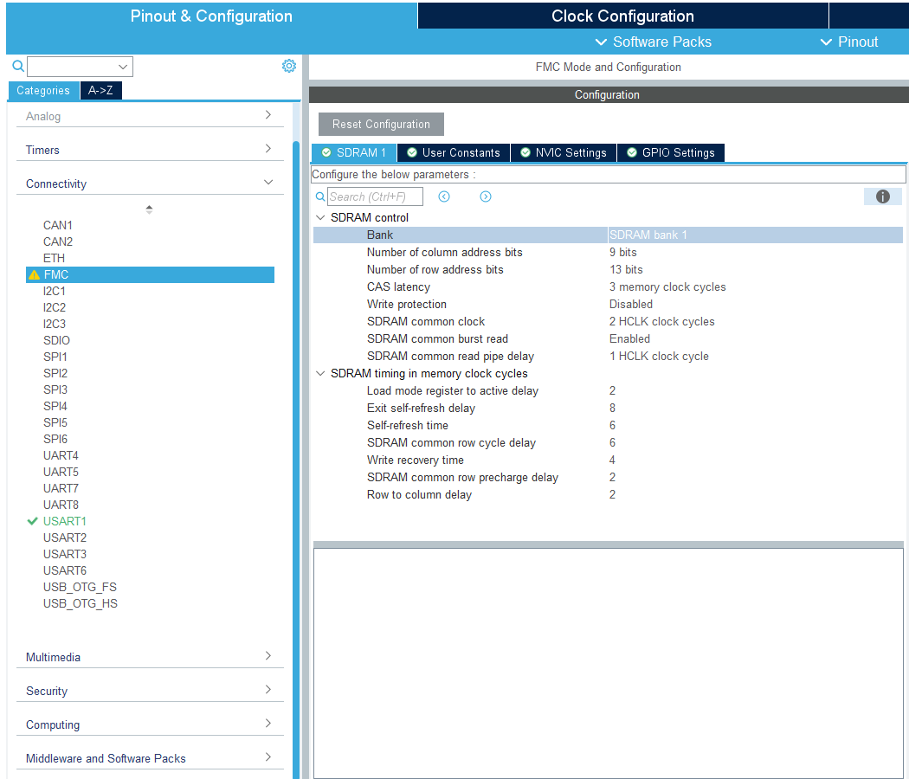

    > `Number of column address bits`：列地址位数；
    >
    > `Number of row address bits`：行地址位数；
    >
    > `CAS latency`： 列地址选通延迟，在发出读命令 (命令同时包含列地址) 后，需要等待几个时钟周期数据线才会输出有效数据，一般可以设置为 2 或 3 个FMC时钟周期。
    >
    > `Write protection`：设置是否使能写保护模式，如果使能了写保护则不能向 SDRAM 写入数据，正常使用都是禁止写保护。
    >
    > `SDRAM common clock`：设置 FMC 与外部 SDRAM 通讯时的时钟频率，可以设置成 STM32 的 HCLK 时钟频率的 1/2、1/3 或禁止输出时钟。
    >
    > `SDRAM common burst read`：设置是否使能突发读取模式，禁止时等效于 BL=1，使能时 BL 的值等于模式寄存器中的配置。
    >
    > `SDRAM common read pipe delay` ：在地址选通延迟后，再等待多少个 HCLK 时钟周期才进行数据采样，在确保正确的前提下，这个值设置为越短越好，可选择设置的参数值为 0、 1 或 2 个 HCLK 时钟周期。
    
  - 控制寄存器配置（`FMC_SDTRx`）
  
    > `Load mode register to active delay`：$t_{RSC}$
    > `Exit self-refresh delay`：$t_{XSR}$
    > `Self-refresh time` ： $t_{RAS}$
    > `SDRAM common row cycle delay` : $t_{RC}$
    > `Write recovery time` ： $t_{WR}$
    > `SDRAM common row precharge delay`： $t_{RP}$
    > `Row to column delay`： $t_{RCD}$
    
    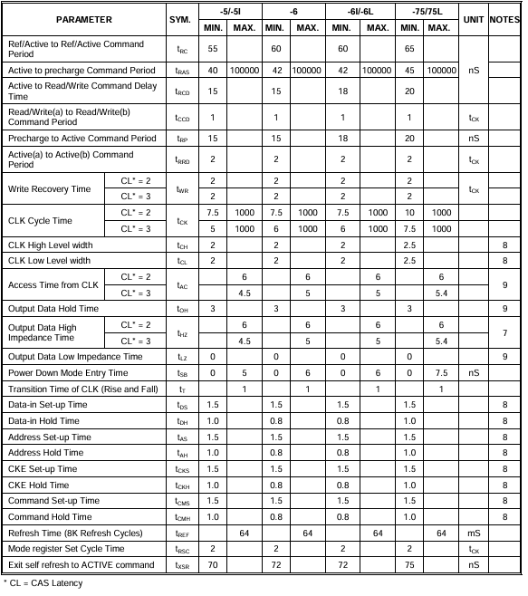
    
    参数单位是 SDRAM 时钟周期（`SDRAM common clock`)。设置值应略大于手册上的最小值。

- HAL 库函数

  ```c
  /**
   * @brief	使能 SDRAM 写保护
   */
  HAL_StatusTypeDef HAL_SDRAM_WriteProtection_Enable(SDRAM_HandleTypeDef *hsdram);
  
  /**
   * @brief	关闭 SDRAM 写保护
   */
  HAL_StatusTypeDef
  HAL_SDRAM_WriteProtection_Disable(SDRAM_HandleTypeDef *hsdram);
  
  /**
   * @brief	SDRAM 	发送指令
   * @param	Command SDRAM命令的结构体
   * @param	Timeout 超时时间
   */
  HAL_StatusTypeDef
  HAL_SDRAM_SendCommand(SDRAM_HandleTypeDef *hsdram, FMC_SDRAM_CommandTypeDef *Command,
   uint32_t Timeout);
  
  typedef struct
  {
   uint32_t CommandMode; 				// 命令类型 
   uint32_t CommandTarget; 			// 目标 SDRAM 存储区域 
   uint32_t AutoRefreshNumber; 		// 自刷新次数
   uint32_t ModeRegisterDefinition; 	// SDRAM 模式寄存器的内容
  }FMC_SDRAM_CommandTypeDef
  ```

  > 1. `CommandMode`
  >
  >    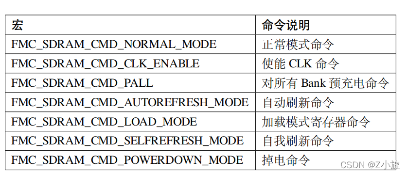
  >
  > 2. `CommandTarget`
  >
  >    ```c
  >    /** @defgroup FMC_SDRAM_Command_Target FMC SDRAM Command Target
  >      * @{
  >      */
  >    #define FMC_SDRAM_CMD_TARGET_BANK2              FMC_SDCMR_CTB2
  >    #define FMC_SDRAM_CMD_TARGET_BANK1              FMC_SDCMR_CTB1
  >    #define FMC_SDRAM_CMD_TARGET_BANK1_2            (0x00000018U)
  >    ```
  > 3. `ModeRegisterDefinition`
  >
  >    设置 SDRAM 模式寄存器，本寄存器在 SDRAM 内部定义。
  >
  >    以下是模式寄存器的位定义：
  >
  >    ```c
  >    /**
  >    * @brief FMC SDRAM 模式配置的寄存器相关定义
  >    */
  >    // 突发长度设置
  >    #define SDRAM_MODEREG_BURST_LENGTH_1 ((uint16_t)0x0000)
  >    #define SDRAM_MODEREG_BURST_LENGTH_2 ((uint16_t)0x0001)
  >    #define SDRAM_MODEREG_BURST_LENGTH_4 ((uint16_t)0x0002)
  >    #define SDRAM_MODEREG_BURST_LENGTH_8 ((uint16_t)0x0004)
  >    // 连续还是间隔模式
  >    #define SDRAM_MODEREG_BURST_TYPE_SEQUENTIAL ((uint16_t)0x0000)
  >    #define SDRAM_MODEREG_BURST_TYPE_INTERLEAVED ((uint16_t)0x0008)
  >    // CL等待几个时钟周期
  >    #define SDRAM_MODEREG_CAS_LATENCY_2 ((uint16_t)0x0020)
  >    #define SDRAM_MODEREG_CAS_LATENCY_3 ((uint16_t)0x0030)
  >    // 正常模式
  >    #define SDRAM_MODEREG_OPERATING_MODE_STANDARD ((uint16_t)0x0000)
  >    // 设置写操作的模式，可以选择突发模式或者单次写入模式
  >    #define SDRAM_MODEREG_WRITEBURST_MODE_PROGRAMMED ((uint16_t)0x0000)
  >    #define SDRAM_MODEREG_WRITEBURST_MODE_SINGLE ((uint16_t)0x0200)
  >    ```
  >

  ```c
  /**
   * @brief	SDRAM 	设置SDRAM刷新频率
   */
  HAL_StatusTypeDef
  HAL_SDRAM_ProgramRefreshRate(SDRAM_HandleTypeDef *hsdram, uint32_t RefreshRate);
  ```
  
  > $$
  > COUNT = (SDRAM刷新周期 / 行数) / SDRAM时钟周期 - 20
  > $$
  >
  > SDRAM 刷新周期由手册给出，SDRAM 接收读请求后若出现内部刷新请求，必须将刷新速率增加 20 个 SDRAM 时钟周期，获得充足余量。
  
  ```c
  HAL_StatusTypeDef
  HAL_SDRAM_GetModeStatus(SDRAM_HandleTypeDef *hsdram);
  ```
  
- SDRAM 函数实现

  ```c
  /**
   * @brief   SDRAM 发送指令函数
   */
  static uint8_t SDRAM_SendCommand(uint32_t CommandMode, uint32_t Bank, uint32_t RefreshNum, uint32_t RegVal)
  {
      uint32_t CommandTarget;
      FMC_SDRAM_CommandTypeDef Command;
  
      if (Bank == 1)
          CommandTarget = FMC_SDRAM_CMD_TARGET_BANK1;
      else if (Bank == 2)
          CommandTarget = FMC_SDRAM_CMD_TARGET_BANK2;
  
      Command.CommandMode            = CommandMode;
      Command.CommandTarget          = CommandTarget;
      Command.AutoRefreshNumber      = RefreshNum;
      Command.ModeRegisterDefinition = RegVal;
      if (HAL_SDRAM_SendCommand(&hsdram1, &Command, 0x1000) == HAL_OK)
          return 1;
      else
          return 0;
  }
  
  /**
   * @brief   SDRAM 初始化函数
   */
  void SDRAM_Init(void)
  {
      uint32_t temp;
  
      SDRAM_SendCommand(FMC_SDRAM_CMD_CLK_ENABLE, 1, 1, 0);       // 使能时钟信号
      delay_us(500);                                              // 至少延时200us
      SDRAM_SendCommand(FMC_SDRAM_CMD_PALL, 1, 1, 0);             // 发送全部预充电命令
      SDRAM_SendCommand(FMC_SDRAM_CMD_AUTOREFRESH_MODE, 1, 8, 0); // 设置自动刷新次数
  
      temp = SDRAM_MODEREG_BURST_LENGTH_1 |                   // 设置突发长度
             SDRAM_MODEREG_BURST_TYPE_SEQUENTIAL |            // 设置突发类型
             SDRAM_MODEREG_CAS_LATENCY_3 |                    // 设置CAS值
             SDRAM_MODEREG_OPERATING_MODE_STANDARD |          // 设置操作模式
             SDRAM_MODEREG_WRITEBURST_MODE_SINGLE;            // 设置突发写模式：单点访问
      SDRAM_SendCommand(FMC_SDRAM_CMD_LOAD_MODE, 1, 1, temp); // 装载模式寄存器的值
  
      HAL_SDRAM_ProgramRefreshRate(&hsdram1, 683); // 设置刷新速率
  }
  
  /**
   * @brief   在指定地址(WriteAddr+Bank5_SDRAM_ADDR)开始,连续写入n个字节
   * @param   pBuffer     字节指针
   * @param   WriteAddr   要写入的地址
   * @param   n           要写入的字节数
   */
  void SDRAM_WriteBuffer(uint8_t *pBuffer, uint32_t WriteAddr, uint32_t n)
  {
      for (; n != 0; n--) {
          *(volatile uint8_t *)(Bank5_SDRAM_ADDR + WriteAddr) = *pBuffer;
          WriteAddr++;
          pBuffer++;
      }
  }
  
  /**
   * @brief   在指定地址(WriteAddr+Bank5_SDRAM_ADDR)开始,连续读出n个字节
   * @param   pBuffer     字节指针
   * @param   WriteAddr   要读出的地址
   * @param   n           要读出的字节数
   */
  void SDRAM_ReadBuffer(uint8_t *pBuffer, uint32_t ReadAddr, uint32_t n)
  {
      for (; n != 0; n--) {
          *pBuffer++ = *(volatile uint8_t *)(Bank5_SDRAM_ADDR + ReadAddr);
          ReadAddr++;
      }
  }
  ```

## 4. 外接 NAND FLASH 驱动

### 外接 NAND FLASH 芯片（MT29F4G08）

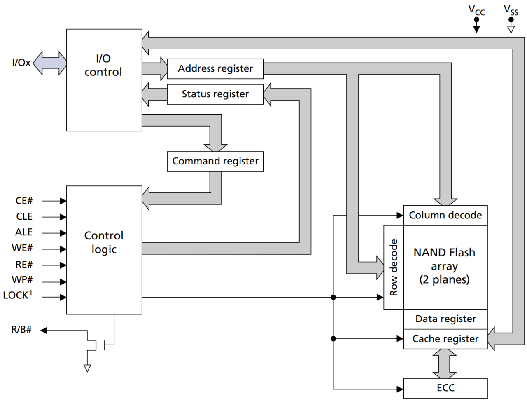

- 芯片引脚

  | 引脚 | 含义                                   |
  | ---- | -------------------------------------- |
  | CE#  | 芯片使能，用于选中NAND FLASH           |
  | CLE  | 命令锁存使能，表示写入的是命令         |
  | ALE  | 地址锁存使能，表示写入的是地址         |
  | WE#  | 写使能，用于写入数据                   |
  | RE#  | 读使能，用于读取数据                   |
  | WP#  | 写保护                                 |
  | R/B  | 就绪/忙，用于判断编程/擦除操作是否完成 |
  | I/Ox | 地址/数据 输入/输出口                  |

- 存储结构：数据存储区(data area)和备用区域(spare area)

  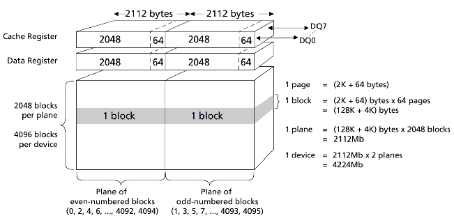

  > MT29F4G08：数据存储区大小为2KB（存放有效数据），备用区域大小为64B（存放ECC校验值）。

  NAND FLASH 由块(block)组成，每块又由若干页(page)组成。页是数据读写的最小单位，块是擦除的最小单位。

- 寻址：块地址(Block Address)、页地址(Page Address)、列地址(Column Address)

  对MT29F4G08，这三个地址，通过5个周期发送，首先发送列地址，再发送页地址和块地址。

  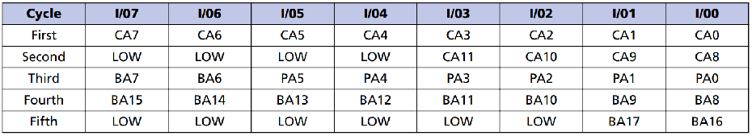

  > - `CA[11:0]`表示列地址，用于在一个Page内部寻址，器件的Page为2112字节，需要12根地址线寻址；
  > - `PA[5:0]`表示页地址，用于在一个Block内部寻址，器件的Block为64个Page，需要6根地址线寻址；
  > - `BA[17:6]`表示块地址，用于块寻址，器件总共有4096个Block ，需要12根地址线寻址。

- 操作指令

  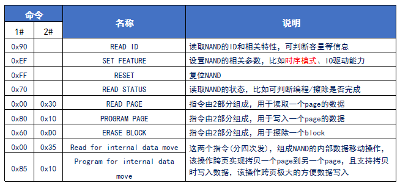

  1. `READ PAGE(00h-30h)`

     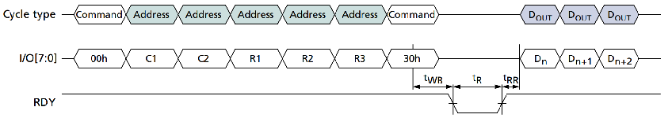

     > READ PAGE的命令分两次发送:
     >
     > 1. 发送`00h`命令；
     > 2. 发送5次地址(Block&Page&Column地址)，指定读取的地址；
     > 3. 发送`30h`命令；
     > 4. 等待$t_{RDY}$时间；
     > 5. 读取PAGE里面的数据。

  2. `PROGRAM PAGE(80h-10h)`

     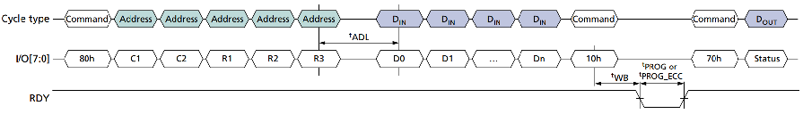

     > PROGRAM PAGE的命令分两次发送：
     >
     > 1. 发送`80h`命令；
     > 2. 发送5次地址(Block&Page&Column地址)，指定写入的地址；
     > 3. 等待$t_{ADL}$时间；
     > 4. 发送需要写入的数据；
     > 5. 发送`10h`命令；
     > 6. 等待$t_{PROG}$时间；
     > 7. 发送`READ STATUS`命令，查询NAND FLASH状态，完成写入操作

  3. `ERASE BLOCK(60h-D0h)`

     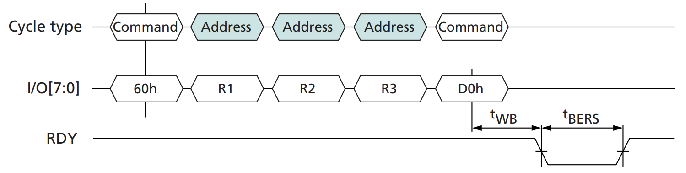

     > ERASE BLOCK的命令分两次发送：
     >
     > 1. 发送`60h`命令；
     > 2. 发送3次地址(Block地址)，指定要擦除的Block地址；
     > 3. 发送`D0h`命令；
     > 4. 等待$t_{BERS}$时间；
     > 5. 发送`READ STATUS`命令，查询状态，完成一个BLOCK的擦除。

  4. `INTERNAL DATA MOVE(00h-35h && 85h-10h)`

     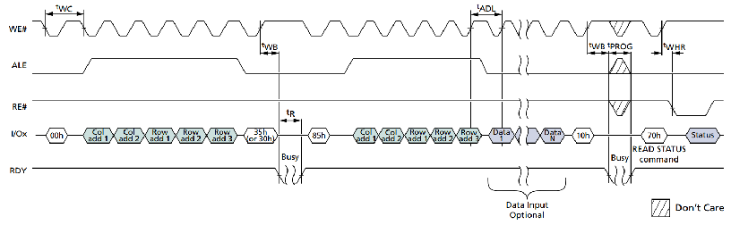

     > 1. 发送`READ FOR INTERNAL DATA MOVE`的命令（00h-35h）过程中指定源地址（源数据）；
     > 2. 发送`READ STATUS`命令查询状态或查询RB信号；
     > 3. 发送`PROGRAM FOR INTERNAL DATA MOVE`的命令（85h-10h）过程中指定目标地址；
     > 4. 等待$t_{PROG}$时间；
     > 5. 发送`READ STATUS`命令查询状态，等待操作完成。

     > 只能在同一个plane中互相拷贝（源地址和目标地址在同一个plane）。内部数据移动过程中，也可以写入数据。当发送`10h`命令时，开始进行拷贝。

- 时间参数

  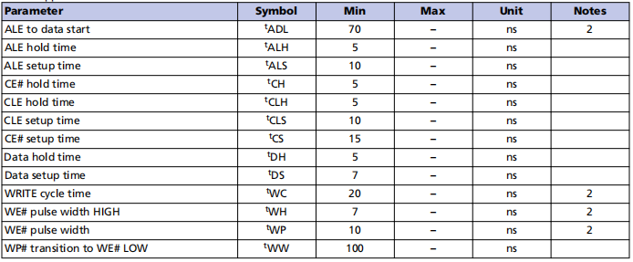

  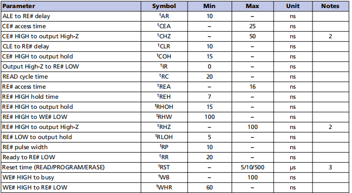

  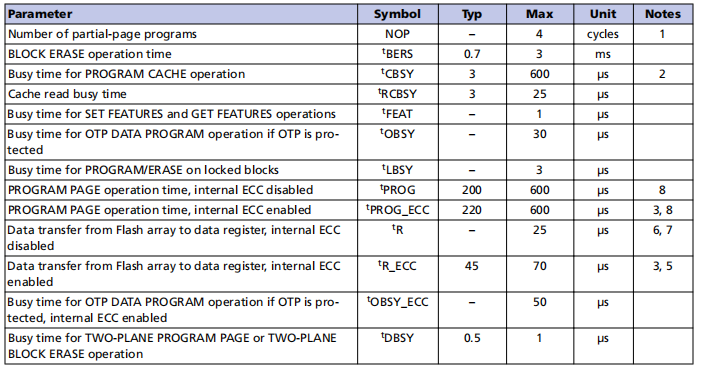


- ECC 检验

  - 坏块

    由于物理特性，NAND FLASH只有有限的擦写次数，超过后，基本上是坏了，属于坏块。需要对坏块进行识别和标记，合理的分配和使用好的块，以最大限度延长NAND FLASH的寿命。

    写入时先用算法计算的到数据的ECC值，把ECC值和块内数据一起存入NAND FLASH中。待读取时也是把块内数据和ECC一并读出，然后用相同的算法计算块内数据的ECC和读出的ECC进行比较，如果不同就认为数据已经发生了变质，没法相信了。

    > NAND FLASH的坏块识别有几种方式：	
    >
    > 1. NAND厂家出厂时，会在每个Block的第一个Page和第二个Page的spare区的第一个字节写入非0xFF的值来表示，可以通过这个来判断该块是否为坏块。
    > 2. 通过给每个Block写入数据（0xFF/0x00）,然后读取出来，判断写入的数据和读取的数据是否完全 一样，来识别坏块。
    > 3. 通过读取数据时，检验ECC错误，来识别坏块。

  - 转换表

    文件系统访问文件时，使用的是逻辑地址，是按顺序编号的，不考虑坏块的情况。NAND FLASH存储地址，称之为物理地址，是有可能存在坏块的。两个地址之间，必须有一个映射表，将逻辑地址转换为物理地址，且不能指向坏块的物理地址，这个映射表称之为 逻辑地址-物理地址转换表，简称转换表(LUT表)。映射表必须存储到NAND FLASH，以便上电后重建。当出现坏块时，需要进行坏块标记并且不再作为正常块使用，还得从保留区提取一个未使用过的块来代替坏块。

    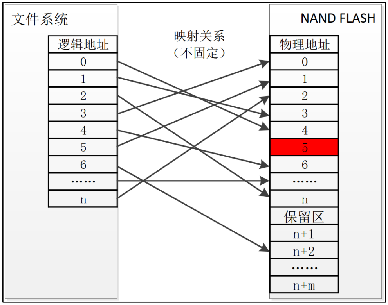

    利用每个Block的第一个page的spare区来存储映射表，另外还需要标记这个Block是否被利用。

    > 第一个字节：用来表示该块是否为坏块（ 0xFF表示好块；0xAA表示坏块）	
    >
    > 第二个字节：用来表示是否被占用（0xFF表示未被占用；0xCC表示已被占用）	
    >
    > 第三和四个字节：用来表示存储该块所映射到的逻辑地址（0xFFFF表示未被分配）
    >
    > 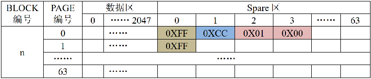
    > 

  - ECC 校验

    ECC，是一种对传输数据的错误检测和修正算法。NAND FLASH 存储单元是串行组织的，当读取一个单元时，读出放大器所检测到的信号强度会被这种串行存储结构削弱，降低了所读信号的准确性，导致读数出错（一般只有1个bit出错）。ECC 就可以检测这种错误，并修正错误的数据位。ECC 校验有三种常用的算法：汉明码(Hamming Code)、RS 码(Reed Solomom Code)和 BCH 码。
  
    STM32 的 FSMC 模块支持硬件 ECC 计算，使用的就是汉明码，可以检测出错误，但无法修正。支持页大小按256、512、1024、2048、4096和8192字节为单位进行ECC计算。
  
    > 1. 数据分割(1/2、1/4、1/8)通过异或运算进行奇偶校验，得到偶校验值和奇校验；
    > 2. 得到ECC值后，需要将原数据包和 ECC 数值写入NAND FLASH里。读取时，ECC值将会重新计算，对比即可知数据有无异常。
    > 3. 如果有异常，按照步骤1进行操作，通过原来 ECC 和现有 ECC 异或可得出错位置。
    > 4. 进行数据纠正。
  
    写操作：STM32 FMC的硬件ECC会计算出ECC值，需要写入到spare区对应地址；
  
    读操作：STM32 FMC的硬件ECC会计算一个新的ECC值，需要进行与原来的ECC值比对，判断数据是否有误，以及1bit 数据纠正。
  
### FMC 驱动 NAND FLASH

- 芯片连接

    | **NAND FLASH** | **FMC**    |
    | -------------- | ---------- |
    | CLE            | FMC_A16    |
    | ALE            | FMC_A17    |
    | WE             | FMC_NWE    |
    | RE             | FMC_NOE    |
    | CE             | FMC_NCE3   |
    | IO[0:7]        | FMC_D[0:7] |
    | R/B            | FMC_NWAIT  |

- CubeMX 配置

  - 引脚配置
  
    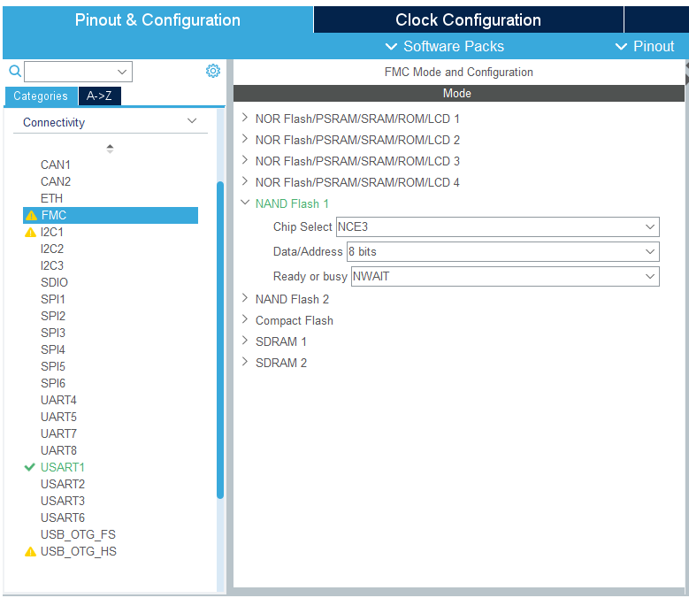
  
    > `Data Address`：数据位数；
    >
    > `Ready or busy`：NWAIT 引脚。
  
  - 基础配置
  
    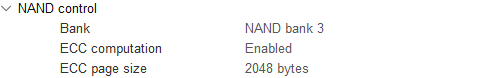
  
  - 时序配置
  
    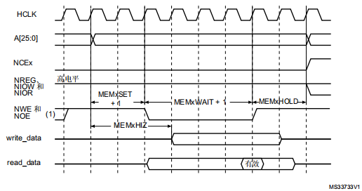
  
    > `MEMxSET` 对应到器件是 $t_{CLS}/t_{ALS}$；
    >
    > `MEMxWAIT` 对应到器件是 $t_{RP}/t_{WP}$；
    >
    > `MEMxHOLD` 对应到器件是 $t_{CLH}/t_{ALH}$；
    >
    > `MEMxHIZ` 对应到器件是 $t_{CLS}/t_{ALS}-t_{DS}$；
  
    四个参数的配置可以参考以下公式(注意CubeMX配置减一)：
  
    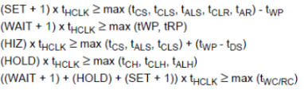
  
    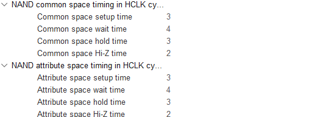
  
  - 时序配置
  
    
  
    对应 $t_{AR}$ 和 $t_{CLR}$。
  
    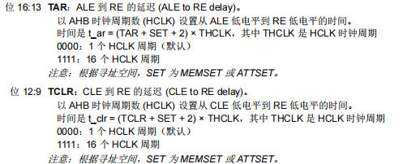
  
  - 容量配置
  
    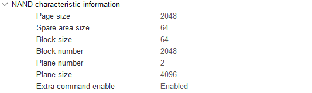
  
    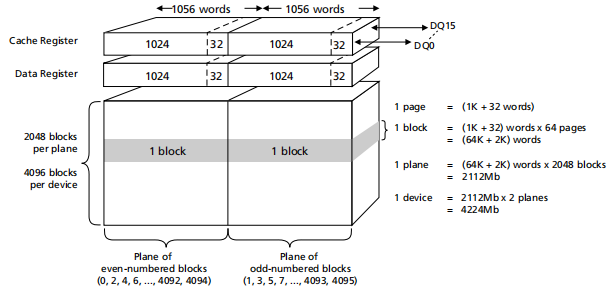

- HAL 库函数

  ```c
  /**
    * @brief  NAND Flash 重置
    */
  HAL_StatusTypeDef HAL_NAND_Reset(NAND_HandleTypeDef *hnand)
  
  /**
    * @brief  读取NAND FLASH ID
    * @param  pNAND_ID NAND ID 结构体
    * @attention 只能读取四位 ID
    */
  HAL_StatusTypeDef HAL_NAND_Read_ID(NAND_HandleTypeDef *hnand, NAND_IDTypeDef *pNAND_ID)
      
  // ID 结构体
  typedef struct
  {
    uint8_t Maker_Id;
    uint8_t Device_Id;
    uint8_t Third_Id;
    uint8_t Fourth_Id;
  } NAND_IDTypeDef;
  
  /**
    * @brief  NAND FLASH 擦除块
    * @param  pAddress NAND FLASH 地址结构体
    */
  HAL_StatusTypeDef HAL_NAND_Erase_Block(NAND_HandleTypeDef *hnand, const NAND_AddressTypeDef *pAddress)
  
  // NAND FLASH 地址结构体
  typedef struct
  {
    uint16_t Page;   
    uint16_t Plane;   
    uint16_t Block;  
  } NAND_AddressTypeDef;
  
  /**
    * @brief  8位读取NAND FLASH页数据
    * @param  pBuffer  读取数组地址
    * @param  NumPageToRead  读取的页数
    */
  HAL_StatusTypeDef HAL_NAND_Read_Page_8b(NAND_HandleTypeDef *hnand, const NAND_AddressTypeDef *pAddress,uint8_t *pBuffer, uint32_t NumPageToRead)
      
  /**
    * @brief  8位写入NAND FLASH页数据
    * @param  pBuffer  写入数组地址
    * @param  NumPageToWrite 写入的页数
    */
  HAL_StatusTypeDef HAL_NAND_Write_Page_8b(NAND_HandleTypeDef *hnand, const NAND_AddressTypeDef *pAddress,const uint8_t *pBuffer, uint32_t NumPageToWrite)
  ```

- 注意事项：

  ```c
  hnand1.Init.Waitfeature = FMC_NAND_PCC_WAIT_FEATURE_DISABLE; // 此处禁用 WAIT
  ```

  