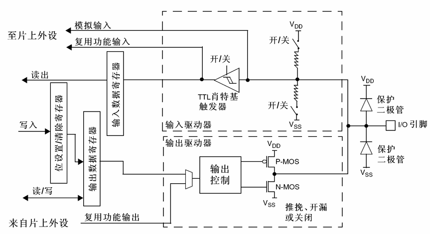
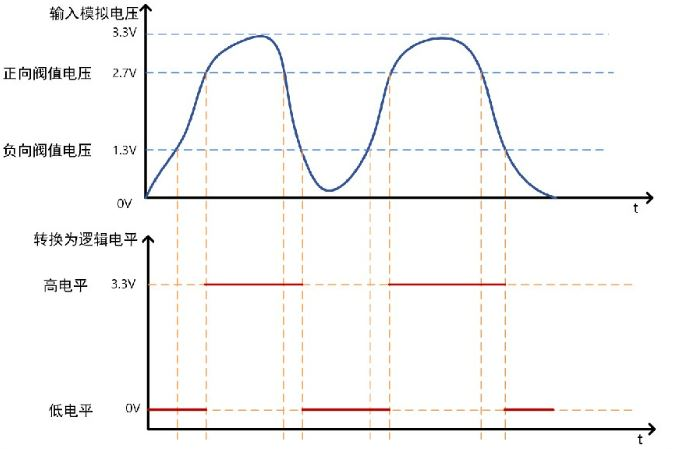
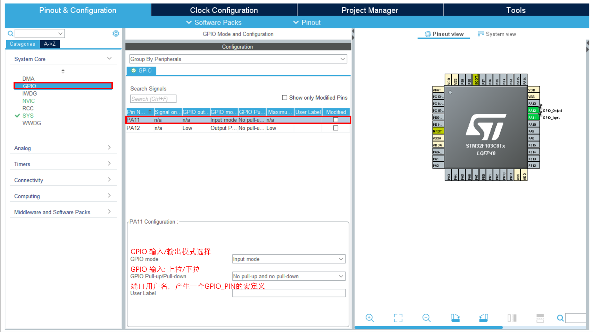
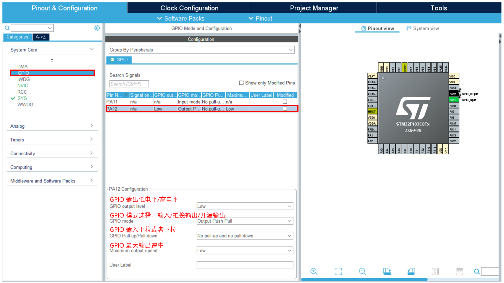

# STM32 基本外设 1_GPIO

> MCU 是一个数字系统，最基本的输出是数字信号输出，单片机的 GPIO 输出能力弱，通常用来做控制信号输出；单片机的 GPIO 输入能力弱，通常用来做信号接收。数字信号相较于模拟信号更好传输，传输不容易发生信息失真或者信息丢失。
>
> GPIO 是所有单片机最基础的外设。

## 1. GPIO 基本原理

General Purpose Input Output，即**通用输入输出端口**，简称GPIO;

### GPIO 电气特性

数字信号分为 0 和 1 两种，在正逻辑下，0 为低电平，1 为高电平；

GPIO 识别电压范围：0 : $-0.3V ≤ V_{IL} ≤ 1.164V$，1: $1.833V ≤ V_{IH} ≤ 3.6V$

GPIO 无法提供大输出电流或者接收大输入电流，电路设计时应当注意 GPIO 的电流输入。

### GPIO 工作框图

 

> - 施密特触发器：使用滞回比较，用于抑制频繁的输入电平抖动。
>
>   
>
> - P-MOS 和 N-MOS 组成推挽输出电路，如果断开 P-MOS 将失去高电平输出能力。
>
> - 两个二极管用于保护端口短接或者电压异常造成的芯片内部损坏。
>
> - 输入端可以选择是否使用上拉和下拉电阻。

1. GPIO 的工作模式

   | 模式           | 特点及应用                                  |
   | -------------- | ------------------------------------------- |
   | 浮空输入       | 输入用，完全浮空，状态不定                  |
   | 上拉输入       | 输入用，用内部上拉，默认是高电平            |
   | 下拉输入       | 输入用，用内部下拉，默认是低电平            |
   | 模拟功能       | ADC、DAC                                    |
   | 开漏输出       | 软件IIC的SDA、SCL等                         |
   | 推挽输出       | 驱动能力强，25mA（max），通用输出           |
   | 开漏式复用功能 | 片上外设功能（硬件IIC 的SDA、SCL引脚等）    |
   | 推挽式复用功能 | 片上外设功能（SPI 的SCK、MISO、MOSI引脚等） |
   
   - 浮空输入
   
     1. 上拉电阻关闭
     2. 下拉电阻关闭
     3. 施密特触发器打开
     4. 双MOS管不导通
   
     **特点：** 空闲时，IO状态不确定(高阻态)，由外部环境决定。
   
   - 上拉输入
   
     1. 上拉电阻打开
     2. 下拉电阻关闭
     3. 施密特触发器打开
     4. 双MOS管不导通
   
     **特点：** 空闲时，IO呈现高电平。
   
   - 下拉输入
   
     1. 上拉电阻关闭
     2. 下拉电阻打开
     3. 施密特触发器打开
     4. 双MOS管不导通
   
     **特点：** 空闲时，IO呈现低电平。
   
   - （复用）模拟功能
   
     1. 上拉电阻关闭
     2. 下拉电阻关闭
     3. 施密特触发器关闭
     4. 双MOS管不导通
   
     **特点：** 专门用于模拟信号输入或输出，如：ADC和DAC。
   
   - 开漏输出（Open-Drain）
   
     1. 上拉电阻关闭
     2. 下拉电阻关闭
     3. 施密特触发器打开
     4. P-MOS管始终不导通
     5. 往ODR对应位写0，N-MOS管导通，写1则N-MOS管不导通
   
     **特点：** 不能输出高电平，必须有外部（或内部）上拉才能输出高电平。
   
   - 开漏复用
   
     1. 上拉电阻关闭
     2. 下拉电阻关闭
     3. 施密特触发器打开
     4. P-MOS管始终不导通
   
     **特点：**
   
     1. 不能输出高电平，必须有外部（或内部）上拉才能输出高电平；
     2. 由其他外设控制输出。
   
   - 推挽输出
   
     1. 上拉电阻关闭
     2. 下拉电阻关闭
     3. 施密特触发器打开
     4. 往ODR对应位写0，N-MOS管导通，写1则P-MOS管导通
   
     **特点：** 可输出高低电平，驱动能力强。
   
   - 推挽复用
   
     1. 上拉电阻关闭
     2. 下拉电阻关闭
     3. 施密特触发器打开
   
     **特点：**
   
     1. 可输出高低电平，驱动能力强；
     2. 由其他外设控制输出。

## 2. 配置和 HAL 库函数

### GPIO 配置





### HAL 库函数

```c
/**
  * @brief	GPIO输出函数
  * @param 	GPIOx GPIO通道号，如GPIOA
  * @param	GPIO_Pin	GPIO引脚号，如GPIO_PIN_13
  * @param 	PinState	GPIO引脚状态，为枚举类型（GPIO_PIN_SET,GPIO_PIN_RESET）
  */

void HAL_GPIO_WritePin(GPIO_TypeDef* GPIOx, uint16_t GPIO_Pin, GPIO_PinState PinState);

/**
  * @brief	GPIO电平翻转函数
  * @param 	GPIOx GPIO通道号，如GPIOA
  * @param	GPIO_Pin	GPIO引脚号，如GPIO_PIN_13
  */
void HAL_GPIO_TogglePin(GPIO_TypeDef* GPIOx, uint16_t GPIO_Pin);

/**
  * @brief	GPIO读取电平函数
  * @param 	GPIOx GPIO通道号，如GPIOA
  * @param	GPIO_Pin	GPIO引脚号，如GPIO_PIN_13
  * @return	引脚状态，高为1，低为0
  */
GPIO_PinState HAL_GPIO_ReadPin(GPIO_TypeDef* GPIOx, uint16_t GPIO_Pin);


/**
  * @brief	毫秒延时函数
  * @param 	Delay 延时毫秒数
  */
__weak void HAL_Delay(uint32_t Delay);
```

