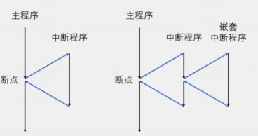
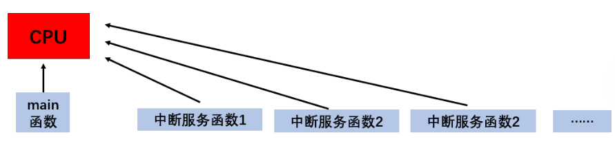
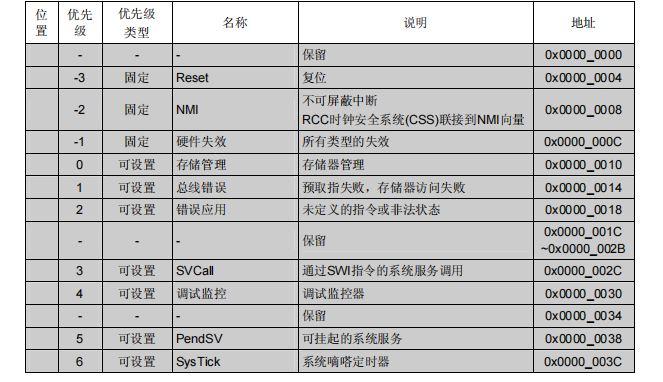
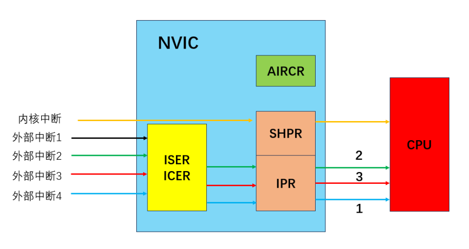
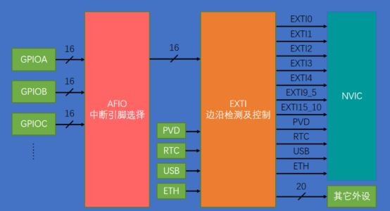
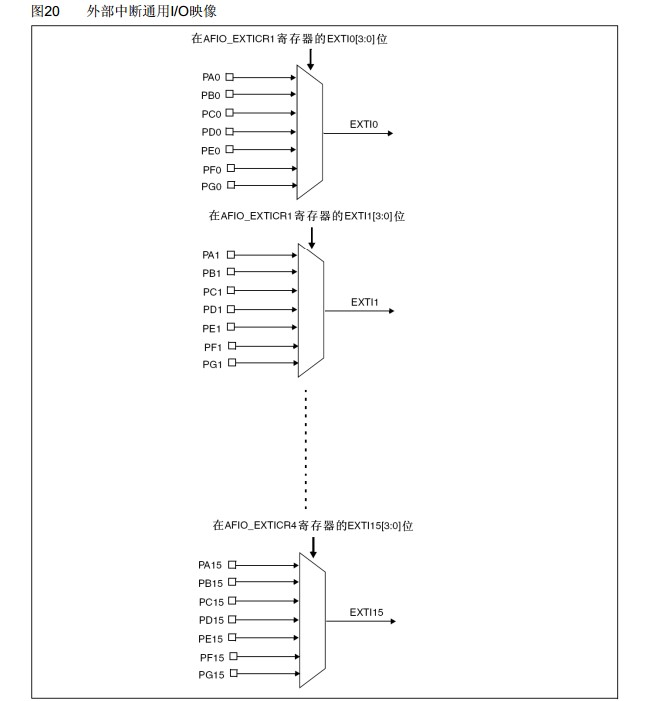
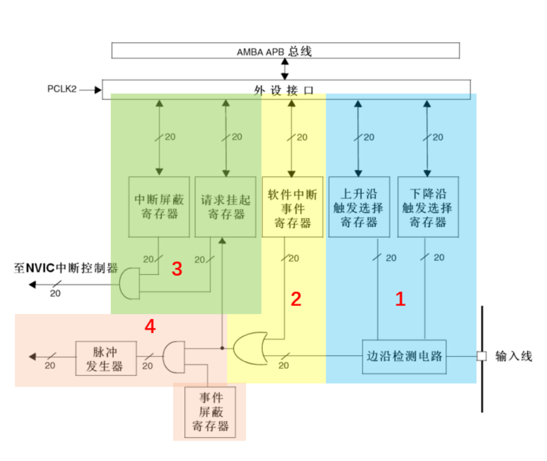
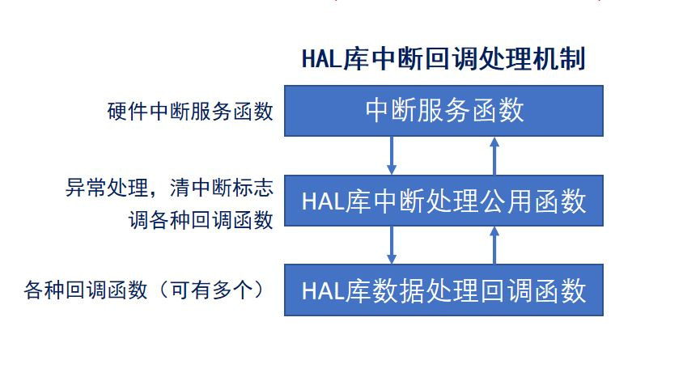
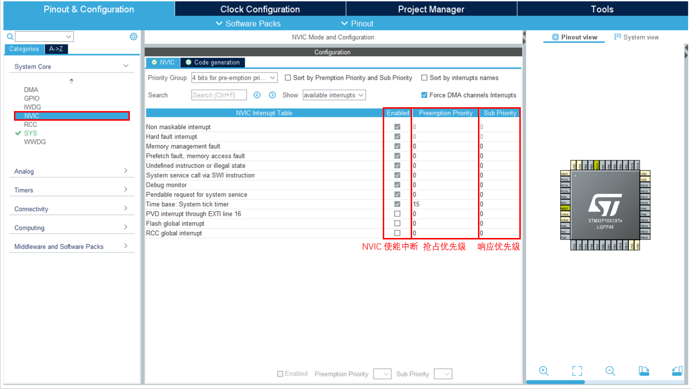
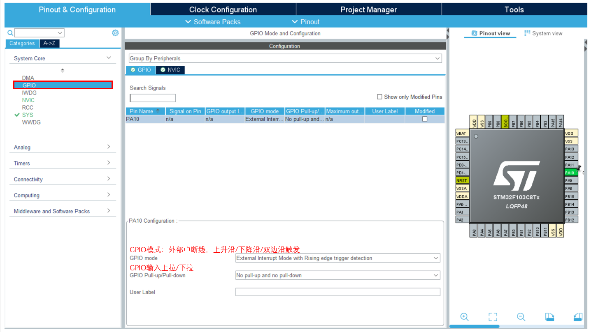

# STM32 基本外设 2_中断和外部中断

## 1. 中断基本概念

### 中断的概念

MCU 裸机同时只能运行一个线程，即 `main.c` 里面的 `while(1)` 无限循环。

单线程运行的实时性难以保证，线程内的代码按照顺序执行，假设有以下代码：

```c
while(1)
{
    TaskA;	
    TaskB;
}
```

TaskA 先于 TaskB 执行，如果 TaskA 需要执行较长时间，TaskB 的执行实时性无法保证。

如果有需要实时性的任务，需要使用中断机制。

**中断：** 打断CPU执行正常的程序，转而处理紧急程序，然后返回原暂停的程序继续运行。

**中断嵌套**：一个中断程序运行时可以被更高优先级的中断打断。依次处理后依次返回。

中断执行时主线程不会执行，因此中断内的任务执行时间不能过长，中断内不能包含延时函数或者阻塞函数。



### NVIC 嵌套向量中断控制器

NVIC 对 STM32 中的中断进行管理，因为 Cortex-M 内核中的中断数量很多，当同时出现多个中断时，优先处理哪个中断，以及哪些中断不处理等，都要靠 NVIC 进行控制。

NVIC支持256个中断（16个内核中断+240个外设中断），支持256个优先级。对于 ST 公司来说，用不了内核中的所有中断以及中断优先级，进而对其进行了一定的裁剪。STM32中共有10个内核中断，60个外部中断，16个中断优先级。

- 中断服务函数和中断向量表

  **中断服务函数是中断被触发后系统的执行部分，中断服务函数是中断的入口。**

  **中断向量表：** 定义一块固定的内存，以4字节对齐，存放各个中断服务函数程序的首地址。中断向量表定义在启动文件，当发生中断，CPU会自动执行对应的中断服务函数。

  

  中断向量表可以在手册和启动文件中查询。

  

- NVIC 的基本工作原理

  
  
  当外设中断被触发时，中断首先进入`ICER`、`ISER`寄存器，用于控制是否开对应的中断，打开的中断进入`IPR`寄存器，进行中断优先级的判断，`IPR`寄存器受`AIRCR`寄存器控制，最后按照中断优先级依次进入CPU被执行。
  
  内核中断由`SHPR`寄存器控制，`SHPR`与`IPR`寄存器属于同一级别。
  
  |寄存器名称|	位数|	个数|	作用|
  |-|-|-|-|
  |中断使能寄存器（`ISER`）|	32|	8|	每一位控制一个中断（打开）|
  |中断失能寄存器（`ICER`）|	32|	8|	每一位控制一个中断（关闭）|
  |应用程序中断及复位控制寄存器（`AIRCR`）|	32|	1|	位[10:8]控制中断优先级分组|
  |中断优先级寄存器`IPR`|	8|	240| 8个位对应一个中断，而 STM32 只使用高4位 |
  
  > 1. `ISER` 与 `ICER` 寄存器共有 256位，用于控制240个中断的打开与关闭；
  > 2. `AIRCR`寄存器，位10、9、8三位用于控制优先级的分组，三位共8种，取其中的5组作为中断优先级的分组情况；
  > 3. `IPR`寄存器，用于控制中断的优先级，包括抢占优先级与响应优先级，高4位控制，至于哪几位控制抢占，哪几位控制响应，由`AIRCR`寄存器决定；
  
- 中断优先级

  > 1. **抢占优先级(pre)：** 高抢占优先级可以打断正在执行的低抢占优先级中断。为高n位。
  > 2. **响应优先级(sub)：** 当抢占优先级相同时，响应优先级高的先执行，但是不能互相打断。为低(4-n)位。
  > 3. 抢占和响应都相同的情况下，自然优先级越高的，先执行。
  > 4. 自然优先级：中断向量表的优先级。
  > 5. ***数值越小，表示优先级越高***。

  |优先级分组	|AIRCR[10:8]	|IPR[7:4]分配|	分配结果|
  |-|-|-|-|
  |0|111|None：[7:4]|抢占优先级(0位、0级)；响应优先级（4位、16级）|
  |1|110|[7]:[6:4]|抢占优先级(1位、2级)；响应优先级（3位、8级）|
  |2|101|[7:6]:[6:4]|抢占优先级(2位、4级)；响应优先级（2位、4级）|
  |3|100|[7:5]:[4]|抢占优先级(3位、8级)；响应优先级（1位、2级）|
  |4|011|[7:4]:None|抢占优先级(4位、16级)；响应优先级（0位、0级）|

## 2. 外部中断

### EXTI 基本概念

EXTI，即外部中断事件控制器，包含20个产生事件/中断请求的边沿检测器，即20条EXIT线；

> - 中断和事件的区别：
>
>   1. 中断：要进入NVIC，有相应的中断服务函数，需要CPU处理；
>
>   2. 事件：不进入NVIC，仅用内部硬件自动控制，TIM，DMA，ADC等；

>- EXTI 线：
>
>  1. 0-15：对应GPIO_PIN 0-15中断;
>
>  2. 16：PVD输出；
>
>  3. 17：RTC闹钟事件；
>
>  4. 18：USB唤醒事件;
>
>  5. 19：连接到以太网唤醒事件(只适用于互联型产品)。



> - AFIO IO引脚复用
>
>   AFIO主要完成两个任务：**复用功能引脚重映射、中断引脚选择**。
>
>   
>

- EXTI 框图

  

  > 0. **输入线**：线路的信息输入端，它可以通过配置寄存器设置为任何一个 GPIO 口，或者是一些外设的事件。输入线一般都是存在电平变化的信号。
  > 1. **边沿检测电路**：上升沿触发选择寄存器和下降沿触发选择寄存器。边沿检测电路以输入线作为信号输入端，如果检测到有边沿跳变就输出有效信号到或门电路，否则输出无效信号。边沿跳变的标准在于对两个触发选择寄存器的设置。
  > 2. **或门电路**：两个信号输入端分别是软件中断事件寄存器和边沿检测电路的输入信号。只要产生中断就会在电路输出端置 1，把请求挂起寄存器(`EXTI_PR`)对应位置 1。
  > 3. **与门电路**(标号3，**中断输出**)：两个信号输入端分别是中断屏蔽寄存器和或门电路信号。如果中断屏蔽寄存器设置为 0 时，不管从或门电路输出的信号特性如何，最终3号与门电路输出的信号都是 0；假如中断屏蔽寄存器设置为 1 时，最终3号与门电路输出的信号才由或门电路输出信号决定，这样可以简单控制中断屏蔽寄存器来实现控制中断的目的。
  > 4. **与门电路**(标号4，**事件输出**)：输入端来自或门电路以及来自于事件屏蔽寄存器。可以简单的控制事件屏蔽寄存器来实现是否产生事件的目的。4号与门电路输出有效信号 1 就会使脉冲发生器电路产生一个脉冲，而无效信号就不会使其产生脉冲信号。脉冲信号产生可以给其他外设电路使用，例如定时器，模拟数字转换器等，这样的脉冲信号一般用来触发 TIM 或者 ADC 开始转换。

### EXTI 的代码流程



1. 中断触发

2. 系统调用中断服务函数

   ```c
   /**
     * @brief EXTI1外部中断服务函数
     */
   void EXTI1_IRQHandler(void)
   {
     /* USER CODE BEGIN EXTI1_IRQn 0 */
   
     /* USER CODE END EXTI1_IRQn 0 */
     HAL_GPIO_EXTI_IRQHandler(GPIO_PIN_1);			//进入中断处理公用函数
     /* USER CODE BEGIN EXTI1_IRQn 1 */
   
     /* USER CODE END EXTI1_IRQn 1 */
   }
   ```

3. 进入中断处理公用函数

   ```c
   /**
     * @brief  EXTI外部中断处理公用函数
     * @param  GPIO_Pin: Specifies the pins connected EXTI line
     * @retval None
     */
   void HAL_GPIO_EXTI_IRQHandler(uint16_t GPIO_Pin)
   {
     /* EXTI line interrupt detected */
     if (__HAL_GPIO_EXTI_GET_IT(GPIO_Pin) != 0x00u)
     {
       __HAL_GPIO_EXTI_CLEAR_IT(GPIO_Pin);					// 清除标志位
       HAL_GPIO_EXTI_Callback(GPIO_Pin);					// 进入回调函数
     }
   }
   ```

4. 进入中断回调函数进行数据处理

   ```c
   /**
     * @brief	EXTI回调函数，由用户编写
     * @attention 回调函数名可以在中断处理公用函数文件中找到
     */
   void HAL_GPIO_EXTI_Callback(uint16_t GPIO_Pin)
   {
   	if( GPIO_Pin == GPIO_PIN_1 )						//引脚判断
   	{
   		HAL_GPIO_TogglePin(GPIOA,GPIO_PIN_7);			//中断执行的代码，注意不能有太长的延时
     }
   }
   ```

### CubeMX 的配置




