# STM32 基本外设 3_STM32的时钟树和定时器

## 1. STM32 时钟树架构

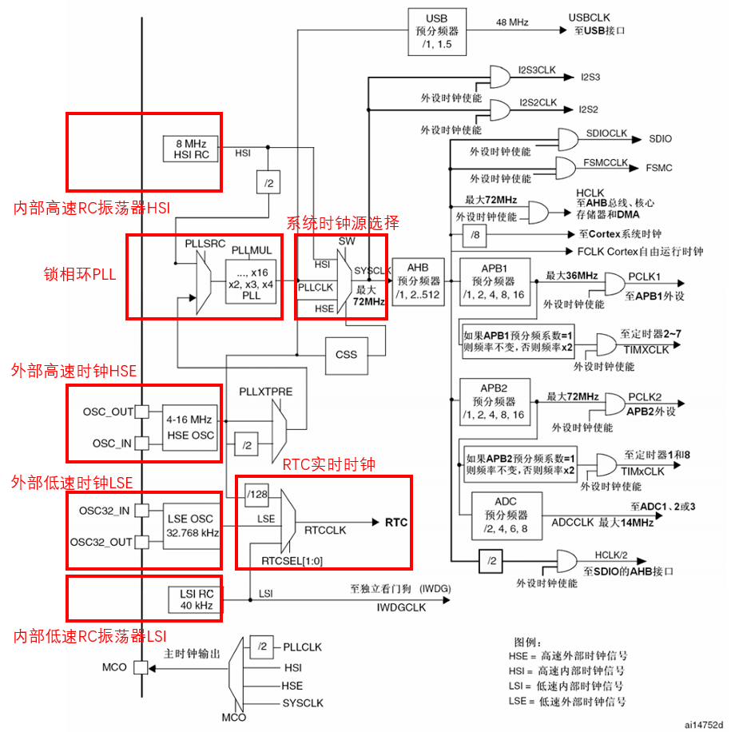

STM32 的运行需要系统时钟（就像CPU需要系统时钟一样），系统时钟的频率称为主频。单片机的主频常常以MHz计算（相比之下，PC的主频以GHz计算）

> STM32 有两个时钟源选择：
>
> - 系统时钟源选择：
>   1. 外部高速时钟HSE；
>   2. 内部高速时钟HSI；
> - RTC 实时时钟源选择：
>   1. 外部高速时钟HSE；
>   2. 外部低速时钟LSE；
>   3. 内部低速时钟LSI；

- 外部高速时钟 HSE

  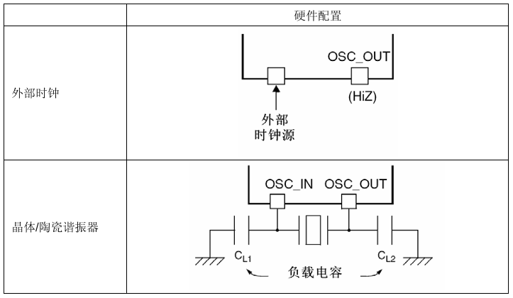

  HSE 有两种时钟源选择：外部时钟源和晶振；硬件连接如上图所示。

  使用晶振时，为了减少时钟输出的失真和缩短启动稳定时间，晶体/陶瓷谐振器和负载电容器必须尽可能地靠近振荡器引脚。负载电容值必须根据所选择的振荡器来调整。 

- 内部高速时钟 HSI

  HSI时钟信号由内部 8MHz 的 RC 振荡器产生，可直接作为系统时钟或在 2 分频后作为 PLL 输入。 HSI RC 振荡器能够在不需要任何外部器件的条件下提供系统时钟。它的启动时间比 HSE 晶体振荡器短。然而，即使在校准之后它的时钟频率精度仍较差。

  如果 HSE 晶体振荡器失效，HSI 时钟会被作为备用时钟源。

- PLL 锁相环

  PLL 是一个倍频器，用于提供更高频率的时钟，内部 PLL 可以用来倍频 HSI RC 的输出时钟或 HSE 晶体输出时钟。PLL 的设置必须在其被激
  活前完成。一旦 PLL 被激活，这些参数就不能被改动。

- 外部低速时钟 LSE

  LSE 为实时时钟或者其他定时功能提供一个低功耗且精确的时钟源。 可以选择外部时钟源和晶振，硬件连接和 HSE 一致。

- 内部低速时钟 LSI

  LSI RC 担当一个低功耗时钟源的角色，它可以在停机和待机模式下保持运行，为独立看门狗和自动唤醒单元提供时钟。LSI时钟频率大约40kHz。

- 系统时钟源选择 SYSCLK

  系统复位后，HSI 振荡器被选为系统时钟。当时钟源被直接或通过 PLL 间接作为系统时钟时，它将不能被停止。 

  只有当目标时钟源准备就绪了(经过启动稳定阶段的延迟或 PLL 稳定)，从一个时钟源到另一个时钟源的切换才会发生。在被选择时钟源没有就绪时，系统时钟的切换不会发生。直至目标时钟源就绪，才发生切换。 

  对于系统时钟一般选择 HSE 时钟经过 PLL 锁相环倍频后的时钟作为系统时钟，倍频系数可选范围：2~16。

- 系统时钟经过分频后分频到各个外设上。

CubeMX 时钟树配置：

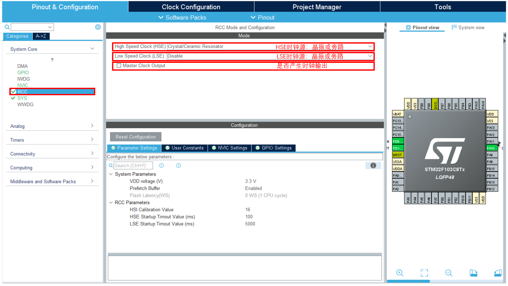

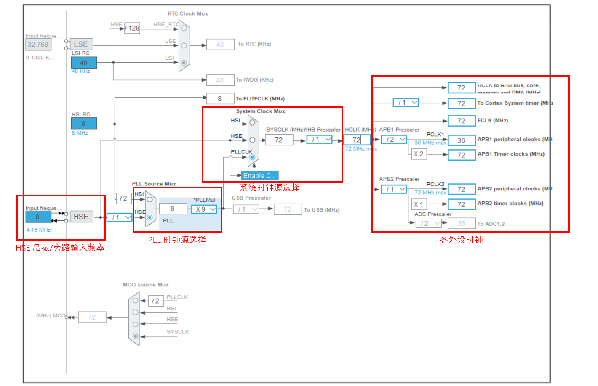

## 2. STM32 的定时器

STM32 分有三种定时器：**基本定时器，通用定时器，高级定时器**。学习高级定时器功能即可，因为高级定时器可以涵盖基本定时器和通用定时器的所有功能。

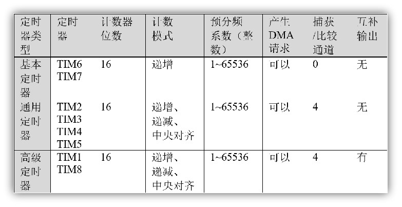

| 定时器类型 | 主要功能                                                     |
| ---------- | ------------------------------------------------------------ |
| 基本定时器 | 没有输入输出通道，常用作时基，即定时功能                     |
| 通用定时器 | 具有多路独立通道，可用于输入捕获/输出比较，也可用作时基      |
| 高级定时器 | 除具备通用定时器所有功能外，还具备带死区控制的互补信号输出、刹车输入等功能（可用于电机控制、数字电源设计等） |

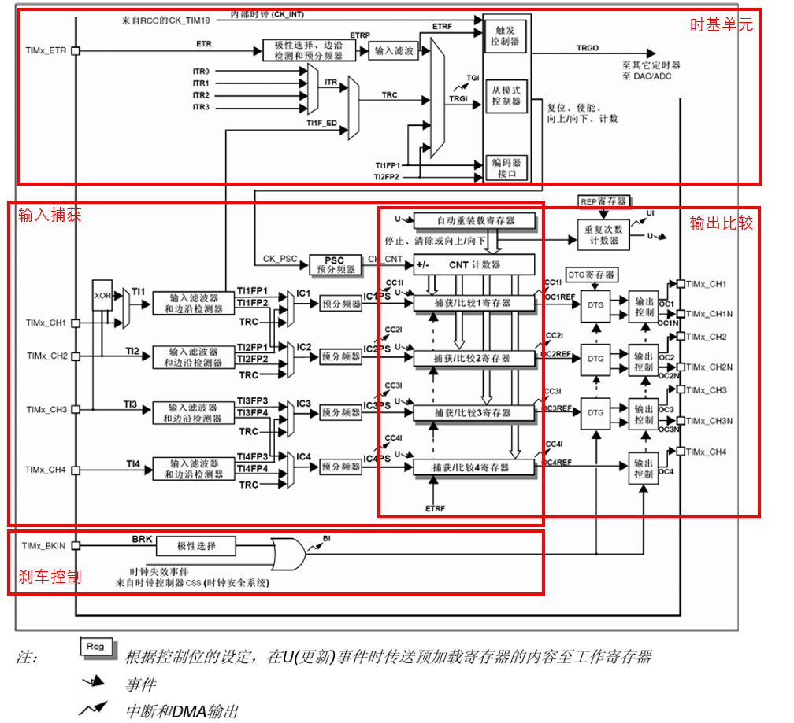

### 时基单元

时基单元主要部分是一个16位计数器和与其相关的自动装载寄存器。计数器可以向上计数、向下计数或者向上向下双向计数。此计数器时钟由预分频器分频得到。 计数器、自动装载寄存器和预分频器寄存器可以由软件读写，即使计数器还在运行读写仍然有效。 

时基单元包含： 计数器寄存器(`TIMx_CNT`) ；预分频器寄存器 (`TIMx_PSC`) ；自动装载寄存器 (`TIMx_ARR`) ；重复次数寄存器 (`TIMx_RCR`) 。大致关系如下：

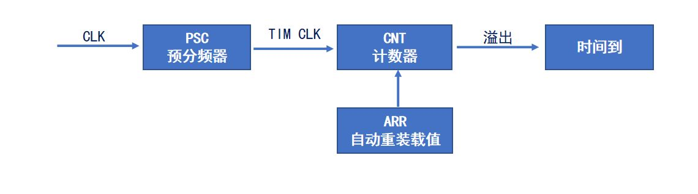

#### 时钟源

| 时钟源             | 说明                                                         | 设置方法                   |
| ------------------ | ------------------------------------------------------------ | -------------------------- |
| 内部时钟(CK_INT)   | 来自外设总线APB提供的时钟                                    | 设置`TIMx_SMCR`的`SMS=000` |
| 外部时钟模式1      | 外部输入引脚(TIx)，来自定时器通道1(TIMx_CH1)或者通道2(TIMx_CH2)引脚的信号(`TI1F_ED`双边沿检测,`TI1FP1`,`TI2FP2`单边沿检测) | 设置`TIMx_SMCR`的`SMS=111` |
| 外部时钟模式2      | 外部触发输入(ETR)，来自可以复用为TIMx_ETR的IO引脚            | 设置`TIMx_SMCR`的`ECE=1`   |
| 内部触发输入(ITRx) | 用于与芯片内部其它通用/高级定时器级联                        | -                          |

> - 外部时钟模式1
>
>   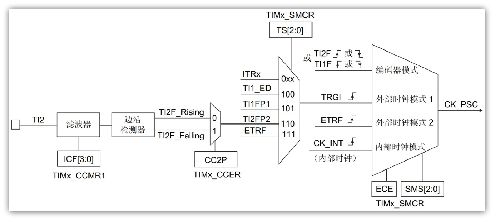
>
>   `TS[2:0]`控制触发选择的数据选择器；`ECE=0`，`SMS[2:0]=111`控制从模式选择数据选择器；`CCxP`控制边沿检测方式选择器；`ICF[3:0]`控制输入捕获滤波器。信号的处理过程由上图所示。
>
> - 外部时钟模式2
>
>   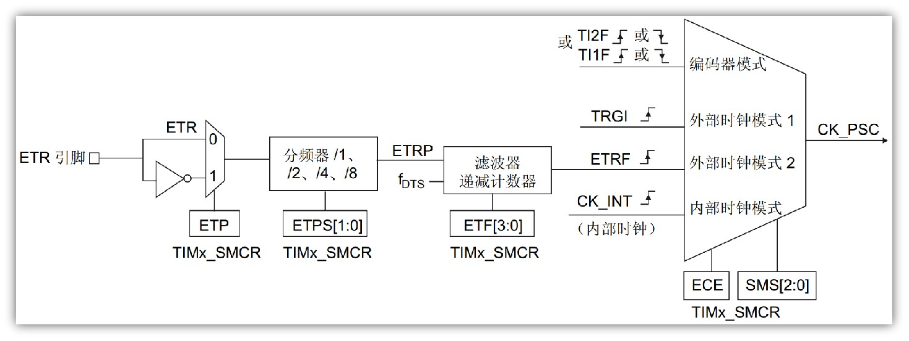
>
>   `ETP`控制极性选择数据寄存器；`ETPS[1:0]`控制外部触发预分频器；`ETF[3:0]`控制滤波器和递减计数器。
>
> - 编码器模式（见电机控制）

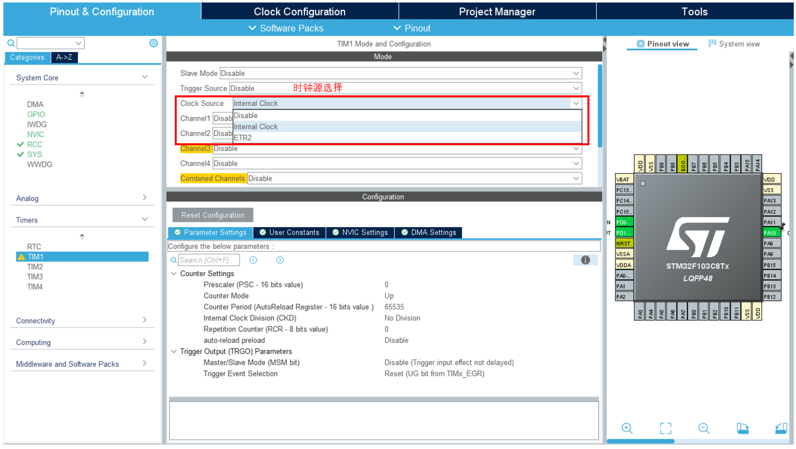

#### 预分频器

预分频器可以将计数器的时钟频率按1到65536之间的任意值分频。它是基于一个(在`TIMx_PSC`寄存器中的)16位寄存器控制的16位计数器。因为这个控制寄存器带有缓冲器，它能够在运行时被改变。**新的预分频器的参数在下一次更新事件到来时被采用**。

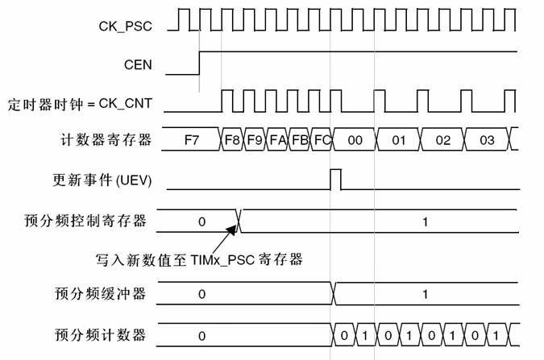

如上图，PSC寄存器被写入时，分频并不会立刻产生变化，而是在更新事件 UEV 后进行变化。

> - **影子寄存器的概念**：
>
> 	***影子寄存器是实际起作用的寄存器，不可直接访问。***
>
> 	PSC，ARR起缓存作用，产生更新事件后转移到影子寄存器起效，从而保证不会发生波形突变。

定时器的**计数频率**：
$$
f_{CK\_CNT} = \frac{f_{CK\_PSC}}{TIMx\_PSC+1}
$$
其中 $f_{CK\_CNT}$ 要注意时钟源频率（**注意APB总线频率！！！**）

#### 计数模式

定时器的计数模式包含**向上计数模式，向下计数模式和中心对齐模式**。

> 1. 向上计数模式：计数器从0计数到自动加载值(`TIMx_ARR`)，然后重新从0开始计数并且产生一个计数器溢出事件（更新事件）。
> 2. 向下计数模式：计数器从自动装入的值(`TIMx_ARR`)开始向下计数到0，然后从自动装入的值重新开始，并产生一个计数器向下溢出事件。
> 3. 中央对齐模式（向上/向下计数）：计数器从 0 开始计数到(`TIMx_ARR`-1)，产生一个计数器溢出事件，然后向下计数到1并且产生一个计数器溢出事件；然后再从 0 开始重新计数。
>
> 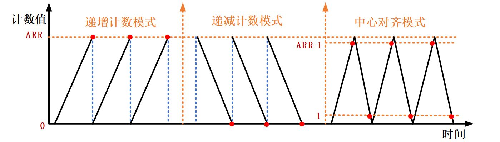

**向上计数/向下计数**定时器的锯齿波（定时器周期）：
$$
f = \frac{f_{CK\_CNT}}{TIMx\_ARR+1}
$$
**中心对齐**定时器的三角波周期（定时器周期）：
$$
f = \frac{f_{CK\_CNT}}{2\times TIMx\_ARR}
$$

- 重复计数器

	**如果使用了重复计数器，当溢出了重复计数寄存器(`TIMx_RCR`)中设定的次数后，将产生更新事件(UEV)，否则每次计数器溢出时才产生更新事件。**
	
	在每 N 次计数上溢或下溢时，数据从预装载寄存器传输到影子寄存器(`TIMx_ARR`自动重载入寄存器，`TIMx_PSC`预装载寄存器，还有在比较模式下的捕获/比较寄存器`TIMx_CCRx`)，N 是`TIMx_RCR`重复计数寄存器中的值。
	
	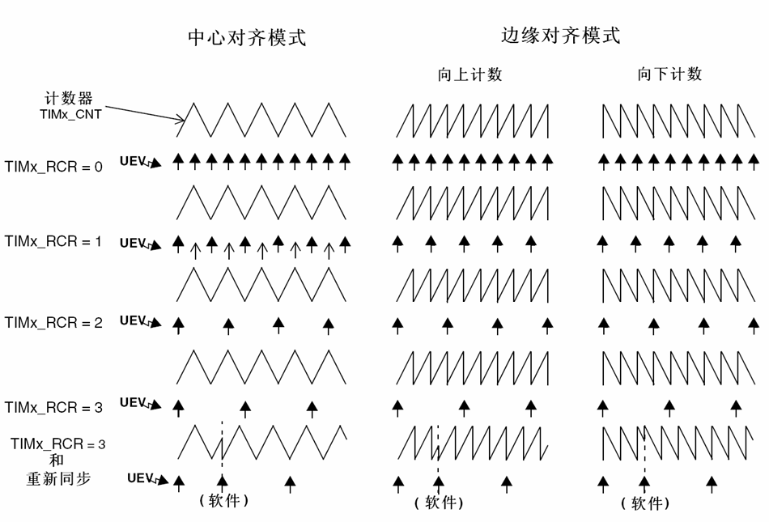
	
	 

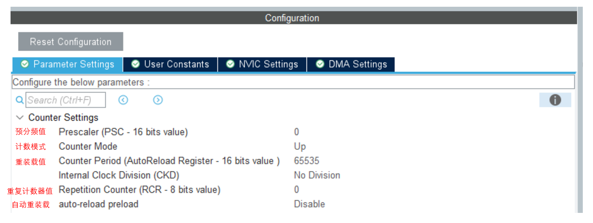

#### HAL 库函数

```c
/**
  * @brief  启动定时器
  * @param  htim 定时器句柄
  */
HAL_StatusTypeDef HAL_TIM_Base_Start(TIM_HandleTypeDef *htim);

/**
  * @brief  启动定时器
  * @param  htim 定时器句柄
  */
HAL_StatusTypeDef HAL_TIM_Base_Stop(TIM_HandleTypeDef *htim);

/**
  * @brief  中断模式下启动定时器
  * @param  htim 定时器句柄
  */  
HAL_StatusTypeDef HAL_TIM_Base_Start_IT(TIM_HandleTypeDef *htim);

/**
  * @brief  中断模式下停止定时器
  * @param  htim 定时器句柄
  */
HAL_StatusTypeDef HAL_TIM_Base_Stop_IT(TIM_HandleTypeDef *htim);

/**
  * @brief	更新中断回调函数
  */
void HAL_TIM_PeriodElapsedCallback(TIM_HandleTypeDef *htim);
```

### 输出比较模块

#### 捕获/比较共用通道

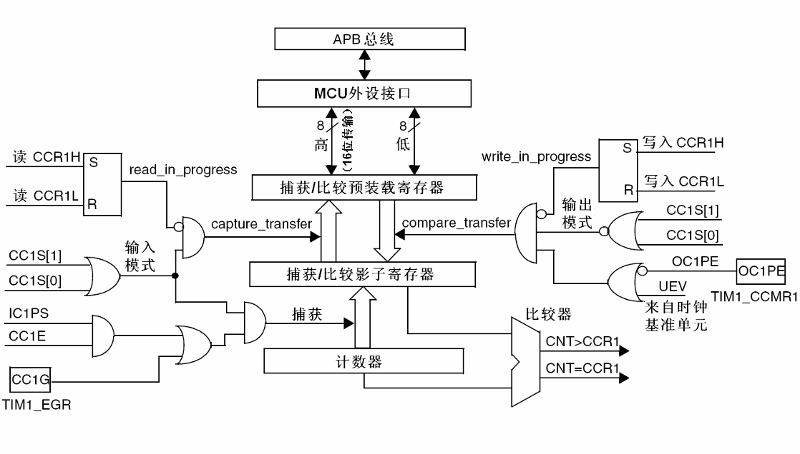

#### 输出比较通道

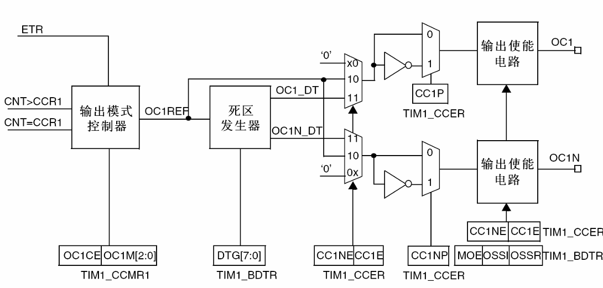

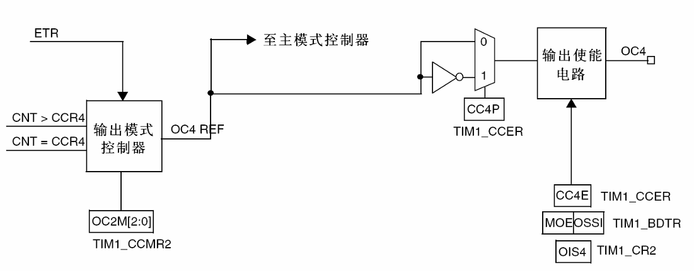

> 计数器和捕获/比较寄存器进行比较；当 $CNT>CCRx$ 或者 $CNT=CCRx$ 时就会给输出模式控制器传一个信号，然后输出模式控制器就会根据`OCxM[2:0]`配置改变输出 `OCxREF` 的高低电平。 `OCxREF` 信号可以前往主模式控制器，可以把REF映射到主模式的TRGO输出（通道4）。
>
> 对于高级定时器，`OCxREF` 会分为两路，一路不产生死区，一路经过死区发生器产生死区，由`CCxNE`和`CCxE`位选择死区选项，死区发生器由 `DTG[7:0]` 配置死区时间。
>
> 在极性选择部分，给极性选择寄存器写0，信号电平不翻转，写1时输出信号就是输入信号高低电平反转。（选择**有效电平**）
>
> > 极性为高时，高电平为有效电平，低电平为无效电平；极性为低时，低电平为有效电平，高电平为无效电平
>
> 输出使能电路选择是否输出。

- PWM/输出比较的输出模式：

  | **模式**         | **描述**                                                     |
  | ---------------- | ------------------------------------------------------------ |
  | 冻结             | $CNT=CCR$ 时，REF保持为原状态                                |
  | 匹配时置有效电平 | $CNT=CCR$ 时，REF置有效电平                                  |
  | 匹配时置无效电平 | $CNT=CCR$ 时，REF置无效电平                                  |
  | 匹配时电平翻转   | $CNT=CCR$ 时，REF电平翻转                                    |
  | 强制为无效电平   | $CNT$ 与 $CCR$ 无效，REF强制为无效电平                       |
  | 强制为有效电平   | $CNT$ 与 $CCR$ 无效，REF强制为有效电平                       |
  | PWM模式1         | 向上计数：$CNT<CCR$ 时，REF置有效电平，$CNT≥CCR$ 时，REF置无效电平<br/>向下计数：$CNT>CCR$ 时，REF置无效电平，$CNT≤CCR$ 时，REF置有效电平 |
  | PWM模式2         | 向上计数：$CNT<CCR$ 时，REF置无效电平，$CNT≥CCR$ 时，REF置有效电平<br>向下计数：$CNT>CCR$ 时，REF置有效电平，$CNT≤CCR$ 时，REF置无效电平 |

  > 输出比较模式下： $CCR = CNT$ 时，翻转输出电平。
  >
  > PWM模式下：  $CNT < CCR$ 时输出一种电平，$CNT > CCR$ 时输出相反的电平。
  >
  > 可以在 $CNT=CCR$ 时产生比较中断或者比较事件。
  
  > 对于中心对齐的三个模式：
  >
  > 1：仅在向下计数时产生比较中断；
  > 2：仅在向上计数时产生比较中断；
  > 3：向下和向上计数均产生比较中断。

#### HAL 库函数

```c
/**
  * @brief  启动PWM信号.
  * @param  htim 定时器句柄 htimx
  * @param  Channel 通道(1-4) TIM_CHANNEL_x
*/
HAL_StatusTypeDef HAL_TIM_PWM_Start(TIM_HandleTypeDef *htim, uint32_t Channel) ;

/**
  * @brief  停止PWM信号.
  * @param  htim 定时器句柄 htimx
  * @param  Channel 通道(1-4) TIM_CHANNEL_x
*/
HAL_StatusTypeDef HAL_TIM_PWM_Stop(TIM_HandleTypeDef *htim, uint32_t Channel);

/**
  * @brief  中断启动PWM信号.
  * @param  htim 定时器句柄 htimx
  * @param  Channel 通道(1-4) TIM_CHANNEL_x
*/
HAL_StatusTypeDef HAL_TIM_PWM_Start_IT(TIM_HandleTypeDef *htim, uint32_t Channel) ;

/**
  * @brief  中断停止PWM信号.
  * @param  htim 定时器句柄 htimx
  * @param  Channel 通道(1-4) TIM_CHANNEL_x
*/
HAL_StatusTypeDef HAL_TIM_PWM_Stop_IT(TIM_HandleTypeDef *htim, uint32_t Channel);

/**
  * @brief  修改ARR值
  * @param  __HANDLE__ 定时器句柄 htimx
  * @param  __AUTORELOAD__ ARR值
*/
__HAL_TIM_SET_AUTORELOAD(__HANDLE__, __AUTORELOAD__);

/**
  * @brief  修改CCR值
  * @param  __HANDLE__ 定时器句柄 htimx
  * @param  __CHANNEL__	通道值
  * @param  __COMPARE__ CCR值
*/
__HAL_TIM_SET_COMPARE(__HANDLE__, __CHANNEL__, __COMPARE__);
```

### 输入捕获模块

#### 输入捕获通道

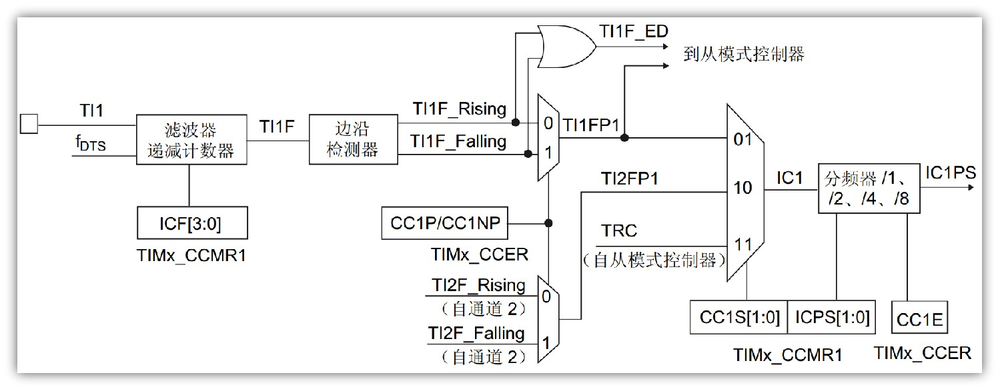

> `TIMx_CCMR1` 寄存器控制 ICF 位用来控制滤波器参数。`TI1` 信号经过滤波形成 `TI1F` 信号。
>
> 通过边沿检测器检查 `TI1F` 的上升沿和下降沿，通过 `CC1P/CC1NP` 寄存器选择极性生成 `TI1FP1`。`TI1F` 信号也可传递到从模式控制器。 
>
> `TIMx_CCMR` 控制捕获的信号通道（`CC1S`）和分频（`ICPS`）。`TIMx_CCER` 控制输入捕获的使能。
>
> 硬件电路可以在捕获后自动清零 `CNT` 值。

输入捕获模式下，当通道输入引脚出现指定电平跳变时，**当前CNT的值将被锁存到CCR中**。

#### HAL 库函数

```c
/**
  * @brief 输入捕获启动函数
  */
HAL_StatusTypeDef HAL_TIM_IC_Start (TIM_HandleTypeDef *htim, uint32_t Channel);

/**
  * @brief 输入捕获停止函数
  */
HAL_StatusTypeDef HAL_TIM_IC_Stop(TIM_HandleTypeDef *htim, uint32_t Channel);

/**
  * @brief 输入捕获中断模式启动函数
  */
HAL_StatusTypeDef HAL_TIM_IC_Start_IT (TIM_HandleTypeDef *htim, uint32_t Channel);

/**
  * @brief 输入捕获中断模式停止函数
  */
HAL_StatusTypeDef HAL_TIM_IC_Stop_IT(TIM_HandleTypeDef *htim, uint32_t Channel);

/**
  * @brief 计数值设置CNT函数
  */
__HAL_TIM_SET_COUNTER(__HANDLE__, __COUNTER__);

/**
  * @brief 	上升/下降沿触发设置函数
  * @param	TIM_INPUTCHANNELPOLARITY_RISING 上升沿
  *         TIM_INPUTCHANNELPOLARITY_FALLING 下降沿
  */
__HAL_TIM_SET_CAPTUREPOLARITY(__HANDLE__, __CHANNEL__, __POLARITY__);

/**
  * @brief 读取输入捕获计数值
  */
uint32_t HAL_TIM_ReadCapturedValue(const TIM_HandleTypeDef *htim, uint32_t Channel);
```

