# STM32 基本外设 8_ADC

## 1. ADC 的基本工作原理

ADC全称Analog-to-Digital Converter，指模拟/数字转换器。ADC可以将引脚上连续变化的模拟电压转换为内存中存储的数字变量，建立模拟电路到数字电路的桥梁。

### 采样保持电路

采样是将时间上连续变化的信号，转换为时间上离散的信号，即将时间上连续变化的模拟量转换为一系列等间隔的脉冲，脉冲的幅度取决于输入模拟量。

采样需遵循采样定理，即当采样频率大于模拟信号中最高频率成分的两倍时，采样值才能不失真的反映原来模拟信号。

模拟信号经采样后，得到一系列样值脉冲，如上右上图。采样脉冲宽度一般是很短暂的，在下一个采样脉冲到来之前，应暂时保持所取得的样值脉冲幅度。

 在采样保持电路中，模拟信号被采样很短的时间间隔，通常在10微秒到1微秒的范围内。此后，采样值保持不变，直到下一个要采样的输入信号到达。

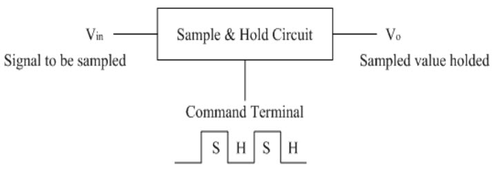

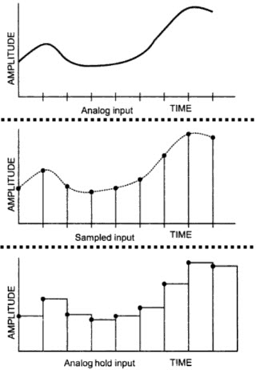

采样保持电路基本结构如下：

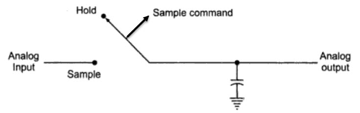

采样保持电路由两个基本组件组成：模拟开关和保持电容；该电路跟踪输入模拟信号，直到采样命令变为保持命令。在保持命令之后，电容器在模数转换期间保持模拟电压。

经过采样保持电路后，接下来就是对采样得到的模拟离散电压进行量化编码。

### 并联比较和逐次逼近电路

输入的模拟信号电压经过采样保持后，得到的是阶梯波。而该阶梯波仍然是一个可以连续取值的模拟量。但n位数字量只能保持 $2^n$ 个数值。因此，用数字量来表示连续变化的模拟量时就有一个类似于四舍五入的近似问题。将采样后的样值脉冲电平归化到与之接近的离散电平之上，这个过程称为量化。指定的离散电平称为量化电平 $U_q$，两个量化电平之间的差值称为量化单位 $\Delta$ ，即1LSB ，位数越多，量化等级越细，$\Delta$ 就越小。

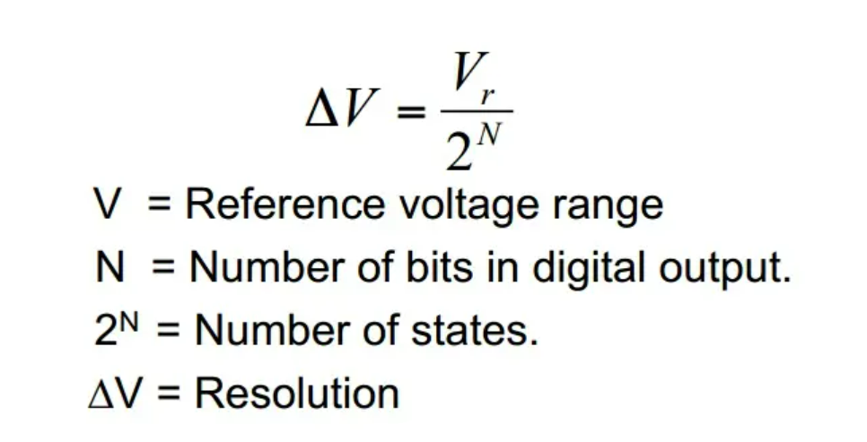

采样保持后未量化的 $U_{o}$ 值与量化电平 $U_{q}$ 值通常是不相等的，其差值称为量化误差 $\epsilon$，即$\epsilon = U_o-U_q$。量化的方法一般有两种：**只舍不入法**和**四舍五入法**。

> 1. **只舍不入法：**当 $U_{o}$ 的尾数小于 $\Delta$ 时，舍尾取整。这种方法 $\epsilon$ 总为正值，$\epsilon_{max} = \Delta$ 。以ADC为例，设输入信号的变化范围为0～1V，那么 $\Delta = \frac{1}{2^3} = \frac{1}{8}V$ ，量化中不足量化单位部分舍弃，如数值在0～1/8V之间的模拟电压都当作 $0\Delta$ ，用二进制数000表示，而数值在1/8～2/8V之间的模拟电压都当作 $1\Delta$ ，用二进制数001表示，以此类推，数值在7/8～8/8V之间的模拟电压都当作 $7\Delta$ ，用二进制数111表示；
>
>    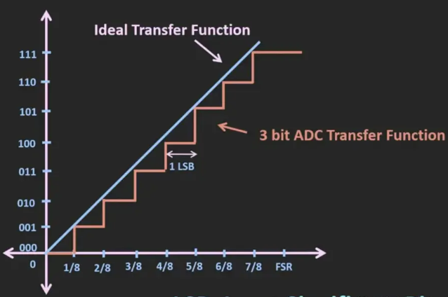
>
> 2. **四舍五入法：**当 $U_o$ 的尾数小于 $\frac{\Delta}{2}$ 时，舍尾取整;当 $U_o$的尾数不小于  $\frac{\Delta}{2}$ 时，舍尾入整。这种方法 $\epsilon$ 可正可负，但是 $|\epsilon_{max}| = \frac{\Delta}{2}$ ，可见它的误差要小。仍以3位ADC为例，设输入信号的变化范围为0～1V，那么 $\Delta = \frac{1}{2^3 \times 2} = \frac{1}{16}V$ ，量化中不足量化单位部分舍弃，如数值在0～1/16V之间的模拟电压都当作 $0\Delta$ ，用二进制数000表示，而数值在1/16～3/16V之间的模拟电压都当作 $1\Delta$，用二进制数001表示，以此类推。
>
>    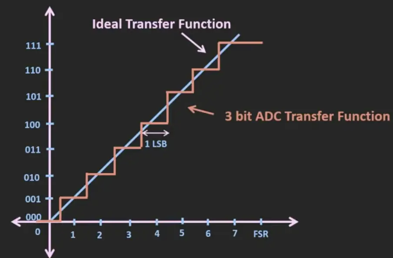

| ADC电路类型 | 优点             | 缺点                     |
| ----------- | ---------------- | ------------------------ |
| 并联比较型  | 转换速度最快     | 成本高、功耗高，分辨率低 |
| 逐次逼近型  | 结构简单，功耗低 | 转换速度较慢             |

**并联比较型**

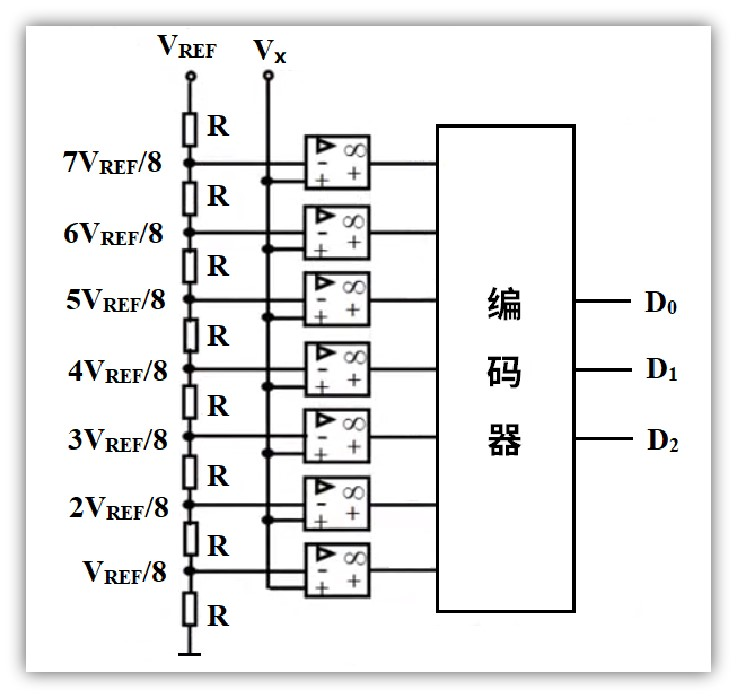

**逐次逼近型**

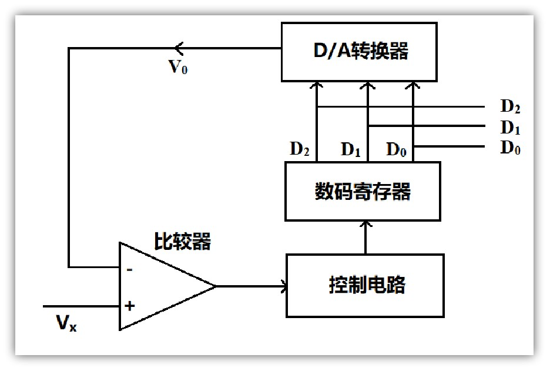

### ADC 参数

**分辨率**：表示ADC能辨别的最小模拟量，用二进制位数表示，比如：8、10、12、16位等

**转换时间**：完成一次A/D转换所需要的时间，转换时间越短，采样率就可以越高

**精度**：最小刻度基础上叠加各种误差的参数，精度受ADC性能、温度和气压等影响

**量化误差**：用数字量近似表示模拟量，采用四舍五入原则，此过程产生的误差为量化误差

> 分辨率和采样速度相互矛盾，分辨率越高，采样速率越低。

## 2. STM32 的 ADC

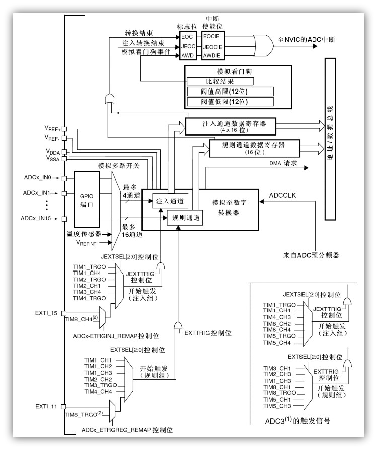

### ADC 引脚

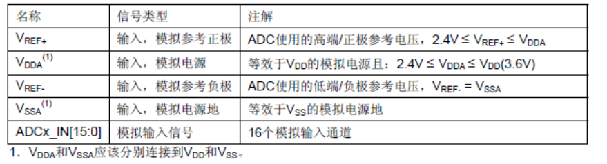

一般情况下，VDD是3.3V，VSS接地，相对应的，VDDA是3.3V，VSSA也接地，模拟输入信号不要超过VDD（3.3V）。

### ADC 时钟配置

来自ADC预分频器的`ADCCLK`是ADC模块的时钟来源。通常，由时钟控制器提供的`ADCCLK`时钟和`PCLK2`（APB2时钟）同步。RCC控制器为ADC时钟提供一个专用的可编程预分频器。

### ADC 中断

ADC中断事件的具体类型有三种。

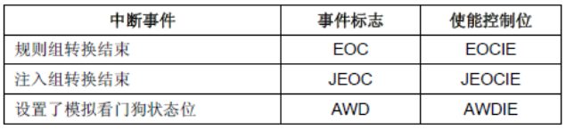

ADC1和ADC2的中断映射在同一个中断向量上，而ADC3的中断有自己的中断向量。

### ADC 通道

STM32 的 ADC 控制器有很多通道，所以模块通过内部的模拟多路开关，可以切换到不同的输入通道并进行转换。

STM32 特别地加入了多种成组转换的模式，可以由程序设置好之后，对多个模拟通道自动地进行逐个地采样转换。它们可以组织成两组：**规则通道组**和**注入通道组**。

> - 规则通道组：最多可以安排16个通道。规则通道和它的转换顺序在`ADC_SQRx`寄存器中选择，规则组转换的总数应写入`ADC_SQR1`寄存器的`L[3:0]`中；
> - 注入通道组：最多可以安排4个通道。注入组和它的转换顺序在`ADC_JSQR`寄存器中选择。注入组里转化的总数应写入`ADC_JSQR`寄存器的`L[1:0]`中。

**在执行规则通道组扫描转换时，如有例外处理则可启用注入通道组的转换。注入通道的转换可以打断规则通道的转换，在注入通道被转换完成之后，规则通道才可以继续转换。**

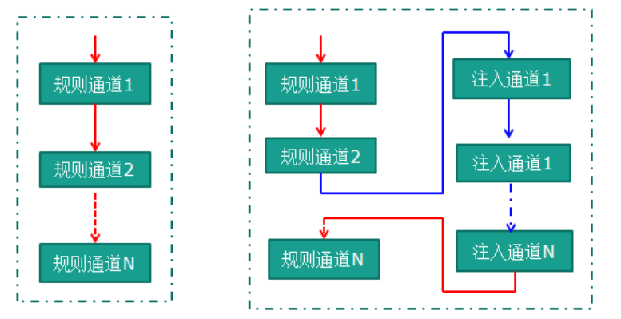

### ADC 转换模式

**单次转换，非扫描模式**

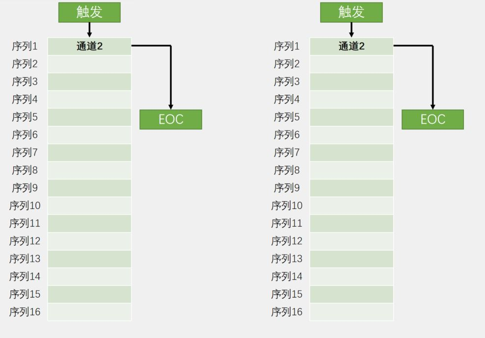

**连续转换，非扫描模式**

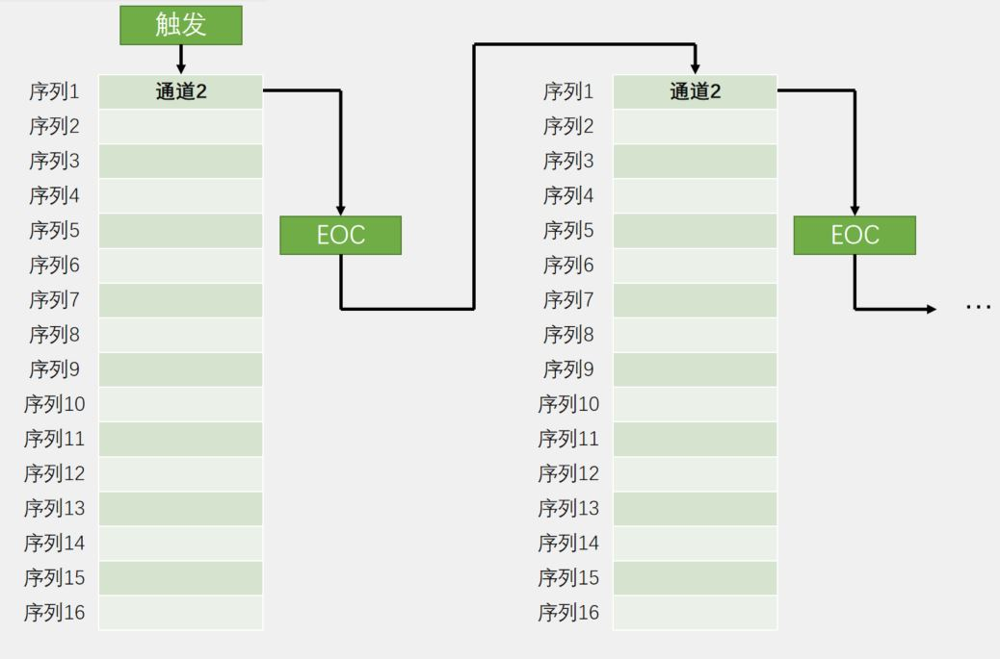

**单次转换，扫描模式**

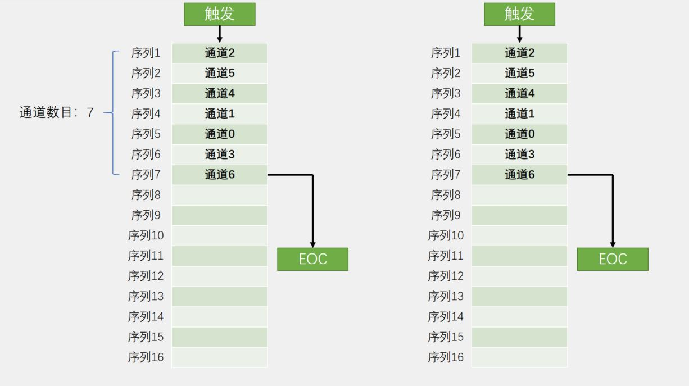

**连续转换，扫描模式**

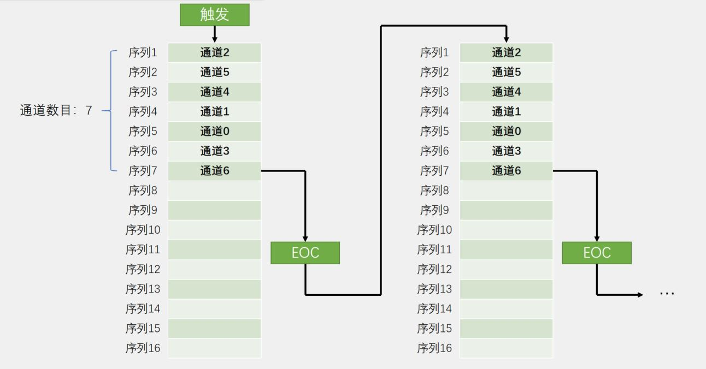

如果设置了DMA位，在每次EOC后，DMA控制器把规则组通道的转换数据传输到SRAM中。而注入通道转换的数据总是存储在`ADC_JDRx`寄存器中。

### ADC 外部触发

规则转换、注入转换可以由外部事件触发（比如定时器捕捉、EXTI线）。

如果设置了`EXTTRIG`控制位，则外部事件就能够触发转换。`EXTSEL[2:0]`和`JEXTSEL2:0]`控制位允许应用程序选择8个可能的事件中的某一个，可以触发规则和注入组的采样。

当外部触发信号被选为ADC规则或注入转换时，只有它的上升沿可以启动转换。

### ADC 校准

校准ADC有一个内置自校准模式。校准可大幅减小因内部电容器组的变化而造成的准精度误差。在校准期间，在每个电容器上都会计算出一个误差修正码（数字值），这个码用于消除在随后的转换中每个电容器上产生的误差。

通过设置 `ADC_CR2` 寄存器的 `CAL` 位启动校准。一旦校准结束，`CAL` 位被硬件复位，可以开始正常转换。建议在上电时执行一次ADC校准。校准阶段结束后，校准码储存在 `ADC_DR` 中。


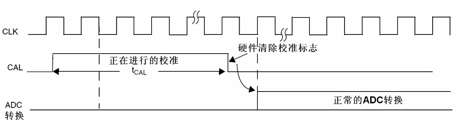

建议在每次上电后执行一次校准。同时启动校准前，ADC必须处于关电状态（`ADON=0`）超过至少两个ADC时钟周期。

### ADC 数据对齐

由于 STM32 的 ADC 是12位逐次逼近型的模拟数字转换器，而数据保存在16位寄存器中。所以，`ADC_CR2`寄存器中的`ALIGN`位选择转换后数据储存的对齐方式。数据可以左对齐或右对齐。

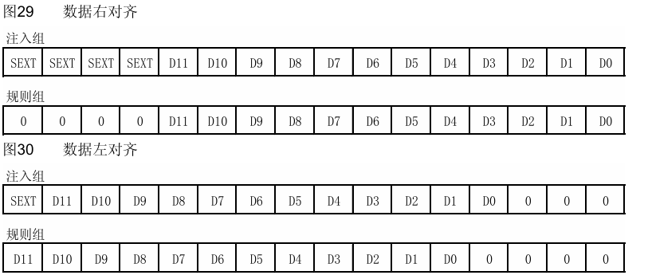

> - 注入组通道转换的数据值已经减去了在`ADC_JOFRx`寄存器中定义的偏移量，因此结果可以是一个负值。`SEXT`位是扩展的符号值。 
> - 对于规则组通道，不需减去偏移值，因此只有12个位有效。

### ADC 采样时间

ADC使用若干个`ADC_CLK`周期对输入电压采样，采样周期数目可以通过`ADC_SMPR1`和`ADC_SMPR2`寄存器中的`SMP[2:0]`位更改。每个通道可以分别用不同的时间采样。采样时间越高，得到的电压精度越高。

总转换时间：
$$
T_{CONV} = 采样时间+ 12.5个周期
$$

### HAL 库函数

#### 规则组读取

```c
/**
  * @brief  ADC校准函数，建议运行
  * @param  hadc ADC句柄 hadcx
  */
HAL_StatusTypeDef HAL_ADCEx_Calibration_Start(ADC_HandleTypeDef* hadc);

/**
  * @brief  ADC轮询方式启动函数，若为单次模式，应在循环中启动
  * @param  hadc ADC句柄 hadcx
  */
HAL_StatusTypeDef HAL_ADC_Start(ADC_HandleTypeDef* hadc);

/**
  * @brief  ADC轮询方式停止函数
  * @param  hadc ADC句柄 hadcx
  */
HAL_StatusTypeDef HAL_ADC_Stop(ADC_HandleTypeDef* hadc);

/**
  * @brief  等待转换完成（EOC标志）函数
  * @param  hadc ADC句柄 hadcx
  * @param  Timeout 超时时间
  */
HAL_StatusTypeDef HAL_ADC_PollForConversion(ADC_HandleTypeDef* hadc, uint32_t Timeout);

/**
  * @brief  ADC中断方式启动函数，若为单次模式，应在中断中启动
  * @param  hadc ADC句柄 hadcx
  */
HAL_StatusTypeDef HAL_ADC_Start_IT(ADC_HandleTypeDef* hadc);

/**
  * @brief  ADC中断方式停止函数
  * @param  hadc ADC句柄 hadcx
  */
HAL_StatusTypeDef HAL_ADC_Stop_IT(ADC_HandleTypeDef* hadc);

/**
  * @brief  ADC DMA方式启动函数
  * @param  hadc ADC句柄 hadcx
  * @param  pData 数据缓存区地址
  * @param  Length 数据缓存区字节数
  * @retval None
  */
HAL_StatusTypeDef HAL_ADC_Start_DMA(ADC_HandleTypeDef* hadc, uint32_t* pData, uint32_t Length);
    
/**
  * @brief  读取ADC值函数（0-4096）
  * @param  hadc ADC句柄 hadcx
  * @retval ADC数值
  */
uint32_t HAL_ADC_GetValue(ADC_HandleTypeDef* hadc);

/**
  * @brief  ADC转换完成中断回调函数
  */
void HAL_ADC_ConvCpltCallback(ADC_HandleTypeDef* hadc);
```

> **ADC 单通道转换**：
> 
>1. ADC 校准；
>2. 如果为非扫描模式，在循环中启动ADC，如果为扫描模式，在循环前启动ADC。
>3. 等待转换完成；
>4. 读取值（可用`HAL_IS_BIT_SET(HAL_ADC_GetState(&hadcx), HAL_ADC_STATE_REG_EOC)`条件辅助判断）
>5. 进行结果转换。

> **ADC 多通道转换**：
>
> 应打开连续和扫描模式，配合DMA使用。

#### 注入组读取

| 模式     | 组别   | 数据储存                                                     |
| -------- | ------ | ------------------------------------------------------------ |
| 单次模式 | 规则组 | 单通道转换结束后选择是否进入中断，数据存入`ADC_DR`寄存器     |
|          | 注入组 | 单通道转换结束后进入中断，数据存入`ADC_JDRx`寄存器           |
| 连续模式 | 规则组 | 本组道转换结束后选择是否进入中断，最新数据存入`ADC_DR`寄存器 |
|          | 注入组 | 禁用                                                         |
| 扫描模式 | 规则组 | 通道转换结束，选择是否进入中断，必须使用DMA转换              |
|          | 注入组 | 通道转换结束进入中断，数据存入`ADC_JDRx`寄存器               |

```c
/**
  * @brief  注入组ADC轮询方式启动函数，若为单次模式，应在循环中启动
  * @param  hadc ADC句柄 hadcx
  */
HAL_StatusTypeDef HAL_ADCEx_InjectedStart(ADC_HandleTypeDef *hadc);

/**
  * @brief   注入组ADC轮询方式停止函数
  * @param  hadc ADC句柄 hadcx
  */
HAL_StatusTypeDef HAL_ADCEx_InjectedStop(ADC_HandleTypeDef *hadc);

/**
  * @brief  注入组等待转换完成（EOC标志）函数
  * @param  hadc ADC句柄 hadcx
  * @param  Timeout 超时时间
  */
HAL_StatusTypeDef HAL_ADCEx_InjectedPollForConversion(ADC_HandleTypeDef *hadc, uint32_t Timeout);

/**
  * @brief  注入组ADC中断方式启动函数，若为单次模式，应在中断中启动
  * @param  hadc ADC句柄 hadcx
  */
HAL_StatusTypeDef HAL_ADCEx_InjectedStart_IT(ADC_HandleTypeDef *hadc);

/**
  * @brief  注入组ADC中断方式停止函数
  * @param  hadc ADC句柄 hadcx
  */
HAL_StatusTypeDef HAL_ADCEx_InjectedStop_IT(ADC_HandleTypeDef *hadc);

/**
  * @brief  注入组ADC DMA方式启动函数
  * @param  hadc ADC句柄 hadcx
  * @param  pData 数据缓存区地址
  * @param  Length 数据缓存区字节数
  * @retval None
  */
HAL_StatusTypeDef HAL_ADCEx_MultiModeStart_DMA(ADC_HandleTypeDef *hadc, uint32_t *pData, uint32_t Length);
    
/**
  * @brief  注入组读取ADC值函数（0-4096）
  * @param  hadc ADC句柄 hadcx
  * @retval ADC数值
  */
uint32_t HAL_ADCEx_InjectedGetValue(ADC_HandleTypeDef *hadc, uint32_t InjectedRank);

/**
  * @brief  注入组ADC转换完成中断回调函数
  */
void HAL_ADCEx_InjectedConvCpltCallback(ADC_HandleTypeDef *hadc);
```

