# STM32 进阶 12_SD卡

## 1. SD 卡简介

SD卡，Secure Digital Card，称为安全数字卡（安全数码卡）。其本质为NAND FLASH 和控制芯片。

### SD 卡基本简介

- 尺寸分类

  1. 标准SD卡：体积较大，卡侧带写保护开关；常见于相机和摄像机中，用于存储高分辨率照片和视频；
  2. Mini SD卡：现在较少看到，已逐渐被 Micro SD 卡取代；
  3. Micro SD卡：旧称 TF 卡，2004年更名为 Micro SD Card, 常用于扩展手机和平板电脑的存储空间。

  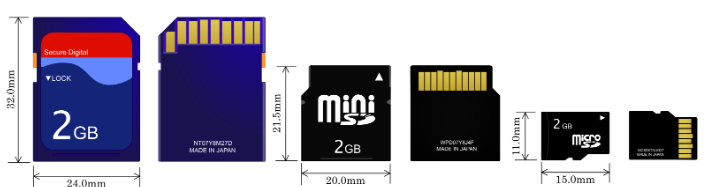

  > 从左到右分别位标准SD卡，Mini SD卡，Micro SD卡(TF卡)

- 存储容量分类

  | SD卡类型 | 协议规范 | 文件系统 | 容量等级   |
  | -------- | -------- | -------- | ---------- |
  | SDSC     | SD1.0    | FAT12,16 | 上限至2GB  |
  | SDHC     | SD2.0    | FAT32    | 2GB至32GB  |
  | SDXC     | SD3.0    | exFAT    | 32GB至2TB  |
  | SDUC     | SD7.0    | exFAT    | 2TB至128TB |

- 速度等级

  SD卡速度等级分为：Speed Class、UHS Speed Class和Video Speed Class。

  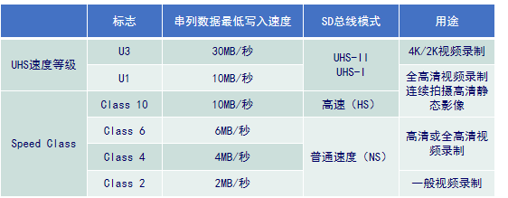

  > Video Speed Class：分为V6、V10、V30、V60、V90，对应不同视频格式。

- SD 卡的硬件接口（SPI接口/SDIO接口）

  | 引脚编号 | 引脚名称  | 功能（SDIO模式） | 功能（SPI模式）    |
  | -------- | --------- | ---------------- | ------------------ |
  | Pin 1    | DAT3/CS   | 数据线3          | 片选信号           |
  | Pin 2    | CMD/MOSI  | 命令线           | 主机输出，从机输入 |
  | Pin 3    | VSS1      | 电源地           | 电源地             |
  | Pin 4    | VDD       | 电源             | 电源               |
  | Pin 5    | CLK       | 时钟             | 时钟               |
  | Pin 6    | VSS2      | 电源地           | 电源地             |
  | Pin 7    | DAT0/MISO | 数据线0          | 主机输入，从机输出 |
  | Pin 8    | DAT1      | 数据线1          | 保留               |
  | Pin 9    | DAT2      | 数据线2          | 保留               |

  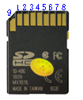
  
  TF 卡只比 SD 卡少了一个电源引脚 VSS2，其他引脚功能类似。
  
- SD 卡寄存器

  SD 卡有8个寄存器，但不能直接进行读写操作，需要通过命令来控制。SD 卡协议定义了一些命令用于实现某一特定功能，SD 卡根据收到的命令要求对内部寄存器进行修改。

  | 名称 | 宽度(bit) | 描述                                                         |
  | ---- | --------- | ------------------------------------------------------------ |
  | CID  | 128       | 卡标识寄存器，提供制造商ID、OEM/应用ID、产品名称、版本、序列号、制造日期等信息（每个卡都是唯一的） |
  | RCA  | 16        | 相对卡地址(Relative card address)寄存器，提供本地系统中卡的地址，动态由卡建议，在主机初始化的时候确定注意：仅SDIO模式下有，SPI模式下无RCA |
  | CSD  | 128       | 卡特定数据寄存器，提供SD卡操作条件相关信息和数据             |
  | SCR  | 64        | SD配置寄存器，提供SD卡一些特定的数据                         |
  | OCR  | 32        | 操作条件寄存器，主要是SD卡的操作电压等信息                   |

### SD 卡的 SDIO 模式

SD 总线上的通信基于命令和数据位流传输。

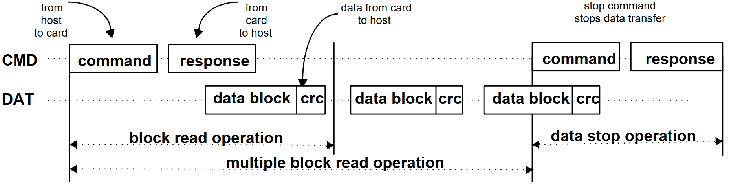

> 1. 命令：应用相关命令 (ACMD) 和通用命令 (CMD)，通过命令线 CMD 传输，固定长度48位；
> 2. 响应：SD 卡接收到命令，会有一个响应，用来反应 SD 卡状态。有2种响应类型：短响应(48位，格式与命令一样)和长响应(136位)。
> 3. 数据：主机发送的数据 / SD 发送的数据。SD 数据是以块(Block)形式传输，SDHC 卡数据块长度一般为 512 字节。数据块需要 CRC 保证数据传输成功。

- 命令格式

  SD 卡的命令格式由 6 个字节组成，发送数据时高位在前。

  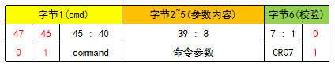

  > 1. Byte1：命令字节，47位为起始位，46位标志传输方向，1为命令。[45:40]位为命令号。
  > 2. Byte[2:5]：命令参数，有些命令参数是保留位，没有定义参数的内容，保留位应设置为0；
  > 3. Byte6：用于校验命令传输内容正确性，前7位为CRC(循环冗余校验)校验位，最后一位为停止位0。

- 命令类型

  > 1. 基本命令 Class 0（CMD0/CMD8/CMD9/CMD10/CMD12/CMD2/CMD3）
  > 2. 面向块读取命令 Class 2（CMD16/CMD17/CMD18）
  > 3. 面向块写入命令 Class 4（CMD16/CMD24/CMD25）
  > 4. 擦除命令 Class 5
  > 5. 加锁命令 Class 7
  > 6. 特定于应用命令 Class 8（CMD55）
  > 7. 面向块写保护命令 Class 6
  > 8. I/O模式命令 Class 9
  > 9. SD卡特定应用命令（ ACMD41 / ACMD6 / ACMD51）
  > 10. Switch功能命令.
  >
  > 其中 Class 0，2，4，5，7，8 是所有 SD 卡都支持的命令。

  常用命令如下：

  | 命令         | 参数              | 响应 | 描述                                                       |
  | ------------ | ----------------- | ---- | ---------------------------------------------------------- |
  | CMD0(0x0)    | NONE              | 无   | 复位SD卡                                                   |
  | CMD8(0X08)   | VHS+Check pattern | R7   | 主机发送接口状态命令                                       |
  | ACMD41(0X29) | HCS+VDD电压       | R3   | 主机发送容量支持信息HCS和OCR寄存器内容                     |
  | CMD2(0X2)    | NONE              | R2   | 读取SD卡的CID寄存器值                                      |
  | CMD3(0X3)    | NONE              | R6   | 要求SD卡发布新的相对地址                                   |
  | CMD9(0X9)    | RCA               | R2   | 获得选定卡的CSD寄存器内容                                  |
  | CMD7(0X7)    | RCA               | R1b  | 选中SD卡                                                   |
  | CMD16(0x10)  | block length      | R1   | 设置SD卡的块大小(字节)                                     |
  | CMD17(0X11)  | 地址              | R1   | 读取一个块的数据                                           |
  | CMD18(0X12)  | 地址              | R1   | 连续读取多个块的数据                                       |
  | CMD12(0X0C)  | NONE              | R1b  | 多块读取强制卡停止传输                                     |
  | CMD13(0x0D)  | RCA               | R1   | 被选中的卡返回其状态                                       |
  | ACMD23(0x97) | Number of block   | R1   | 设置需要预擦除的数据块数，提高SD卡多数据块写入性能（速度） |
  | CMD24(0X18)  | 地址              | R1   | 写入一个块的数据                                           |
  | CMD25(0X19)  | 地址              | R1   | 连续写入多个块的数据                                       |
  | CMD55(0X37)  | NONE              | R1   | 通知SD卡，接下来发送是应用命令                             |

- 响应

  SD 卡和单片机的通信采用发送应答机制。每发送一个命令，SD 卡都会给出一个应答，以告知主机该命令的执行情况，或者返回主机需要获取的数据。使用 SDIO 接口时，响应通过 CMD 线传输。

  SD 卡响应因使用接口不同，格式也不同。响应具体有R1、R1b、R2、R3、R7。响应内容大小可以分为短响应(48bit)和长响应(136bit)。

  | 响应 | 长度(SDIO) | 描述                                        |
  | ---- | ---------- | ------------------------------------------- |
  | R1   | 48bit      | 正常响应命令                                |
  | R1b  | 48bit      | 格式与R1相同，可选增加忙信号(数据线0上传输) |
  | R2   | 136bit     | SDIO:根据命令可返回CID/CSD寄存器值          |
  | R3   | 48bit      | SDIO:ACMD41命令的响应，返回OCR寄存器值      |
  | R6   | 48bit      | 已发布的RCA响应                             |
  | R7   | 48bit      | CMD8命令的响应(卡支持电压信息)              |

  - R1 响应
  
    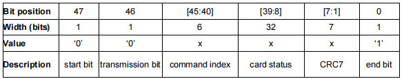
  
    > 1. 如果有传输到卡的数据，那么在数据线有busy信号(R1b)。
    > 2. 通过响应内容中的 command index 获知响应哪个命令。
  
  - R2 响应
  
    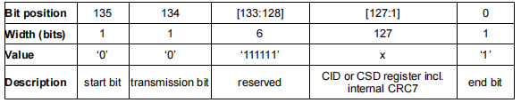
  
    > CID 寄存器内容作为 CMD2 和 CMD10 响应，CSD 寄存器内容作为 CMD9 响应。
  
  - R3 响应
  
    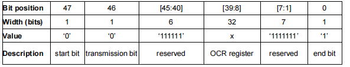
  
    > OCR寄存器的值作为ACMD41的响应。
  
  - R7响应
  
    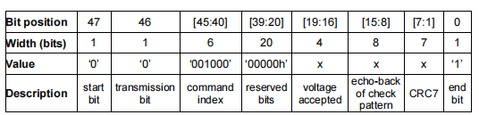
  
    > 专用于命令 CMD8 的响应，返回卡支持电压范围和检测模式。
  
  - R6响应
  
    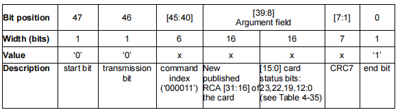
  
    > 专用于命令CMD3的响应(RCA响应)。
  
- 读写操作

  - 多块读取

    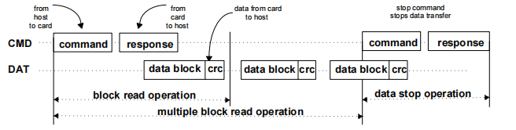

  - 多块写入
  
    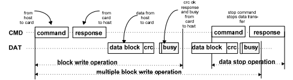
  
- SD 卡的操作模式

  在 SD 卡系统(主机和 SD 卡)定义了两种操作模式：卡识别模式和数据传输模式。

  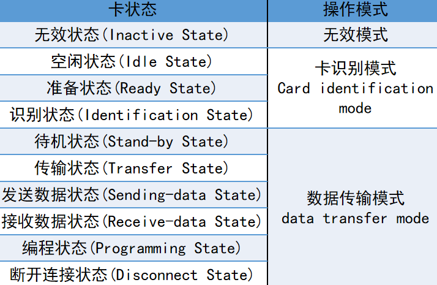

  SDIO 模式下的状态转换如下：

  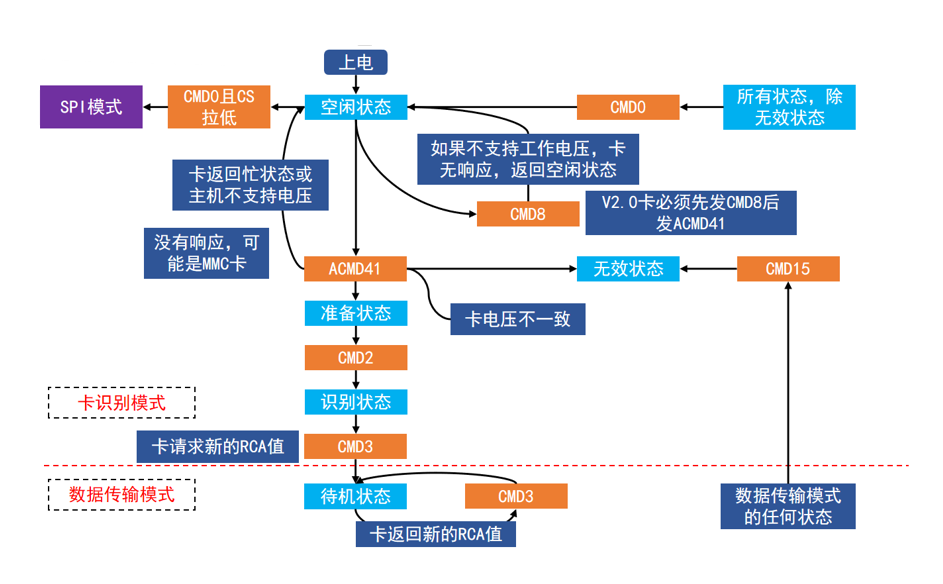

  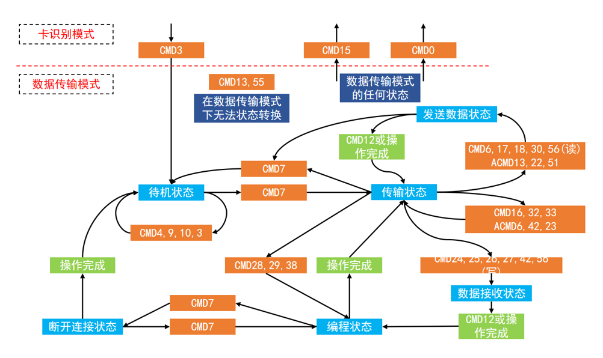

  - SD 卡的初始化流程：

    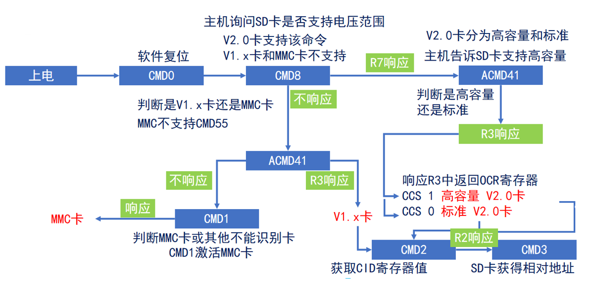

  - SD 卡的单块数据块读取流程：

    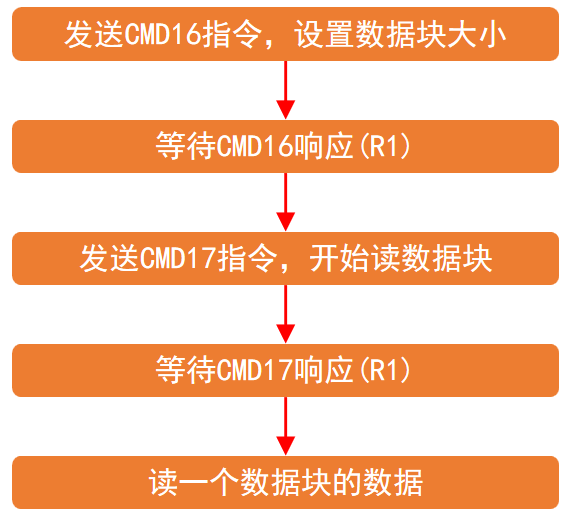

    > CMD16 设置的数据块大小，一般为512字节，此设置直接决定 SD 卡的块大小，SD 卡默认的块大小自动失效。

  - SD 卡多块数据块读取流程：

    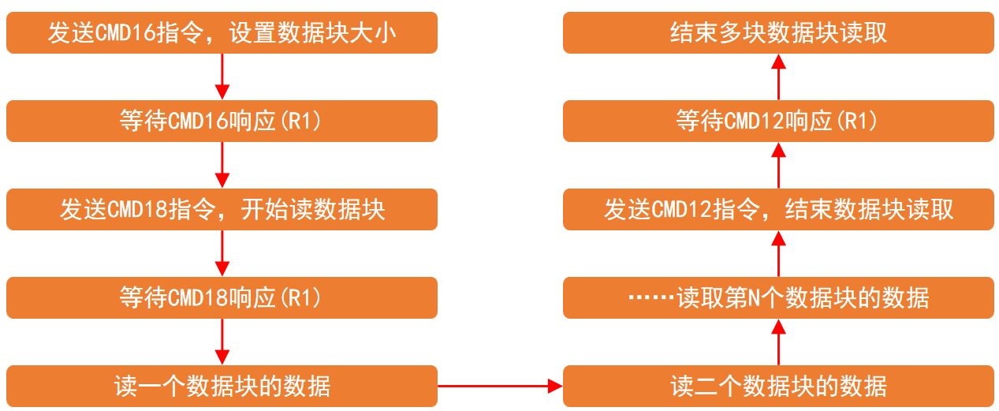

  - SD 卡单块数据块写入流程

    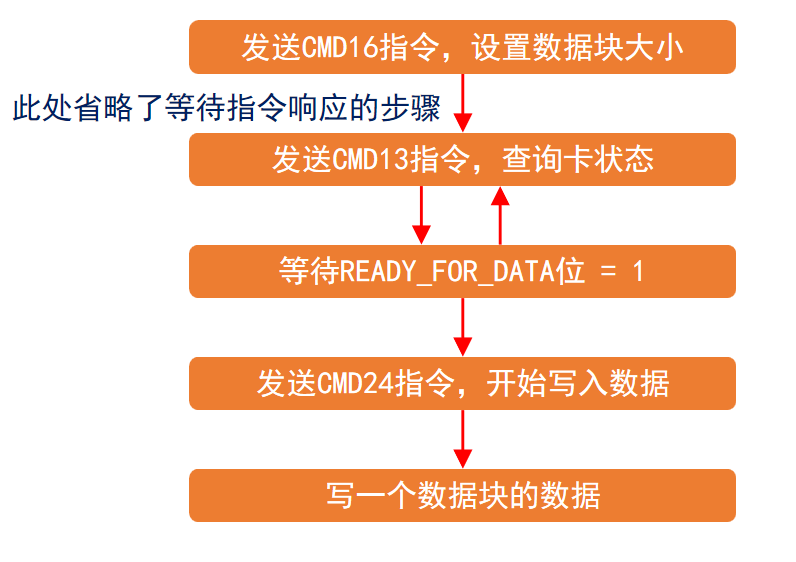

  - SD 卡多块数据块写入流程

    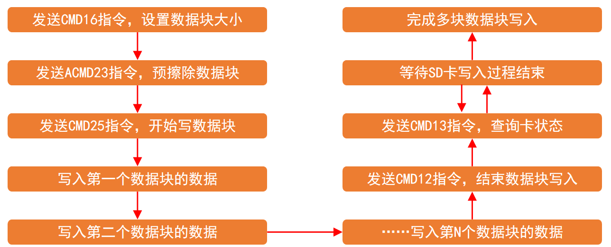

### SD 卡的 SPI 模式

SD 卡的通信基于命令和数据位流传输。

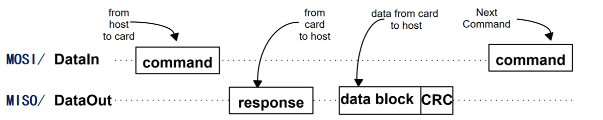

> 1. 命令：应用相关命令(ACMD)和通用命令(CMD)，通过命令线DataIn传输，固定长度48位。
> 2. 响应：SD卡接收到命令，都会有一个响应，用来反映SD卡状态。
> 3. 数据：主机发送的数据 / SD卡发送的数据。SD卡数据是以块(Block)形式传输，SDHC卡数据块长度一般为512字节。数据块需要CRC保证数据传输成功。

- 命令格式

  SD 卡的命令格式由 6 个字节组成，发送数据时高位在前。

  

  > 1. Byte1：命令字节，47位为起始位，46位标志传输方向，1为命令。[45:40]位为命令号。
  > 2. Byte[2:5]：命令参数，有些命令参数是保留位，没有定义参数的内容，保留位应设置为0；
  > 3. Byte6：用于校验命令传输内容正确性，前7位为CRC（循环冗余校验）校验位（SPI模式时忽略CRC，设为0；某些命令的CRC是固定的，CMD0:0x95，CMD8:0x87），最后一位为停止位0。
  
  > 发送 ACMD 命令之前，必须先发送 CMD55，接下来要发送的是应用命令(APP CMD)，而非标准命令。

- 常用命令

  | 命令         | 参数              | 响应 | 描述                                                       |
  | ------------ | ----------------- | ---- | ---------------------------------------------------------- |
  | CMD0(0x0)    | NONE              | R1   | 复位SD卡                                                   |
  | CMD8(0X08)   | VHS+Check pattern | R7   | 主机发送接口状态命令                                       |
  | ACMD41(0X29) | HCS               | R3   | 主机发送容量支持信息激活卡的初始化过程                     |
  | CMD58(0X3A)  | NONE              | R3   | 读取SD卡的OCR寄存器值                                      |
  | CMD17(0X11)  | 地址              | R1   | 读取一个块的数据                                           |
  | CMD18(0X12)  | 地址              | R1   | 连续读取多个块的数据                                       |
  | CMD12(0X0C)  | NONE              | R1b  | 多块读取强制卡停止传输                                     |
  | ACMD23(0x97) | Number of block   | R1   | 设置需要预擦除的数据块数，提高SD卡多数据块写入性能（速度） |
  | CMD24(0X18)  | 地址              | R1   | 写入一个块的数据                                           |
  | CMD25(0X19)  | 地址              | R1   | 连续写入多个块的数据                                       |
  | CMD55(0X37)  | NONE              | R1   | 通知SD卡，接下来发送是应用命令                             |
  | CMD9(0X09)   | NONE              | R1   | 读取卡特定数据寄存器(CSD)                                  |
  | CMD10(0X0A)  | NONE              | R1   | 读取卡标志数据寄存器(CID)                                  |

- 响应

  SD 卡和单片机的通信采用发送应答机制。每发送一个命令，SD 卡都会给出一个应答，以告知主机该命令的执行情况，或者返回主机需要获取的数据。使用 SPI 接口时，通过 MISO 传输。SD 卡响应因使用接口不同，格式也不同。SPI 无 R6 响应。

  | 响应 | 长度(SPI) | 描述                                     |
  | ---- | --------- | ---------------------------------------- |
  | R1   | 8bit      | 正常响应命令                             |
  | R1b  | 8bit      | 格式与R1相同，可选增加忙信号(MISO上传输) |
  | R2   | 16bit     | SPI:CMD13命令的响应，返回SD_STATUS       |
  | R3   | 40bit     | SPI:CMD58命令的响应，返回OCR寄存器值     |
  | R7   | 40bit     | CMD8命令的响应(卡支持电压信息)           |

  - R1 响应
  
    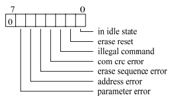
  
    > 1. `in idle state`：1表示SD卡处于空闲状态；
    > 2. `erase reset`：接收到无需擦除操作的命令，擦除操作被复位；
    > 3. `illegal command`：接收到一个无效的命令代码；
    > 4. `com crc error`：接收到上一个命令的CRC校验错误；
    > 5. `erase sequence error`：擦除命令的控制顺序错误；
    > 6. `address error`：读写的数据地址不对齐(数据地址需按块大小对齐)；
    > 7. `parameter error`：命令的参数错误；
    >
    > 有错误，对应位置1。
  
  - R3 响应
  
    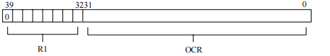
  
    > 位 30 用于判断是 CCS1：高容量V2.0卡/CCS0：标准容量V2.0卡。
  
  - R7 响应
  
    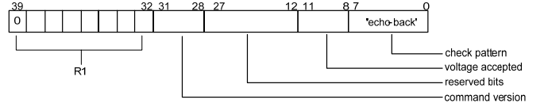
  
    > 位[11:8]：操作电压反馈。0：未定义；1：2.7V~3.6V；2：低电压。
    >
    > 发送完 CMD8 命令(主机支持电压范围)后，SD 卡 R7 响应，进而查看 SD 卡支持操作电压。

- 读写操作

  - 单块读取操作

    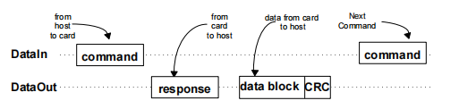

  - 多块读取操作

    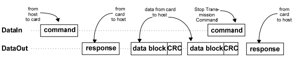

  - 单块写入操作

    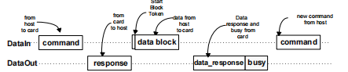

    > 数据块传输时，存在Token控制。Token分为两种：数据响应Token 和数据块开始和停止的 Token。
    >
    > - 数据响应Token：`data_respense`，向SD卡写入数据块后，SD卡返回一个数据响应，以此检查写入是否正常。
    >
    >   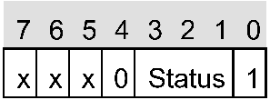
    >
    >   Status Bit[3:1]: 010：数据被接收；101：CRC校验失败，数据被拒绝；110：写入错误，数据被拒绝。
    >
    > - 数据块开始和停止Token：
    >
    >   单块写入/单块读取/多块读取时：数据块前面的 Token 标志均使用一个字节 0xFE 表示数据块的开始。

  - 多块写入操作

    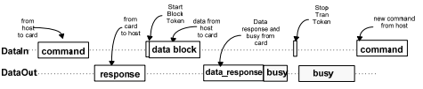

    > 数据块传输时，存在Token控制。Token分为两种：数据响应Token 和数据块开始和停止的 Token。
    >
    > - 数据响应Token：`data_respense`，向SD卡写入数据块后，SD卡返回一个数据响应，以此检查写入是否正常。
    >
    > - 数据块开始和停止Token：
    >
    >   多块写入时：数据块前面的 Token 标志均用 0xFC表示数据块的开始，并以 0xFD 表示数据块的结束。

- SD 卡的操作模式

  - SD 卡的初始化流程

    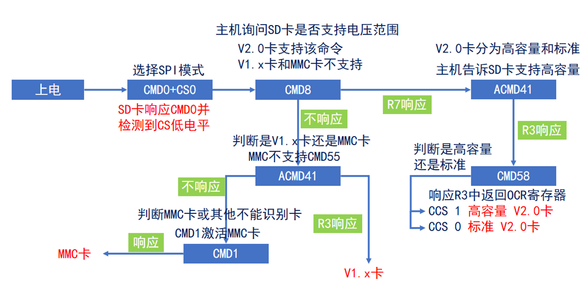

  - SD 卡单块数据块读取流程

    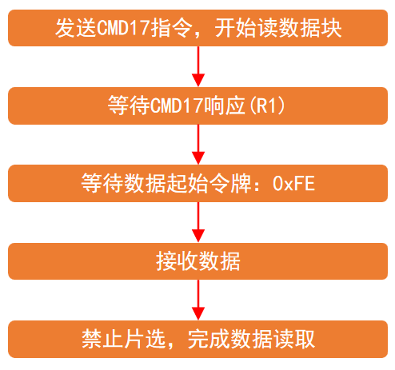

    > 对于标准容量卡，数据块大小由 CMD16 命令设置；而对于高容量卡，数据块大小为 512 字节。

  - SD 卡多块数据块读取流程

    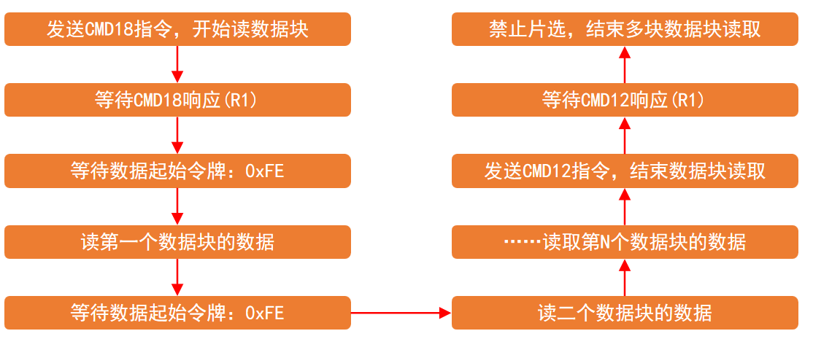

  - SD 卡单块数据块写入流程

    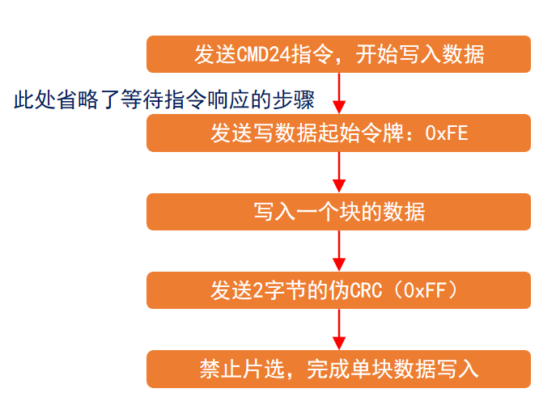

    > SD 卡收完一个数据块以后，会拉低 MISO，直到数据块编程结束。

  - SD 卡多块数据块写入流程

    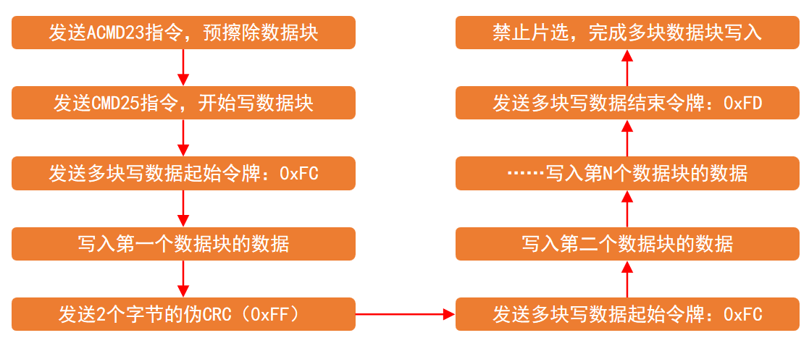

## 2. STM32 的 SDIO 外设

### SDIO 外设简介

SDIO，全称 Secure Digital Input and Output，即安全数字输入输出接口。

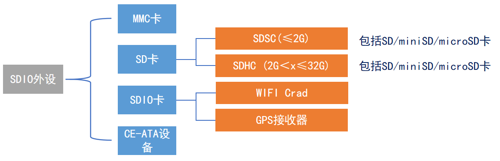

STM32F10x 系列和 F4xx 系列控制器只支持 SD 卡规范版本2.0，即只支持标准容量 SD 卡和高容量 SDHC 卡，不支持超大容量 SDXC 标准卡，所以可以支持最高卡容量是 32G。

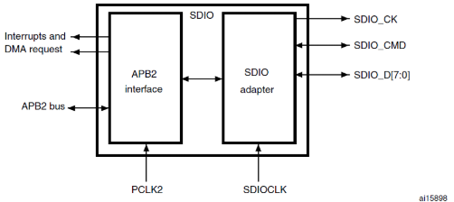

> `SDIO_CK`：产生时钟；
>
> `SDIO_CMD`：发送命令，接收应答；
>
> `SDIO_D[7:0]`：双向传输数据。

- SDIO 的时钟

  1. 卡时钟（`SDIO_CK`）：每个时钟周期在命令和数据线上传输1位命令或数据。对于 SD 或SD I/O卡，时钟频率可以在0MHz至25MHz间变化。
  2. SDIO 适配器时钟（`SDIOCLK`，48MHz）：该时钟用于驱动 SDIO 适配器，可用于产生 SDIO_CK 时钟。

  > $SDIO\_CK = SDIOCLK / (2 + CLKDIV)$
  >
  > SD 卡初始化时，`SDIO_CK` 不可超过 400KHz；          
  >
  > 初始化完成后，可设为最大(不可超过 SD 卡最大操作频率 25MHz)并可更改数据总线宽度(默认只用`SDIO_D0`进行初始化)。

- SDIO 适配器

  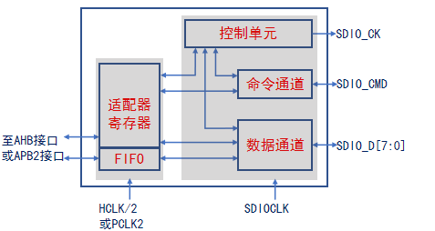

  > 1. 控制单元：电源管理和时钟管理功能；
  > 2. 命令通道：控制命令发送并接收响应，命令通道状态机(CPSM)；
  > 3. 数据通道：负责主机和卡之间传输数据，数据通道状态机(DPSM)；
  > 4. 数据FIFO：具有发送和接收数据缓冲器。

  - 命令通道状态机

    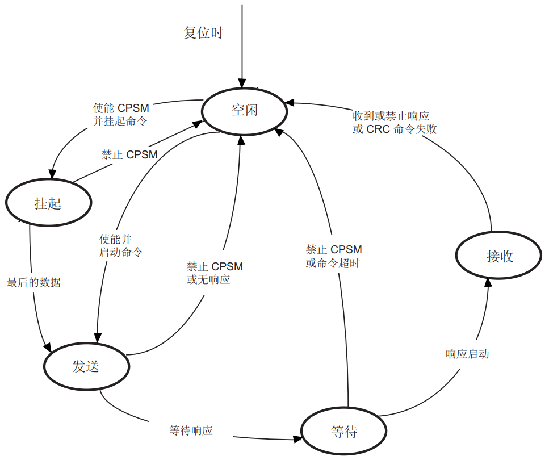

    > 1. 命令通道进入空闲至少8个`SDIO_CK`后，CPSM进入空闲状态；
    > 2. 置位发送使能，写命令寄存器；命令开始发送；
    > 3. 不需要响应，进入空闲状态；如果还需响应，进入等待状态，启动命令定时器；
    > 4. 超时未接收到响应，置位超时标志，进入空闲状态；或者接收响应完成，根据CRC设置状态寄存器。
    > 5. 命令发送完成后设置状态标志：`CMDREND`：响应CRC正常；`CCRCFAIL`：响应CRC失败；`CMDSENT`：发送了不需要响应的命令；`CTIMEOUT`：响应超时；`CMDACT`：正在进行命令传输。

  - 数据通道状态机
    
    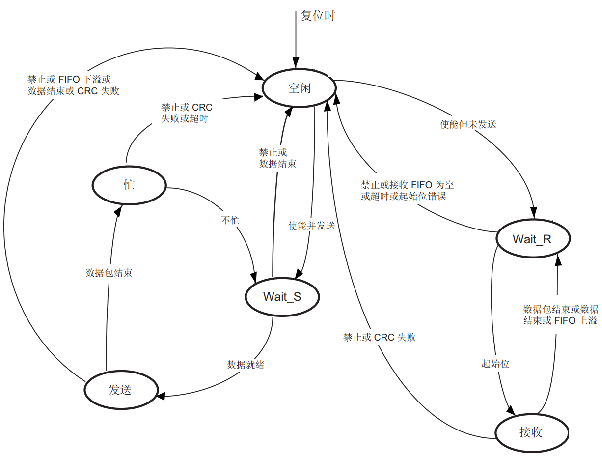
    
    > 1. 空闲：置位 `DCTRL` 寄存器的 `DTEN`，启动数据定时器；并根据数据方向跳转到 Wait_R 或 Wait_S；
    > 2. Wait_R：在超时到来前接收到起始位，跳转到接收；超时就跳转到空闲状态；
    > 3. Wait_S：等待FIFO寄存器非空，跳转到发送状态；
    > 4. Busy：等待CRC状态标志：CRC不匹配：置位错误标志，跳转空闲状态；CRC匹配：若 DAT0 非低电平就跳转 Wait_S；超时：置位标志跳转空闲状态；
    > 5. 接收：可在FIFO寄存器进行读取，若CRC失败，跳转到空闲；
    > 6. 发送：开始发送数据，发送完产生CRC和STOP，跳转到Busy。
    

- 数据 FIFO：包括32个字的数据缓冲，和发送与接收电路。

- 命令格式和数据传输见 SDIO 模式。

  > 写入时：busy 信号由 SD 卡拉低 SDIO_D0 表示，SDIO 硬件自动控制，不需要软件处理。

### SDIO 配置

- CubeMX 配置

  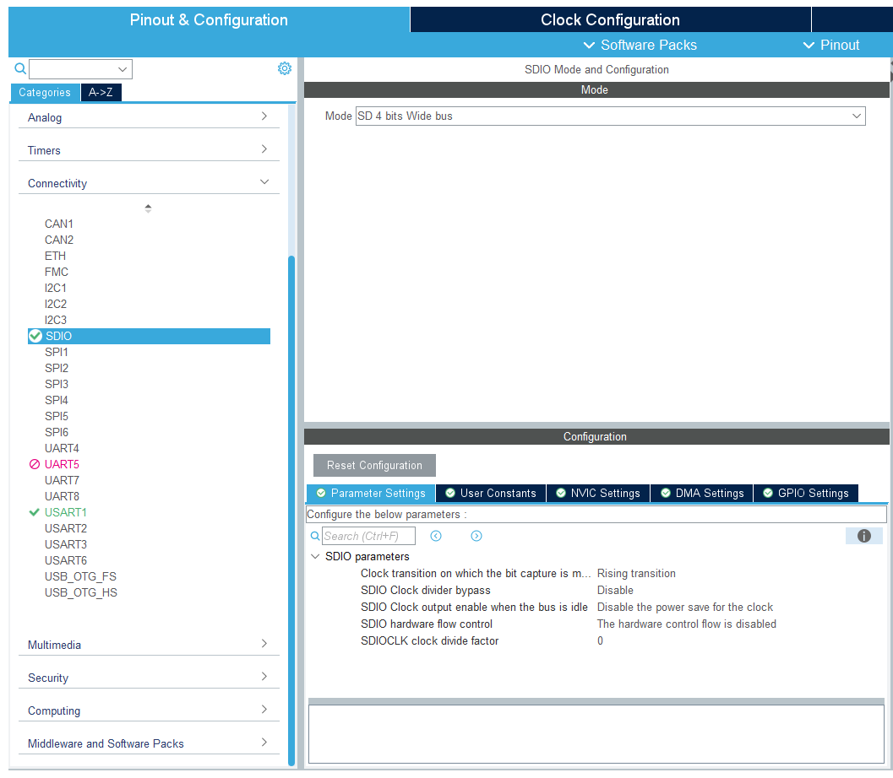

  ```c
  void MX_SDIO_SD_Init(void)
  {
  
    /* USER CODE BEGIN SDIO_Init 0 */
  
    /* USER CODE END SDIO_Init 0 */
  
    /* USER CODE BEGIN SDIO_Init 1 */
  
    /* USER CODE END SDIO_Init 1 */
    hsd.Instance = SDIO;
    hsd.Init.ClockEdge = SDIO_CLOCK_EDGE_RISING;
    hsd.Init.ClockBypass = SDIO_CLOCK_BYPASS_DISABLE;
    hsd.Init.ClockPowerSave = SDIO_CLOCK_POWER_SAVE_DISABLE;
    hsd.Init.BusWide = SDIO_BUS_WIDE_1B;
    hsd.Init.HardwareFlowControl = SDIO_HARDWARE_FLOW_CONTROL_DISABLE;
    hsd.Init.ClockDiv = 6;
    if (HAL_SD_Init(&hsd) != HAL_OK)
    {
      Error_Handler();
    }
    if (HAL_SD_ConfigWideBusOperation(&hsd, SDIO_BUS_WIDE_4B) != HAL_OK)
    {
      Error_Handler();
    }
    /* USER CODE BEGIN SDIO_Init 2 */
  
    /* USER CODE END SDIO_Init 2 */
  
  }
  ```

- HAL 库函数

  ```c
  /**
    * @brief  数据传输带宽设置
    * @param  WideMode: SDIO 数据传输带宽
    *          This parameter can be one of the following values:
    *            @arg SDIO_BUS_WIDE_8B: 8-bit data transfer
    *            @arg SDIO_BUS_WIDE_4B: 4-bit data transfer
    *            @arg SDIO_BUS_WIDE_1B: 1-bit data transfer
    * @retval HAL status
    */
  HAL_StatusTypeDef HAL_SD_ConfigWideBusOperation(SD_HandleTypeDef *hsd, uint32_t WideMode);
  
  /**
    * @brief  读取 SD 卡状态
    * @retval Card state
    */
  HAL_SD_CardStateTypeDef HAL_SD_GetCardState(SD_HandleTypeDef *hsd);
  
  #define HAL_SD_CARD_READY          0x00000001U  /*!< Card state is ready                     */
  #define HAL_SD_CARD_IDENTIFICATION 0x00000002U  /*!< Card is in identification state         */
  #define HAL_SD_CARD_STANDBY        0x00000003U  /*!< Card is in standby state                */
  #define HAL_SD_CARD_TRANSFER       0x00000004U  /*!< Card is in transfer state               */
  #define HAL_SD_CARD_SENDING        0x00000005U  /*!< Card is sending an operation            */
  #define HAL_SD_CARD_RECEIVING      0x00000006U  /*!< Card is receiving operation information */
  #define HAL_SD_CARD_PROGRAMMING    0x00000007U  /*!< Card is in programming state            */
  #define HAL_SD_CARD_DISCONNECTED   0x00000008U  /*!< Card is disconnected                    */
  #define HAL_SD_CARD_ERROR          0x000000FFU  /*!< Card response Error                     */
  
  /**
    * @brief  读取 CID 寄存器
    */
  HAL_StatusTypeDef HAL_SD_GetCardCID(SD_HandleTypeDef *hsd, HAL_SD_CardCIDTypeDef *pCID);
  
  typedef struct
  {
    __IO uint8_t  ManufacturerID;  /*!< Manufacturer ID       */
    __IO uint16_t OEM_AppliID;     /*!< OEM/Application ID    */
    __IO uint32_t ProdName1;       /*!< Product Name part1    */
    __IO uint8_t  ProdName2;       /*!< Product Name part2    */
    __IO uint8_t  ProdRev;         /*!< Product Revision      */
    __IO uint32_t ProdSN;          /*!< Product Serial Number */
    __IO uint8_t  Reserved1;       /*!< Reserved1             */
    __IO uint16_t ManufactDate;    /*!< Manufacturing Date    */
    __IO uint8_t  CID_CRC;         /*!< CID CRC               */
    __IO uint8_t  Reserved2;       /*!< Always 1              */
  
  }HAL_SD_CardCIDTypeDef;
  
  /**
    * @brief  轮询读取 SD 卡块
    * @param  pData		   接收数据缓冲区
    * @param  BlockAdd       开始扇区号
    * @param  NumberOfBlocks 读取扇区数
    * @param  Timeout		   超时时间
    */
  HAL_StatusTypeDef HAL_SD_ReadBlocks(SD_HandleTypeDef *hsd, uint8_t *pData, uint32_t BlockAdd, uint32_t NumberOfBlocks, uint32_t Timeout);
  
  /**
    * @brief  轮询写入 SD 卡块
    */
  HAL_StatusTypeDef HAL_SD_WriteBlocks(SD_HandleTypeDef *hsd, uint8_t *pData, uint32_t BlockAdd, uint32_t NumberOfBlocks, uint32_t Timeout);
  
  /**
    * @brief  擦除 SD 卡块
    * @param  BlockStartAdd: 		起始块地址
    * @param  BlockEndAdd: 		结束块地址
    */
  HAL_StatusTypeDef HAL_SD_Erase(SD_HandleTypeDef *hsd, uint32_t BlockStartAdd, uint32_t BlockEndAdd);
  
  /**
    * @brief  DMA 写入函数
    */
  HAL_StatusTypeDef HAL_SD_WriteBlocks_DMA(SD_HandleTypeDef *hsd, uint8_t *pData, uint32_t BlockAdd, uint32_t NumberOfBlocks);
  
  /**
    * @brief  DMA 读取函数
    */
  HAL_StatusTypeDef HAL_SD_ReadBlocks_DMA(SD_HandleTypeDef *hsd, uint8_t *pData, uint32_t BlockAdd, uint32_t NumberOfBlocks);
  
  // 中断回调函数
  void HAL_SD_TxCpltCallback(SD_HandleTypeDef *hsd)
  {
      ;
  }
   
  void HAL_SD_RxCpltCallback(SD_HandleTypeDef *hsd)
  {
      ;
  }
  ```

  
