# STM32 进阶 FatFS 文件系统

## 1. FATFS 文件系统简介

文件系统是为了存储和管理数据，而在存储设备上建立的一种组织结构。使用文件系统前，需先对存储设备进行格式化，擦除原来的数据，在存储设备上建立一个文件分配表和目录。

Windows上常用FAT12，FAT16，FAT32，exFAT，NTFS；在小型的嵌入式存储设备大多使用的是 FAT32 和 exFAT。

> - FAT16 的单个分区容量不能超过2GB；
> - FAT32 的单个分区容量不能超过32GB，单个文件大小不能
>   超过4GB；
> - exFAT (Extended File Allocation Table)是继FAT16/FAT32
>   之后Microsoft开发的一种文件系统，它更适用于基于闪存的存
>   储器，如SD卡、U盘等，而不适用于机械硬盘。exFAT文件系统允许单个文件大小超过4GB。单个分区大小和单个文件大小几乎没有限制。

- FAT 卷

  一个 FAT 文件系统称为一个逻辑卷（logical volume）或逻辑驱动器（logical drive），如电脑上的C盘、D盘。一个 FAT 卷包括如下的区域（Area），每个区域占用1个或多个扇区，并按如下的顺序排列：

  

  > 1. 系统引导扇区：引导程序，以及文件系统信息(扇区字节数/每簇扇区数/保留扇区数等)
  > 2. 文件分配表：记录文件存储中簇与簇之间连接的信息
  > 3. 根目录：存在所有文件和子目录信息(文件名/文件夹名/创建时间/文件大小)
  > 4. 数据区：文件等数据存放地方，占用大部分的磁盘空间

  - 扇区

    扇区（Sector）是存储介质上读写数据的最小单元。一般的扇区大小是512字节，FATFS 支持512、1024、2048和4096字节等几种大小的扇区。

    存储设备上的每个扇区有一个扇区编号，从设备的起始位置开始编号的称为物理扇区号（physical sector number），也就是扇区的绝对编号。另外也可以从卷的起始位置开始相对编号，称为扇区号（sector number）
    
  - 簇

    一个卷的数据区分为多个簇（cluster），一个簇包含1个或多个扇区，数据区就是以簇为单位进行管理的。一个卷的 FAT 类型就是由其包含的簇的个数决定的，由簇的个数就可以判断卷的FAT 类型。

    FAT 文件系统用簇作为数据单元，一个簇由一组连续的扇区组成，而一个扇区的大小为 512 字节。所有的簇从 2 开始进行编号，每个簇都有自己的地址编号，用户文件和数据都存储在簇中。

- FATFS 文件系统

  FATFS 是专门用于小型嵌入式系统的通用 FAT/exFAT 文件系统模块。标准C语言编写，具有良好的硬件平台独立性，简单修改就可移植到单片机上。

  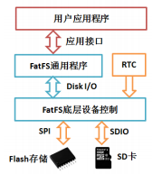

  > 1. 用户应用程序：通过 FATFS 的通用接口API函数进行文件系统的操作。例如用函数`f_open()`打开一个文件，用函数`f_write()`向文件写入数据，用函数`f_close()`关闭一个文件。
  > 2. FATFS 通用程序：与硬件无关的用于文件系统管理的一些通用操作API函数，包括文件系统的创建和挂载、目录操作和文件操作等函数。
  > 3. FATFS 底层设备控制：FATFS 与底层存储设备通讯的一些
  >    功能函数，包括读写存储介质的函数 `disk_read()` 和`disk_write()` 等。FATFS 底层设备控制部分是与硬件密切相关的，FATFS 的移植主要就这部分的移植。
  > 4. 存储介质和RTC：例如Flash存储芯片、SD卡、U盘、扩展的SRAM等。在一个嵌入式设备上可以使用 FATFS 管理多个存储设备。RTC用于获取当前时间，作为文件的时间戳信息。

- FATFS 文件组成

  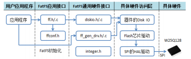

  > 1. FATFS 应用接口：面向用户应用程序的编程接口，提供文件操作的API函数，这些API函数与具体的存储介质和处理器类型无关。文件 `ff.h` 和 `ff.c` 中定义和实现了这些API函数。文件 `ffconf.h` 是 FATFS 的配置文件，用于定义FATFS 的一些参数，以便进行功能裁剪。
  > 2. FATFS 通用硬件接口：实现存储介质访问（Disk IO）的通用接口。文件`diskio.h/.c`中定义和实现了Disk IO的几个基本函数，包括`disk_initialize()`、`disk_read()`、`disk_ioctl()`等。文件`ff_gen_drv.h`中定义了驱动器和驱动器列表管理的一些类型和函数。主程序里进行 FATFS 初始化时会将一个驱动器链接到 FATFS 管理的驱动器列表里。

- FATFS 硬件访问函数

  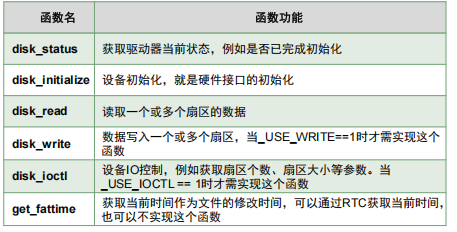

- FATFS 应用程序接口函数

  - 卷管理和系统配置函数

    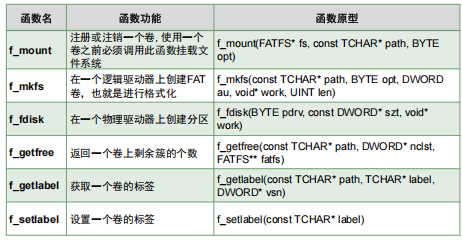

    1. `f_mount()`

       FATFS 要求每个逻辑驱动器（FAT卷）有一个文件系统对象作为工作区域，在对这个逻辑驱动器进行文件操作之前，需要用函数 `f_mount()` 将逻辑驱动器和文件系统对象注册。

       ```c
       FRESULT f_mount (
       FATFS* fs, 					/* [IN]文件系统对象指针，NULL表示卸载 */
       const TCHAR* path,			/* [IN]需要挂载或卸载的逻辑驱动器号，如”0:” */
       BYTE opt 					/* [IN]模式选项， 0: 延迟挂载, 1:立刻挂载 */
       )
       ```

       如果`f_mount()`返回值为`FR_NO_FILESYSTEM`，表示存储介质还没有文件系统，需要调用`f_mkfs()`函数格式化。

  - 文件和目录管理相关函数

     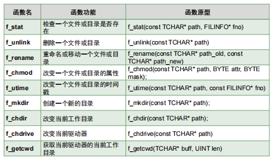

  - 目录访问相关函数

     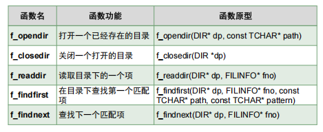

  - 文件访问相关函数

     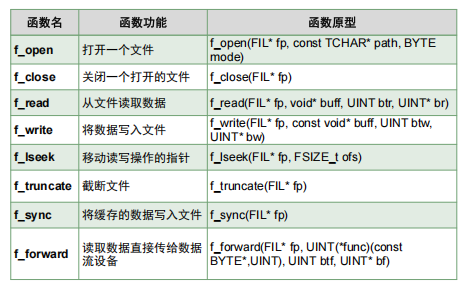

     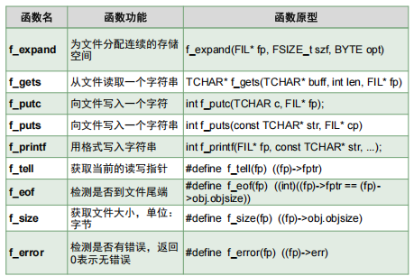

     1. `f_open()`
     
        ```c
        FRESULT f_open(
        FIL* fp, 					/* [OUT] 文件对象指针 */
        const TCHAR* path, 			/* [IN] 文件名 */
        BYTE mode 					/* [IN] 访问模式 */
        )
        ```
     
        参数`mode`是文件访问模式，是一些宏定义的位运算组合。
     
        ```c
        #define FA_READ 0x01 						// 读取模式
        #define FA_WRITE 0x02 						// 写入模式, FA_READ | FA_WRITE表示可读可写
        #define FA_OPEN_EXISTING 0x00 				// 打开的文件必须已存在，否则函数失败
        #define FA_CREATE_NEW 0x04 					// 新建文件，如果文件已经存在，函数失败并返回FR_EXIST
        #define FA_CREATE_ALWAYS 0x08 				// 总是新建文件，如果文件已经存在会覆盖现有文件
        #define FA_OPEN_ALWAYS 0x10 				// 打开一个已存在的文件，如果不存在就创建新文件
        #define FA_OPEN_APPEND 0x30 				// 与FA_OPEN_ALWAYS相同，只是读写指针定位在文件尾端
        ```
     
     2. `f_write()`
     
        ```c
        FRESULT f_write (
        FIL* fp,			 						/* [IN] 文件对象指针 */
        const void* buff, 							/* [IN] 待写入的数据缓存区指针 */
        UINT btw, 									/* [IN] 待写入数据的字节数 */
        UINT* bw 									/* [OUT] 实际写入文件的数据字节数 */
        )
        ```
     
        参数`fp`是用`f_open()`打开文件时返回的文件对象指针。文件对象结构体 FIL 有一个`DWORD`类型的成员变量`fptr`，称为文件读写位置指针，它表示文件内当前读写位置。文件打开后，这个读写位置指针指向文件顶端。`f_write()`在当前的读写位置指针处向文件写入数据，写入数据后读写位置指针会自动向后移动。
     
     3. `f_read()`
     
        ```c
        FRESULT f_read(
        FIL* fp, 								/* [IN] 文件对象指针 */
        void* buff, 							/* [OUT] 保存读出数据的缓存区 */
        UINT btr, 								/* [IN] 要读取数据的字节数 */
        UINT* br 								/* [OUT] 实际读取数据的字节数 */
        )
        ```
     
        `f_read()` 会从文件的当前读写位置处读取 `btr` 个字节的数据，读出的数据保存到缓存区 `buff` 里，实际读取的字节数返回到变量 `*br` 里。读出数据后，文件的读写指针会自动向后移动。
     
     4. `f_puts()`和`f_gets()`
     
        ```c
        int f_puts (const TCHAR* str, FIL* fp);
        TCHAR* f_gets (TCHAR* buff, int len, FIL* fp);
        ```
     
     5. 文件内读写指针的移动
     
        `f_tell()` 返回文件读写指针的当前值.
     
        `f_lseek()` 直接将文件读写指针移动到文件内的某个绝对位置.
     
        `f_eof()` 可以判断文件读写指针是否到文件尾端了.

## 2. STM32 FATFS 配置

### CubeMX 配置

- RTC 配置

  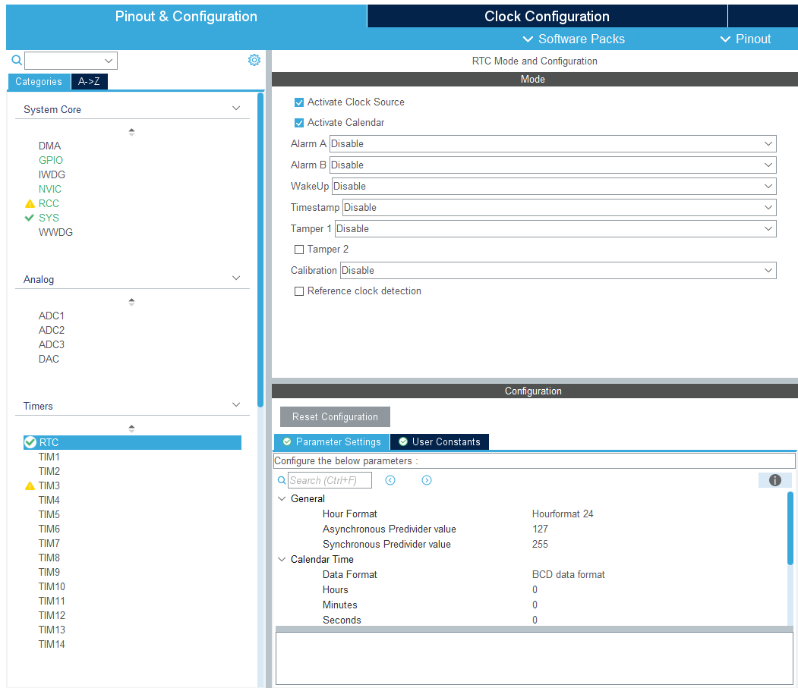
  
- FATFS 配置

  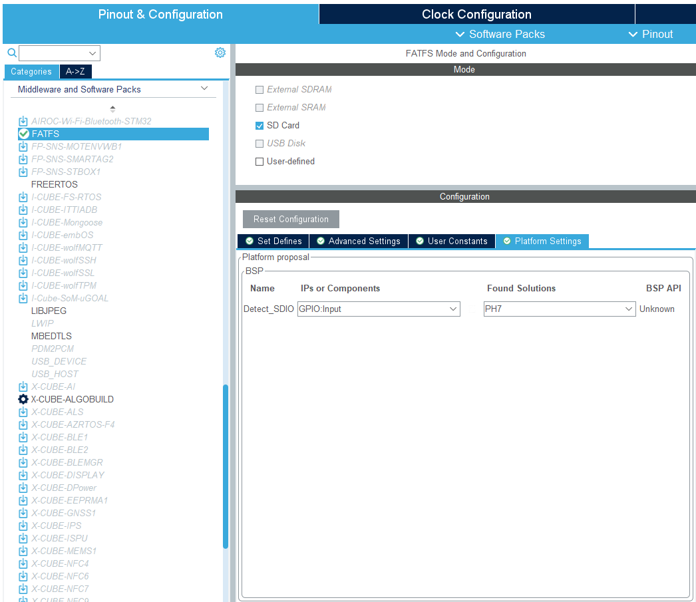

  > 可以设置一个插入检测引脚（GPIO_Input），低电平时初始化通过。（可以不设置）

  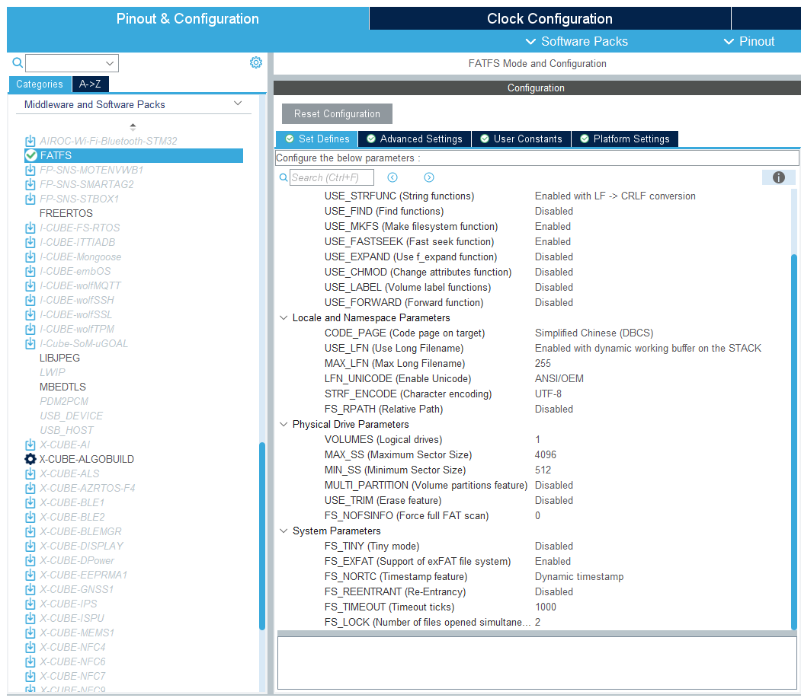

生成代码后直接使用 FATFS 系统函数即可。
